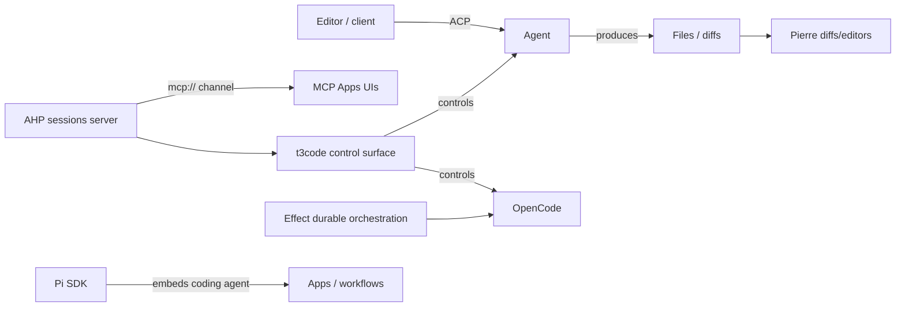

# Agentic SDLC factory toolchain

This is the canonical hub for the **toolchain behind an agentic SDLC factory** — how protocols, runtime SDKs, and agent-control frontends compose into one software-delivery pipeline. It was synthesized from the 2026-08-16 web-search Factory tools run (evidence on the [web-search Factory tools source page](/sources/web-search-factory-tools.md)).

The factory idea: an agent orchestrates coding, hosting, diffs, durable tasks, and editor UI through a shared set of standardized parts rather than one monolithic tool.

## The wire-protocol layer

- **[Agent Client Protocol (ACP)](/protocols/agent-client-protocol.md)** — the editor↔agent wire protocol ("connecting any editor to any agent"), officially implemented in TypeScript by `@agentclientprotocol/sdk`. It is what lets editor clients and coding agents speak a negotiated `protocolVersion`, independent of the harness. Concrete ACP server instances include [GitHub Copilot CLI](/protocols/agent-client-protocol.md#github-copilot-cli-acp-server-official-source-backed-2026-08-16) (`copilot --acp`), useful for CI/CD and multi-agent delivery paths in the factory.
- **[Agent Host Protocol (AHP)](/protocols/agent-host-protocol.md)** — Microsoft's synchronized, multi-client sessions-server state protocol (JSON-RPC 2.0, channel-based routing). Its role in the factory is *hosting* agents and exposing their session state to multiple clients. AHP also speaks an `mcp://` side-channel, which relays the [Model Context Protocol](/protocols/model-context-protocol.md) wire format and links AHP into the [MCP Apps](/protocols/mcp-apps.md) generative-UI domain.

## The tooling / control layer

- **[Pierre](/frameworks/pierre.md)** — the Pierre Computer Company's open-source toolkit (diffs, trees, memes) plus its in-place file-diff editors, used to visualize and edit the outputs agents produce.
- **[t3code](/frameworks/t3code.md)** — an "agent harness control surface" that controls the agents already on your machine (Claude Code, Codex, Cursor, Grok Build, OpenCode) from one mobile/web/desktop app; distributed via a nightly `0.0.34-nightly.*` release stream plus `npx t3@latest`.
- **[Effect](/frameworks/effect.md)** — the TypeScript library (v4 era) providing the typed, effectful orchestration foundation; its durable-execution surface is confirmed source-backed: `DurableQueue` ported from v3 with persistent semantics and `@effect/workflow` delivering durable workflows in alpha.
- **[OpenCode SDK](/frameworks/opencode-sdk.md)** — the type-safe JS/TS client (`@opencode-ai/sdk`) for controlling the opencode server programmatically.
- **[Pi SDK](/frameworks/pi-sdk.md)** — programmatic access (`pi.dev/docs/latest/sdk`) to the Pi coding agent's capabilities for embedding in applications and automated workflows; for non-JS integrations it exposes an RPC mode (`pi --mode rpc`, strict LF-delimited JSONL over stdin/stdout).

## How they compose

*How the factory composes: ACP/AHP wire and hosting layer, tooling/control surface (t3code), diff editing (Pierre), durable orchestration (Effect), and embedding SDKs (OpenCode, Pi).*

The same ACP/AHP foundation that powers editors and agent hosts is reused by control surfaces (t3code) and embedding SDKs (OpenCode, Pi), with Pierre handling the diff/edit presentation and Effect providing durable task orchestration.

## Key facts (source-backed)

- ACP and AHP are distinct, documented on their own canonical pages; this run confirms ACP's official library set includes TypeScript, Python, Rust, and Kotlin SDKs plus a `registry` (see [ACP source evidence](/sources/github-acp-typescript-sdk.md)).
- The VS Code agent host is the first-party AHP reference server and uses AHP to power AI coding agents (confirmed by VS Code issue evidence in this run).
- AHP's `mcp://` channel reuses the upstream [MCP](/protocols/model-context-protocol.md) wire format for a capability-gated subset served to MCP Apps-style UIs (see [AHP page](/protocols/agent-host-protocol.md)).
- Pierre's `@pierre/diffs` reached v1.3.0 ("the Edit release") — adopting in-place code editing for rendered diffs (see [Pierre page](/frameworks/pierre.md)).
- t3code is early-stage, launched via `npx t3@latest`, and controls OpenCode among other agents (see [t3code page](/frameworks/t3code.md)).
- **Effect's durable-execution surface is now source-backed**: the v4 beta launch (2026-02-18) and February–May recap confirm `DurableQueue` was ported from v3 to v4 with persistent queue semantics, and `@effect/workflow` delivers durable workflows in alpha (see [Effect page](/frameworks/effect.md)).

## Followed idea feeds

Since 2026-08-17 this hub is also fed by four engineering blogs, tracked by the same `web-search-factory-tools` source instance: the [Zed blog](https://zed.dev/blog) (editor and agent-harness design, the ACP end of the factory), the [Solo.io blog](https://www.solo.io/blog) (gateway and agent-infrastructure layer), the [Mastra blog](https://mastra.ai/blog) (agent runtime, workflows, memory), and the [GitHub Agentic Workflows blog](https://github.github.com/gh-aw/blog) (agents running as CI workflows, with their trigger, permission, and safe-output model). Durable concepts and ideas from those posts are folded into this hub and the tool pages above rather than kept as per-post summaries. Which posts have already been consumed is recorded in the [blog post ingestion ledger](/sources/blog-post-ledger.md), which is what keeps repeated scheduled runs from ingesting the same post twice.

The [gh-aw workflow gallery](https://github.github.com/gh-aw/index.html#gallery) is followed alongside it as a catalogue of reusable agentic workflow patterns — the CI-side counterpart to the editor-side and control-surface tools above. Being a living index rather than a post feed, it sits outside the ledger and is re-read each run, contributing only when its entries actually change.

The factory also depends on the knowledge-base layer that documents it: the [Open Knowledge Format](/protocols/open-knowledge-format.md) spec is the format standard this wiki (an [OpenWiki](/frameworks/openwiki.md) personal-mode wiki) uses to keep its concept corpus agent-maintainable, and the [web-search Agent wiki run](/sources/web-search-agent-wiki.md) documented that layer.

### First blog-feed signals (2026-08-17 run)

**GitHub Agentic Workflows (`gh-aw`)** is the first feed to yield durable, source-backed concept material:

- `gh-aw` **compiles Markdown workflow files into GitHub Actions workflows** that run AI agents for complex, multi-step repository tasks; GitHub Actions supplies triggers, runners, logs, and job orchestration, while `gh-aw` adds the agent-specific model. This makes agent workflows **CI-native** — a complement to the local harnesses and session protocols above, and the "agent as workflow" counterpart to [ACP](/protocols/agent-client-protocol.md)/[AHP](/protocols/agent-host-protocol.md) agent sessions.
- **Agent taxonomy** (Peli's Agent Factory post): workflows may be *read-only analysts*, *PR-proposing change agents*, or *meta-agents monitoring other workflows* — a durable vocabulary for cataloguing agent deployments.
- **Continuous documentation workflows** (2026-01-13 post): a collections-of-agents approach where separate agents generate, maintain, and validate docs — a concrete pattern for the factory's documentation pipeline.
- **Safety/permission model**: because gh-aw runs agents as Actions, its safety surface is the CI permission model (workflow permissions, tokens, runners) — the gateway/guardrail layer for factory agents.
- **Technical Preview + org move (2026-08-22 re-read):** the community discussion [GitHub Agentic Workflows now in Technical Preview](https://github.com/orgs/community/discussions/186451) confirms gh-aw is in **technical preview** and is a collaboration between GitHub, **Microsoft Research, and Azure Core Upstream** — with install (`gh-aw`), a quick start, and the workflow gallery as the adoption surface. The org move `githubnext/gh-aw` → `github/gh-aw` (PR #13335) was noted in the 2026-08-18 run. Sources also re-surface the gallery/quick-start install and `gh-aw-mcpg`; the "weekly-blog-post-writer" GitHub workflow shows the gh-aw blog itself is produced by a gh-aw workflow (dogfooding).
- Watchlist: **`gh-aw-mcpg`** — a Docker-based **MCP Gateway** for gh-aw (config `awmg-config.json`), connecting the CI-agent layer to the MCP ecosystem and aligning with the gateway theme below.
- Watchlist: blog index "Weekly Update – July 13, 2026" reports **v0.82.8** and a fixed Docker-authentication bug affecting `sbx`-runtime workflows. The `v0.86.1` in the synthesized answer is **unverified** — treat as watchlist.

**Zed blog signals (watchlist/saved-context):**

- **DeltaDB** — Zed's synchronization engine tracking every operation at character-level granularity, designed to let humans and agents share a single, consistent view of the codebase as it evolves ("We're Not Building AI Features for the Money"). A durable design idea for the editor side of the factory: human-agent shared state on par with AHP's synchronized sessions. The 2026-08-22 re-read re-surfaced the same DeltaDB phrasing plus the "Introducing Delta" post title on the blog index (watchlist, body not retrieved).
- Sequoia backing and the Student Plan ($10/month) are company/funding news — not durable technical knowledge; recorded only to close them in the [ledger](/sources/blog-post-ledger.md).
- **Sandboxing (2026-08-22, ledgered):** the sandboxing post (author Cameron Mcloughlin, Aug 2026) exists in the feed and is the editor-side extension of the safety theme — no body was retrieved this run, so nothing beyond the topic is adopted; the Zed "Sandboxing" and "Parallel Agents" posts remain **watchlist** for future full-body reads.

**Solo.io blog signals (2026-08-18, source-backed for the gateway/product facts, watchlist for broader claims):**

- **Progressive disclosure / token saving at the MCP gateway layer** — the `mcp-progressive-disclosure` post explains loading only the tools you need (the client sees a lightweight index upfront and retrieves tool schemas on demand), and the `keeping-context-and-tokens-low` post quantifies it at **"up to 91% token reduction"** for large MCP servers (SQL/GitHub/Slack can consume 100K tokens before the first prompt). This is the gateway-side cost-optimization surface over the base [Model Context Protocol](/protocols/model-context-protocol.md) (whose 2026-07-28 cacheable list results / header-based routing is the upstream surface this optimizes).
- **Solo Enterprise for agentgateway 2.2** (2026-03-12, source-backed): GA on agentgateway OSS 1.0; **MCP authentication for desktop AI coding agents** (authenticates users up-front on connect so hosted/shared MCP tool calls don't OAuth-popup mid-task), plus **Anthropic protocol translation**, cloud-native **prompt guards**, richer **LLM cost visibility**, and MCP security hardening — for coding agents in Cursor/Claude Code against hosted MCP (Atlassian, GitHub, platform services).
- **"On-Behalf-Of" (OBO)** demo for **Solo Enterprise for agentgateway** — delegation/identity for agent-to-service calls across MCP and A2A.
- **kagent (context-aware Kubernetes)** — Solo Enterprise for kagent extends Kubernetes so agents, tools, and LLMs are first-class workloads ("context-aware"), tied to the donation of **agentgateway to the Linux Foundation** as an open project.
- **agentgateway Linux Foundation donation (2026-08-22, official [donation post](https://www.solo.io/blog/solo-contributes-agentgateway-linux-foundation), ledgered 2026-08-22):** the dedicated donation announcement confirms the earlier-implied donation fact: agentgateway is contributed to the Linux Foundation "to Make AI Agents More Accessible, Capable, and Secure" — the governance anchor for the gateway layer. Watchlist: the same post and the related "From MCP Servers to Services: Introducing **kmcp** for Enterprise-Grade MCP Development" teaser (kmcp = an MCP-server-as-Kubernetes-service development companion, gateway-side) are teaser snippets only; fetch full bodies before promoting.
- **AAIF (Agentic AI Foundation)** announcement — enterprise secure agentic infrastructure for MCP.

**Mastra blog signals (source-backed where primary runtime facts, watchlist otherwise):**

- **Mastra 1.0 stable** — stabilized APIs, simplified deployment, improved observability, production issues addressed. **A2A (Agent-to-Agent) support** for cross-framework multi-agent systems. **AI Tracing** — noise filtering across multiple observability platforms (OpenTelemetry-based).
- **Agent orchestration on AI SDK v5** (2026-08-26, adopted 2026-08-18): Mastra now controls the agent loop and tool calling itself (from v0.14.0) while remaining backward-compatible with AI SDK v4 and v5, and added **nested streaming** so agent-in-tool / agent-in-workflow streams compose — a durable runtime capability for the factory's orchestration layer (see [Mastra agentic-UI](/frameworks/mastra-agentic-ui.md)).
- Watchlist: Changelog 2026-03-23 (token-aware model routing, MongoDB-backed versioned datasets/experiments, Okta SSO with RBAC).

All blog signals remain **watchlist** level unless confirmed from primary docs (Solo 2.2 and kagent product facts above are source-backed from the post bodies); the ledger records each post so a later run only re-examines them if content demonstrably changed.

## Backlog
- **Activity semantics + full `@effect/workflow` API surface** — the DurableQueue port and workflow fixes are source-backed, but the exact Workflow/Activity primitive semantics and packaging were not fully retrieved; target the official v4 workflow docs directly.
- **Direct ingestion of Pierre, t3code, Effect, OpenCode, and Pi repo/release resources** — each was only witnessed via web-search results this run; direct repo/release ingestion would confirm version history and cadence. (Pi's official release trail exists at `pi.dev/news` but is only partially covered; t3code's nightly stream was captured 2026-08-18.)
- **Full-body re-reads of the followed blog feeds** — prior runs captured teaser snippets; the [ledger](/sources/blog-post-ledger.md) now closes those posts, so budget direct fetches of *new* posts on future runs (revisiting a closed post requires demonstrably changed content). The 2026-08-18 run began moving several Solo.io gateway topics from teaser-only to source-backed post bodies; the 2026-08-22 run added the Solo.io Linux Foundation donation post (anchor adopted, the **kmcp** companion teaser still pending a full fetch) and the Zed sandboxing post (no body retrieved).