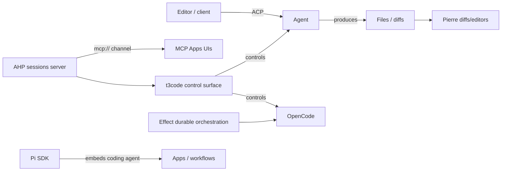

# Agentic SDLC factory toolchain

This is the canonical hub for the **toolchain behind an agentic SDLC factory** — how protocols, runtime SDKs, and agent-control frontends compose into one software-delivery pipeline. It was synthesized from the 2026-08-16 web-search Factory tools run (evidence on the [web-search Factory tools source page](/sources/web-search-factory-tools.md)).

The factory idea: an agent orchestrates coding, hosting, diffs, durable tasks, and editor UI through a shared set of standardized parts rather than one monolithic tool.

## The wire-protocol layer

- **[Agent Client Protocol (ACP)](/protocols/agent-client-protocol.md)** — the editor↔agent wire protocol ("connecting any editor to any agent"), officially implemented in TypeScript by `@agentclientprotocol/sdk`. It is what lets editor clients and coding agents speak a negotiated `protocolVersion`, independent of the harness. Concrete ACP server instances include [GitHub Copilot CLI](/protocols/agent-client-protocol.md#github-copilot-cli-acp-server-official-source-backed-2026-08-16) (`copilot --acp`), useful for CI/CD and multi-agent delivery paths in the factory.
- **[Agent Host Protocol (AHP)](/protocols/agent-host-protocol.md)** — Microsoft's synchronized, multi-client sessions-server state protocol (JSON-RPC 2.0, channel-based routing). Its role in the factory is *hosting* agents and exposing their session state to multiple clients. AHP also speaks an `mcp://` side-channel, which links it into the [MCP Apps](/protocols/mcp-apps.md) generative-UI domain.

## The tooling / control layer

- **[Pierre](/frameworks/pierre.md)** — the Pierre Computer Company's open-source toolkit (diffs, trees, memes) plus its in-place file-diff editors, used to visualize and edit the outputs agents produce.
- **[t3code](/frameworks/t3code.md)** — an "agent harness control surface" that controls the agents already on your machine (Claude Code, Codex, Cursor, Grok Build, OpenCode) from one mobile/web/desktop app.
- **[Effect](/frameworks/effect.md)** — the TypeScript library (v4 era) providing the typed, effectful orchestration foundation; its durable-execution surface is confirmed source-backed: `DurableQueue` ported from v3 with persistent semantics and `@effect/workflow` delivering durable workflows in alpha.
- **[OpenCode SDK](/frameworks/opencode-sdk.md)** — the type-safe JS/TS client (`@opencode-ai/sdk`) for controlling the opencode server programmatically.
- **[Pi SDK](/frameworks/pi-sdk.md)** — programmatic access (`pi.dev/docs/latest/sdk`) to the Pi coding agent's capabilities for embedding in applications and automated workflows.

## How they compose

*How the factory composes: ACP/AHP wire and hosting layer, tooling/control surface (t3code), diff editing (Pierre), durable orchestration (Effect), and embedding SDKs (OpenCode, Pi).*

The same ACP/AHP foundation that powers editors and agent hosts is reused by control surfaces (t3code) and embedding SDKs (OpenCode, Pi), with Pierre handling the diff/edit presentation and Effect providing durable task orchestration.

## Key facts (source-backed)

- ACP and AHP are distinct, documented on their own canonical pages; this run confirms ACP's official library set includes TypeScript, Python, Rust, and Kotlin SDKs plus a `registry` (see [ACP source evidence](/sources/github-acp-typescript-sdk.md)).
- The VS Code agent host is the first-party AHP reference server and uses AHP to power AI coding agents (confirmed by VS Code issue evidence in this run).
- AHP's `mcp://` channel reuses the upstream MCP wire format for a capability-gated subset served to MCP Apps-style UIs (see [AHP page](/protocols/agent-host-protocol.md)).
- Pierre's `@pierre/diffs` reached v1.3.0 ("the Edit release") — adopting in-place code editing for rendered diffs (see [Pierre page](/frameworks/pierre.md)).
- t3code is early-stage, launched via `npx t3@latest`, and controls OpenCode among other agents (see [t3code page](/frameworks/t3code.md)).
- **Effect's durable-execution surface is now source-backed**: the v4 beta launch (2026-02-18) and February–May recap confirm `DurableQueue` was ported from v3 to v4 with persistent queue semantics, and `@effect/workflow` delivers durable workflows in alpha (see [Effect page](/frameworks/effect.md)).

## Backlog
- **Activity semantics + full `@effect/workflow` API surface** — the DurableQueue port and workflow fixes are source-backed, but the exact Workflow/Activity primitive semantics and packaging were not fully retrieved; target the official v4 workflow docs directly.
- **Direct ingestion of Pierre, t3code, Effect, OpenCode, and Pi repo/release resources** — each was only witnessed via web-search results this run; direct repo/release ingestion would confirm version history and cadence. (Pi's official release trail exists at `pi.dev/news` but is only partially covered this run.)