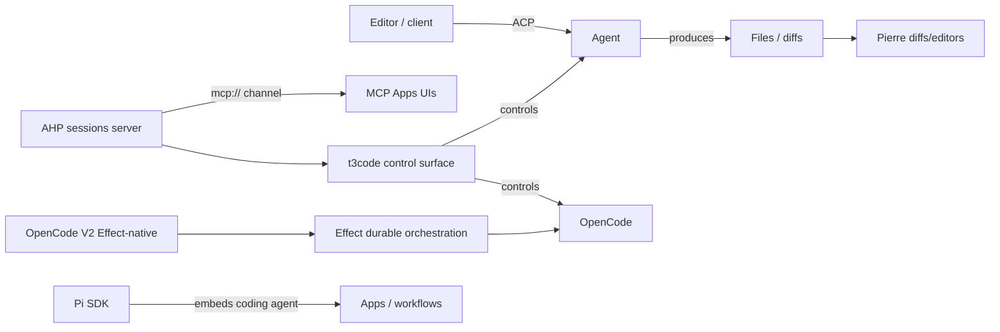

# Agentic SDLC factory toolchain

This is the canonical hub for the **toolchain behind an agentic SDLC factory** — how protocols, runtime SDKs, and agent-control frontends compose into one software-delivery pipeline. It was synthesized from the 2026-08-16 web-search Factory tools run (evidence on the [web-search Factory tools source page](/sources/web-search-factory-tools.md)).

The factory idea: an agent orchestrates coding, hosting, diffs, durable tasks, and editor UI through a shared set of standardized parts rather than one monolithic tool.

## The wire-protocol layer

- **[Agent Client Protocol (ACP)](/protocols/agent-client-protocol.md)** — the editor↔agent wire protocol ("connecting any editor to any agent"), officially implemented in TypeScript by `@agentclientprotocol/sdk`. It is what lets editor clients and coding agents speak a negotiated `protocolVersion`, independent of the harness. Concrete ACP server instances include [GitHub Copilot CLI](/protocols/agent-client-protocol.md#github-copilot-cli-acp-server-official-source-backed-2026-08-16) (`copilot --acp`), useful for CI/CD and multi-agent delivery paths in the factory.
- **[Agent Host Protocol (AHP)](/protocols/agent-host-protocol.md)** — Microsoft's synchronized, multi-client sessions-server state protocol (JSON-RPC 2.0, channel-based routing). Its role in the factory is *hosting* agents and exposing their session state to multiple clients. AHP also speaks an `mcp://` side-channel, which relays the [Model Context Protocol](/protocols/model-context-protocol.md) wire format and links AHP into the [MCP Apps](/protocols/mcp-apps.md) generative-UI domain.

## The tooling / control layer

- **[Pierre](/frameworks/pierre.md)** — the Pierre Computer Company's open-source toolkit (diffs, trees, memes) plus its in-place file-diff editors, used to visualize and edit the outputs agents produce. Current `@pierre/diffs` line is **v1.4.x** (v1.4.2, 2026-09-11, TypeScript 7, breaking-change line with a migration guide from 1.3).
- **[t3code](/frameworks/t3code.md)** — an "agent harness control surface" that controls the agents already on your machine (Claude Code, Codex, Cursor, Grok Build, OpenCode, Google Antigravity) from one mobile/web/desktop app; a Node WebSocket server wraps provider CLIs; distributed via a nightly `0.0.34-nightly.*` release stream plus `npx t3@latest`.
- **[Effect](/frameworks/effect.md)** — the TypeScript library (v4 era) providing the typed, effectful orchestration foundation; its durable-execution surface is confirmed source-backed: `DurableQueue` ported from v3 with persistent semantics, `@effect/workflow` delivering durable workflows in alpha, and — from the 2026-08-27 [July 2026 recap](https://www.effect.website/blog/effect-v4beta-july-recap) — the **activity retry policy fixed** plus SQL-backed persisted-queue fixes; **Effect v4 entered Release Candidate on 2026-08-14** (API presumed stable; cluster + durable-execution fixes in the RC window). This runtime is now directly consumable by the Effect-native OpenCode V2 SDK.
- **[OpenCode SDK](/frameworks/opencode-sdk.md)** — the type-safe JS/TS client (`@opencode-ai/sdk`) for controlling the opencode server programmatically; a new **V2 SDK (beta)** is **Effect-native** (`OpenCode.create()` hosts OpenCode in-process through an in-memory HTTP router), so it composes directly with the [Effect](/frameworks/effect.md) orchestration layer below.
- **[Pi SDK](/frameworks/pi-sdk.md)** — programmatic access (`pi.dev/docs/latest/sdk`) to the Pi coding agent's capabilities for embedding in applications and automated workflows; for non-JS integrations it exposes an RPC mode (`pi --mode rpc`, strict LF-delimited JSONL over stdin/stdout).

## How they compose

```mermaid
flowchart LR
    E[Editor / client] -->|ACP| AG[Agent]
    H[AHP sessions server] -->|mcp:// channel| MA[MCP Apps UIs]
    AG -->|produces| DIFF[Files / diffs]
    DIFF --> PI[Pierre diffs/editors]
    H --> T[t3code control surface]
    T -->|controls| OPC[OpenCode]
    T -->|controls| AG
    EFF[Effect durable orchestration] --> OPC
    OPC2[OpenCode V2 Effect-native] --> EFF
    PS[Pi SDK] -->|embeds coding agent| APP[Apps / workflows]
```
*How the factory composes: ACP/AHP wire and hosting layer, tooling/control surface (t3code), diff editing (Pierre), durable orchestration (Effect), and embedding SDKs (OpenCode, Pi).*

The same ACP/AHP foundation that powers editors and agent hosts is reused by control surfaces (t3code) and embedding SDKs (OpenCode, Pi), with Pierre handling the diff/edit presentation and Effect providing durable task orchestration.

## Key facts (source-backed)

- ACP and AHP are distinct, documented on their own canonical pages; this run confirms ACP's official library set includes TypeScript, Python, Rust, and Kotlin SDKs plus a `registry` (see [ACP source evidence](/sources/github-acp-typescript-sdk.md)).
- The VS Code agent host is the first-party AHP reference server and uses AHP to power AI coding agents (confirmed by VS Code issue evidence in this run).
- AHP's `mcp://` channel reuses the upstream [MCP](/protocols/model-context-protocol.md) wire format for a capability-gated subset served to MCP Apps-style UIs (see [AHP page](/protocols/agent-host-protocol.md)).
- Pierre's `@pierre/diffs` reached v1.3.0 ("the Edit release") — adopting in-place code editing for rendered diffs (see [Pierre page](/frameworks/pierre.md)).
- t3code is early-stage, launched via `npx t3@latest`, and controls OpenCode among other agents (see [t3code page](/frameworks/t3code.md)).
- **Effect's durable-execution surface is now source-backed**: the v4 beta launch (2026-02-18) and February–May recap confirm `DurableQueue` was ported from v3 to v4 with persistent queue semantics, and `@effect/workflow` delivers durable workflows in alpha (see [Effect page](/frameworks/effect.md)).

## 2026-09-19 run deltas (sixth re-pull)

- **Pierre — `@pierre/diffs` v1.4 line (source-backed release body):** the releases page now leads with **v1.4.2 (2026-09-11, `@amadeus`, commit `f6d917f`; trail v1.3.6 → v1.4.0 → v1.4.1 → v1.4.2)**. v1.4.2 updates **the entire app to TypeScript 7** (#1114) and fixes **both languages loading on a diff that renames languages** (#1122); the notes carry an explicit **migration guide pointer for upgrading from 1.3** — the v1.4 line is breaking. This moves the diff/edit layer of the factory to the TypeScript-7 generation (see [Pierre](/frameworks/pierre.md)).
- **Effect — v4 Release Candidate (source-backed):** [This Week in Effect 131](https://effect.website/blog/this-week-in-effect/131) (2026-08-14) announces **Effect v4 is now in Release Candidate — the API surface is presumed stable, focus shifts to correctness/reliability/docs** — with cluster & durable-execution fixes (cluster shutdown hang, execution-plan observer pairing, TxPubSub subscriber release, SQL findById resolver empty-batch calls, SQL-executor empty batches, migrations for SQL persisted queues, integration coverage for owner-loss/cluster-transport-failure replay). The Feb–May recap + July recap (DurableQueue port, `@effect/workflow` alpha, activity retry policy, SQL-backed persisted queues) and the issue #6014 Activity-replay edge case re-confirmed. See [Effect](/frameworks/effect.md).
- **ACP — org/spec + SDK 1.2.1 signal (source-backed reconfirmation):** the `agentclientprotocol` org listing re-confirmed the official SDK set (typescript-sdk updated Sep 7 2026; registry, codex-acp, rust-sdk, python-sdk, kotlin-sdk, java-sdk) plus the spec README's `protocolVersion`-negotiated wire-compat rule. The npm CDN README surfaced **`@agentclientprotocol/sdk@1.2.1`** as the latest package version, with the SDK's layered architecture (central `acp.ts` entrypoint, JSON-RPC engine split across `connection.ts`/`jsonrpc.ts`, `Stream` transports for stdio/HTTP/WebSocket/Node child processes; ESM-only, Zod peer dependency) — version-cadence evidence still lives on the [ACP releases](/references/agent-client-protocol-typescript-sdk-releases.md) page (v1.3.0 trail stands). See [ACP](/protocols/agent-client-protocol.md).
- **t3code — README/AGENTS.md surface (source-backed):** the README now reads **"agent harness control surface"** with a **Node WebSocket server wrapping provider CLIs and agents (Codex, Claude Code, Cursor, Grok, OpenCode, Antigravity)** serving web/desktop/mobile clients, positioning t3code as an open-source "bring-your-own-subscription" alternative to Claude Desktop / Codex App / Cursor Glass / Conductor; install channels re-confirmed (`npx t3@latest`, winget/brew cask/AUR). **Watchlist:** issue **#402** requests Pi as a first-class provider via RPC; issue **#231** requests `Steer`/`Queue` follow-up modes beside `Chat`/`Plan`; issue **#8602** reports Codex `config.toml` moving to `default`/`priority` while t3code expects `flex`/`fast`. See [t3code](/frameworks/t3code.md).
- **Pi — SDK doc live-update + t3code integration demand (source-backed + watchlist):** the official `packages/coding-agent/docs/sdk.md` was updated **2026-09-16** ("Mid conversation system messages", #9548 by mitsuhiko) — the SDK doc is a living reference; the `pi.dev/docs/latest/sdk` and `#custom-tools` extension docs URLs re-confirmed. Third-party issues reference the ResourceLoader/`CLAUDE.md` interplay (watchlist); [t3code#402](https://github.com/pingdotgg/t3code/issues/402) requests **Pi as a first-class t3code provider via RPC** (watchlist, cross-link to [Pi SDK](/frameworks/pi-sdk.md)).
- **OpenCode — reconfirmation + AI-SDK-v6 provider signal:** the v1 SDK docs and the OpenCode Go subscription page re-confirmed (model table incl. Grok 4.6, GPT 5.6 Luna, GLM-5.x, Kimi K2.x, DeepSeek V4); community signals `ai-sdk-provider-opencode-sdk` (Vercel-AI-SDK provider, **v2.x targets AI SDK v6** via `@opencode-ai/sdk/v2`) and `anomalyco/opencode-sdk-python` re-surfaced — third-party, watchlist. See [OpenCode SDK](/frameworks/opencode-sdk.md).
- **AHP — doctrine/README reconfirmation (source-backed):** the AHP README re-confirmed the **"synchronized, multi-client state protocol for AI agent sessions"** framing with the **immutable state + pure reducers + write-ahead reconciliation** design triad and the per-language client-library table (Rust `ahp`/`ahp-types`/`ahp-ws`, TS `@microsoft/agent-host-protocol`, Kotlin `com.microsoft.agenthostprotocol`); the doctrine doc ("authoritative, replayable view") and the spec versioning doc (SemVer MAJOR.MINOR.PATCH, no pre-release/build metadata) re-confirmed. **No new spec release** — the independent per-language SemVer tracks on the [AHP releases](/references/agent-host-protocol-releases.md) page stand. See [AHP](/protocols/agent-host-protocol.md).

### Followed feeds (2026-09-19 — reconfirmatory, one new durable Zed post)

All four followed blogs and the gh-aw gallery returned **no new durable blog-post material** beyond one Zed post (all other hits were already-ledgered posts or catalogue re-reads; see [ledger](/sources/blog-post-ledger.md)):

- **Zed — Worktree Trust (new post, source-backed topic):** "[Zed Moves Toward Secure-by-Default: Introducing Worktree Trust](https://zed.dev/blog/secure-by-default)" documents a **secure-by-default worktree trust model**: a malicious `.zed/settings.json` in a project could execute arbitrary code with the user's privileges, so Zed now runs projects in a **restricted mode by default** until the user trusts a worktree (trust hierarchy + per-scenario behaviors in docs; responsible disclosure by Aaron Portnoy / Mindgard). This is the editor-side complement to the factory's safety theme (CI permission model on the gh-aw side; [sandboxing-related](#followed-idea-feeds) signals on the harness side) — adopted as a durable security-by-default concept on the editor/agent-harness axis.
- **Zed older posts re-confirmed (ledgered, no re-adoption):** `not-building-ai-for-the-money` (DeltaDB), `dev-containers`, `terms-update`, `student-plan` — all already in the ledger. The index related-posts again surfaced **"Xanadu Was Waiting for Agents"** (2026-09-01) and **"Replace PRs with Delta – Now in Public Beta"** (2026-09-16) — watchlist (snippets only); **"Introducing Delta"** (2026-08-12) re-confirmed as the Delta launch post.
- **Solo.io re-confirmed (all ledgered):** progressive disclosure ×2, AAIF, LLM-observability (Langfuse), "From Service Mesh to Agentic Mesh" — the mesh post is out of scope (service-mesh, not factory); the blog index shows a new **"Introducing agentdesktop"** spotlight (2026-09-03: visibility, identity, policy, credential management for AI tools / MCP servers / agents on desktop fleets) — **watchlist** (teaser only, ledgered 2026-09-19 as a bookkeeping row).
- **Mastra re-confirmed (all ledgered):** AI Tracing, v1 beta, rebrand, UI dojo, plus index-level posts (Incident Alerts 2026-09-17, Error Diagnosis 2026-09-15, Server Health 2026-09-14, Sandbox Lifecycle Controls 2026-09-07) — all feature-level platform announcements with snippet-only bodies, recorded as index reconfirmation (no ledger row; no durable concept adopted).
- **gh-aw re-confirmed:** the blog index (page 2), the technical-preview changelog post (2026-02-13), and the continuous-simplicity/documentation workflow posts are all already documented; the **gallery** re-read shows the same catalogue (use-safely guidance: review trigger/engine-auth/tools/network/permissions/safe outputs; `gh aw compile` → inspect `.md` + `.lock.yml` → narrowest permissions) — **no new durable entries**. The gallery's safety-guidance wording ("Use a Gallery Workflow Safely") was re-confirmed as already documented.

## 2026-08-29 run deltas (fifth re-pull)

- **AHP — ACP/AHP composition clarified (source-backed issue):** `microsoft/agent-host-protocol#282` (2026-06-27) documents the intended composition: **ACP is the client↔agent-runtime protocol**, **AHP is the host that sits between the client and the agent and translates client requests into ACP to talk to the agent**. This resolves how the two protocols layer in the factory's wire stack (see [AHP](/protocols/agent-host-protocol.md)).
- **ACP — first-party SDK set + wire-compat rule re-confirmed:** the ACP org listing and spec README re-confirmed the official SDK set (TypeScript `@agentclientprotocol/sdk`, Python, Rust, Kotlin `acp-kotlin`, Java `java-sdk`) and the README's wire-compatibility rule — the negotiated `protocolVersion` (stable `1`), not the release artifact version, determines wire shape (schema artifacts in `schema/v1`/`schema/v2`). Community adapter signal: `blowmage/cursor-agent-acp-npm` (third-party ACP adapter for Cursor CLI on stdio, watchlist).
- **Effect — v4 API query now returns official + community material:** `whats-new` gist, the official February–May recap, and the v4 Beta release post re-surfaced as deterministic hits. The durable-execution query stayed on the official `Effect-TS/effect#6014` Activity-replay bug plus community durable engines (out of scope). See [Effect page](/frameworks/effect.md).
- **Pi — 0.80.4/0.80.8 release bodies (source-backed):** full release notes for two 0.80.x generation releases document the **ModelRuntime evolution** — 0.80.4 adds GPT-5.6 metadata + verified openai-codex support, zstd SSE compression, `agent_settled` events, `before_provider_headers` hook, and a batch of provider retry/connection fixes; 0.80.8 makes **`ModelRuntime` the canonical async SDK facade** with provider-owned `/login` discovery, file-backed dynamic catalogs (`models-store.json`), Radius gateway support, and `refreshModels(context)` dynamic discovery. See [Pi SDK](/frameworks/pi-sdk.md).
- **Mastra — Studio metrics/logs (source-backed):** see the Mastra bullet above — the observability corner of the factory's runtime layer.
- **gh-aw — two-layer versioning (source-backed):** see the gh-aw bullet above — CLI vs compiled `.lock.yml` version tracking with weekly/bi-weekly minor cadence.
- **Pierre — snapshot/activity signals (watchlist):** the repo snapshot is ~6.1k stars / 207 forks; tags show the `v1.1.0-beta.*` line (`@pierre/diffs` bumps with annotation sizing, theme-as-third-party-dep, gutter implementation, WorkerPool task-leak fix, Safari inline-size workaround); PR activity shows **diffshub comment support, code-font + display preferences, palette/theme export as Figma variables, and `[diffs/edit]` edit-prediction support** (all watchlist, third-party/open PRs). See [Pierre page](/frameworks/pierre.md).
- **t3code — packaging + architecture signals (watchlist):** `Sawrz/t3code-nix` re-surfaced as a nix flake following each GitHub release (AppImage/x64/arm64 assets, `t3` npm package); issue **#2137** tracks the nightly build not following the latest full release (nightly ~0.0.18 vs full 0.0.20 era); issue **#671** proposes an explicit **`BackendTarget` model** (`local`, `wsl:<distro>`, future `ssh:<host>`) with a desktop-side backend-lifecycle controller; issue **#386** pins T3 Code `v0.0.4` vs newer Codex app-server `interactionMode` values (`plan`, `code`, `pair_programming`, `execute`, `custom` — no `default`). See [t3code](/frameworks/t3code.md).
- **Solo.io — LLM observability teaser (watchlist):** see the Solo.io bullet above — agentgateway + Langfuse tracing for open-source LLM observability.

## Followed idea feeds

Since 2026-08-17 this hub is also fed by four engineering blogs, tracked by the same `web-search-factory-tools` source instance: the [Zed blog](https://zed.dev/blog) (editor and agent-harness design, the ACP end of the factory), the [Solo.io blog](https://www.solo.io/blog) (gateway and agent-infrastructure layer), the [Mastra blog](https://mastra.ai/blog) (agent runtime, workflows, memory), and the [GitHub Agentic Workflows blog](https://github.github.com/gh-aw/blog) (agents running as CI workflows, with their trigger, permission, and safe-output model). Durable concepts and ideas from those posts are folded into this hub and the tool pages above rather than kept as per-post summaries. Which posts have already been consumed is recorded in the [blog post ingestion ledger](/sources/blog-post-ledger.md), which is what keeps repeated scheduled runs from ingesting the same post twice.

The [gh-aw workflow gallery](https://github.github.com/gh-aw/index.html#gallery) is followed alongside it as a catalogue of reusable agentic workflow patterns — the CI-side counterpart to the editor-side and control-surface tools above. Being a living index rather than a post feed, it sits outside the ledger and is re-read each run, contributing only when its entries actually change.

The factory also depends on the knowledge-base layer that documents it: the [Open Knowledge Format](/protocols/open-knowledge-format.md) spec is the format standard this wiki (an [OpenWiki](/frameworks/openwiki.md) personal-mode wiki) uses to keep its concept corpus agent-maintainable, and the [web-search Agent wiki run](/sources/web-search-agent-wiki.md) documented that layer.

### First blog-feed signals (2026-08-17 run)

**GitHub Agentic Workflows (`gh-aw`)** is the first feed to yield durable, source-backed concept material:

- `gh-aw` **compiles Markdown workflow files into GitHub Actions workflows** that run AI agents for complex, multi-step repository tasks; GitHub Actions supplies triggers, runners, logs, and job orchestration, while `gh-aw` adds the agent-specific model. This makes agent workflows **CI-native** — a complement to the local harnesses and session protocols above, and the "agent as workflow" counterpart to [ACP](/protocols/agent-client-protocol.md)/[AHP](/protocols/agent-host-protocol.md) agent sessions.
- **Agent taxonomy** (Peli's Agent Factory post): workflows may be *read-only analysts*, *PR-proposing change agents*, or *meta-agents monitoring other workflows* — a durable vocabulary for cataloguing agent deployments.
- **Continuous documentation workflows** (2026-01-13 post): a collections-of-agents approach where separate agents generate, maintain, and validate docs — a concrete pattern for the factory's documentation pipeline.
- **Safety/permission model**: because gh-aw runs agents as Actions, its safety surface is the CI permission model (workflow permissions, tokens, runners) — the gateway/guardrail layer for factory agents.
- **Technical Preview + org move (2026-08-22 re-read):** the community discussion [GitHub Agentic Workflows now in Technical Preview](https://github.com/orgs/community/discussions/186451) confirms gh-aw is in **technical preview** and is a collaboration between GitHub, **Microsoft Research, and Azure Core Upstream** — with install (`gh-aw`), a quick start, and the workflow gallery as the adoption surface. The org move `githubnext/gh-aw` → `github/gh-aw` (PR #13335) was noted in the 2026-08-18 run. Sources also re-surface the gallery/quick-start install and `gh-aw-mcpg`; the "weekly-blog-post-writer" GitHub workflow shows the gh-aw blog itself is produced by a gh-aw workflow (dogfooding).
- **Status wording (2026-08-27):** the gh-aw homepage now reads **"GitHub Agentic Workflows is in Public Preview"**, a governance-status wording drift from the earlier "technical preview" discussion framing — record as a wording change, not a material status change. The technical-preview collaboration (GitHub × Microsoft Research × Azure Core Upstream) and install surface (CLI, `gh aw add-wizard`, Markdown-with-YAML-frontmatter → `.lock.yml` Actions compilation) were re-confirmed.
- **Versioning + release cadence (2026-08-29, source-backed reference page):** the [Releases and Versioning](https://github.github.com/gh-aw/reference/releases) reference documents gh-aw's **two-layer versioning model** — the CLI extension (`gh aw`) you run locally or in CI and the compiled `.lock.yml` files that run in GitHub Actions, each with independent version tracking — and a **weekly or bi-weekly minor release cadence** modeled on VS Code's practices: a new minor version is published as a prerelease and floated for a few days, then on **Monday** the last known-good prerelease is promoted to stable and `latest` is updated (adopted on the hub; ledgered).
- Watchlist: **`gh-aw-mcpg`** — a Docker-based **MCP Gateway** for gh-aw (config `awmg-config.json`), connecting the CI-agent layer to the MCP ecosystem and aligning with the gateway theme below.
- Watchlist: blog index "Weekly Update – July 13, 2026" reports **v0.82.8** and a fixed Docker-authentication bug affecting `sbx`-runtime workflows. The `v0.86.1` in the synthesized answer is **unverified** — treat as watchlist.

**Zed blog signals (watchlist/saved-context):**

- **DeltaDB** — Zed's synchronization engine tracking every operation at character-level granularity, designed to let humans and agents share a single, consistent view of the codebase as it evolves ("We're Not Building AI Features for the Money"). A durable design idea for the editor side of the factory: human-agent shared state on par with AHP's synchronized sessions. The 2026-08-22 re-read re-surfaced the same DeltaDB phrasing plus the "Introducing Delta" post title on the blog index (watchlist, body not retrieved).
- Sequoia backing and the Student Plan ($10/month) are company/funding news — not durable technical knowledge; recorded only to close them in the [ledger](/sources/blog-post-ledger.md).
- **Sandboxing (2026-08-22, ledgered):** the sandboxing post (author Cameron Mcloughlin, Aug 2026) exists in the feed and is the editor-side extension of the safety theme — no body was retrieved this run, so nothing beyond the topic is adopted; the Zed "Sandboxing" and "Parallel Agents" posts remain **watchlist** for future full-body reads.

**Solo.io blog signals (2026-08-18, source-backed for the gateway/product facts, watchlist for broader claims):**

- **Progressive disclosure / token saving at the MCP gateway layer** — the `mcp-progressive-disclosure` post explains loading only the tools you need (the client sees a lightweight index upfront and retrieves tool schemas on demand), and the `keeping-context-and-tokens-low` post quantifies it at **"up to 91% token reduction"** for large MCP servers (SQL/GitHub/Slack can consume 100K tokens before the first prompt). This is the gateway-side cost-optimization surface over the base [Model Context Protocol](/protocols/model-context-protocol.md) (whose 2026-07-28 cacheable list results / header-based routing is the upstream surface this optimizes).
- **Solo Enterprise for agentgateway 2.2** (2026-03-12, source-backed): GA on agentgateway OSS 1.0; **MCP authentication for desktop AI coding agents** (authenticates users up-front on connect so hosted/shared MCP tool calls don't OAuth-popup mid-task), plus **Anthropic protocol translation**, cloud-native **prompt guards**, richer **LLM cost visibility**, and MCP security hardening — for coding agents in Cursor/Claude Code against hosted MCP (Atlassian, GitHub, platform services).
- **"On-Behalf-Of" (OBO)** demo for **Solo Enterprise for agentgateway** — delegation/identity for agent-to-service calls across MCP and A2A.
- **kagent (context-aware Kubernetes)** — Solo Enterprise for kagent extends Kubernetes so agents, tools, and LLMs are first-class workloads ("context-aware"), tied to the donation of **agentgateway to the Linux Foundation** as an open project.
- **agentgateway Linux Foundation donation (2026-08-22, official [donation post](https://www.solo.io/blog/solo-contributes-agentgateway-linux-foundation), ledgered 2026-08-22):** the dedicated donation announcement confirms the earlier-implied donation fact: agentgateway is contributed to the Linux Foundation "to Make AI Agents More Accessible, Capable, and Secure" — the governance anchor for the gateway layer. Watchlist: the same post and the related "From MCP Servers to Services: Introducing **kmcp** for Enterprise-Grade MCP Development" teaser (kmcp = an MCP-server-as-Kubernetes-service development companion, gateway-side) are teaser snippets only; fetch full bodies before promoting.
- **AAIF (Agentic AI Foundation)** announcement — enterprise secure agentic infrastructure for MCP.
- **Warm scale-to-zero MCP servers (2026-08-27, watchlist):** the new post "[Warm Scale-to-Zero MCP Servers with agentgateway and Agent Substrate](https://www.solo.io/blog/warm-scale-to-zero-mcp-servers-with-agentgateway-and-agent-substrate)" surfaces the gateway-side runtime/scale story (agentgateway + Agent Substrate) — teaser snippet, no full body, so the durable detail is pending a full fetch. Consistent with the gateway theme above. A second new Solo result, "Migrating from sidecars to ambient with zero downtime," is a **service-mesh** migration post and is **out of scope** for the factory toolchain (ledgered as `none`).
- **LLM observability with Langfuse (2026-08-29, watchlist):** the new post "[Open Source LLM Observability: Tracing AI Calls with Agentgateway and Langfuse](https://www.solo.io/blog/llm-observability-agentgateway-langfuse)" pairs the gateway layer with **open-source LLM observability** (agentgateway + Langfuse tracing) — teaser snippet only; held as watchlist in the gateway/observability theme until a full-body fetch. (Ledgered 2026-08-29.)

**Mastra blog signals (source-backed where primary runtime facts, watchlist otherwise):**

- **Mastra 1.0 stable** — stabilized APIs, simplified deployment, improved observability, production issues addressed. **A2A (Agent-to-Agent) support** for cross-framework multi-agent systems. **AI Tracing** — noise filtering across multiple observability platforms (OpenTelemetry-based).
- **Agent orchestration on AI SDK v5** (2026-08-26, adopted 2026-08-18): Mastra now controls the agent loop and tool calling itself (from v0.14.0) while remaining backward-compatible with AI SDK v4 and v5, and added **nested streaming** so agent-in-tool / agent-in-workflow streams compose — a durable runtime capability for the factory's orchestration layer (see [Mastra agentic-UI](/frameworks/mastra-agentic-ui.md)).
- **AI SDK v7 supported from day one (2026-08-18 post, adopted 2026-08-27):** Mastra supported the AI SDK **v7** release (June 25, 2026) from its launch day, covering image generation, reasoning control, multimodal prompts, stream handlers, and UI helpers — extending Mastra's version-agnostic agent loop to the current AI-SDK generation (see [Mastra](/frameworks/mastra-agentic-ui.md)).
- **Studio metrics and logs (2026-08-29, source-backed post):** "[Introducing Metrics and Logs](https://mastra.ai/blog/introducing-studio-metrics)" (2026-04-01) documents **Mastra Studio now supporting logs, traces, and metrics** — a metrics dashboard tracking model costs, latency percentiles, scores, and error counts across agents, tools, and workflows, plus a logging system saving logs to the observability store and searchable in Studio. This extends the Mastra observability signal (AI Tracing) into the factory's **runtime-observability** corner (see [Mastra](/frameworks/mastra-agentic-ui.md)).
- Watchlist (2026-08-27): Changelog 2026-02-26 (`@mastra/core@1.8.0`) adds a **supervisor pattern for multi-agent coordination**(with metadata-only vector queries, more flexible `runEvals`, LSP diagnostics, and a Blaxel sandbox provider) — single-source, watchlist.

All blog signals remain **watchlist** level unless confirmed from primary docs (Solo 2.2 and kagent product facts above are source-backed from the post bodies); the ledger records each post so a later run only re-examines them if content demonstrably changed.

## Backlog
- **Full `@effect/workflow` API surface + Activity semantics** — the DurableQueue port, workflow fixes, and (via issue #6014 and the July recap) an Activity retry policy and a replay-extending concurrency edge case are source-backed, but the complete procedural `@effect/workflow` API surface and packaging were not retrieved; target the official v4 workflow docs directly. The 2026-08-29 pull also surfaced `Effect-TS/effect`'s own `LLMS.md` (an LLM-oriented repo summary in the Effect repo) and the durable-monad replay-vs-snapshot design notes — community/secondary, watchlist; the 2026-09-19 pull added the **v4 RC** status (API presumed stable) but not the workflow docs.
- **Pierre `@pierre/diffs` v1.4.0 breaking-change body** — the v1.4.2 release notes point at a migration guide for 1.3→1.4 (TypeScript 7 line) but the v1.4.0 breaking-change body was not retrieved; fetch it to capture the concrete migration surface.
- **Direct ingestion of Pierre, t3code, Effect, OpenCode, and Pi repo/release resources** — each was only witnessed via web-search results this run; direct repo/release ingestion would confirm version history and cadence. (Pi's official release trail exists at `pi.dev/news` but is only partially covered; t3code's nightly stream was captured 2026-08-18.)
- **Full-body re-reads of the followed blog feeds** — prior runs captured teaser snippets; the [ledger](/sources/blog-post-ledger.md) now closes those posts, so budget direct fetches of *new* posts on future runs (revisiting a closed post requires demonstrably changed content). The 2026-08-18 run began moving several Solo.io gateway topics from teaser-only to source-backed post bodies; the 2026-08-22 run added the Solo.io Linux Foundation donation post (anchor adopted, the **kmcp** companion teaser still pending a full fetch) and the Zed sandboxing post (no body retrieved). The 2026-08-29 run added a Solo.io **LLM-observability (Langfuse) teaser** still pending a full fetch; the Mastra **studio-metrics** post was adopted from its retrieved body. The 2026-09-19 run adopted the Zed **Worktree Trust** post from its retrieved body; Solo.io **agentdesktop** (2026-09-03 spotlight) and the Zed **Delta-public-beta** / **Xanadu** posts are watchlist teasers pending full reads.