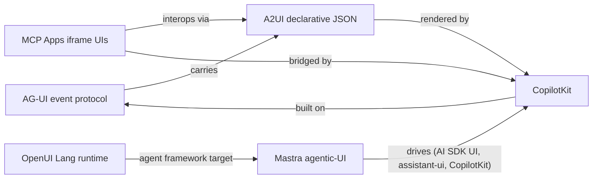

# Generative-UI ecosystem

This is the canonical cross-source hub for **how agents describe and stream user interfaces to clients**, comparing the competing (and partially interoperating) 2026-generation generative-UI efforts. It synthesizes the AG-UI, A2UI, OpenUI, and MCP Apps evidence into one comparison rather than treating each source in isolation.

Sources and durable concepts are documented on their own pages; this page maps their relationships and tradeoffs.

## The two questions every approach answers

1. **How does the agent describe UI to the client?** (wire model / surface)
2. **How do streaming, state sync, and human-in-the-loop interaction work?**

Different answers produce the four families below.

## Approach comparison

| Protocol / framework | Kind | How UI is described | Streaming & transport | State sync | HITL / security stance | Canonical home |
|---|---|---|---|---|---|---|
| [AG-UI](/protocols/ag-ui.md) | Event wire protocol | Typed event stream (~16 event types) + `RunAgentInput` | SSE, WebSockets, HTTP binary, custom via middleware layer | Bi-directional + `STATE_SNAPSHOT`/`STATE_DELTA` | Human-in-the-loop collaboration built-in | `ag-ui-protocol/ag-ui` |
| [A2UI](/protocols/a2ui.md) | Declarative JSON protocol | `A2UI Response` JSON (abstract component tree; Surfaces, Components, Catalogs) | Any JSON transport: A2A, AG-UI, SSE/WS, REST, gRPC; progressive rendering | Data model binding + `dataModelUpdate` | Declarative data, no code execution; client owns styling | a2ui.org |
| [OpenUI](/frameworks/openui.md) | Declarative language + runtime | OpenUI Lang DSL (assignment statements, component calls) → runtime parses/progressive-renders | Streaming-first language runtime | Conversation/artifact persistence (OpenUI Cloud) | Output validation via OpenUI Cloud; agent composes from client's component library | openui.com |
| [MCP Apps](/protocols/mcp-apps.md) | MCP extension (iframe apps) | Server-declared HTML UI resources (`mimeType text/html;profile=mcp-app`) | N/A at UI layer — secure iframe messaging | Host communicates with iframe app; mobile/desktop device caps | CSP-sandboxed iframe (connect-src, static origins), secure-by-default | `modelcontextprotocol/ext-apps` |

## How the approaches relate

Key relationships, with the page where each is explained:

- **AG-UI *carries* A2UI** — A2UI lists [AG-UI](/protocols/ag-ui.md) as one of the transports its JSON messages can travel over, and the AG-UI repo ships an `ag-ui-a2ui-integration` skill for adding A2UI rendering to AG-UI apps (see [AG-UI](/protocols/ag-ui.md) and [A2UI](/protocols/a2ui.md)).
- **A2UI *interops with* MCP Apps** — the A2UI site documents *A2UI over MCP*, *MCP Apps in A2UI*, and *A2UI in MCP Apps*; yet A2UI routes non-integrated remote widgets to iframes "like MCP Apps", marking a different integration depth (declarative in-renderer components vs iframe-wrapped apps) — see [A2UI](/protocols/a2ui.md) and [MCP Apps](/protocols/mcp-apps.md).
- **CopilotKit *consumes* all three generative-UI types** — its generative-UI playground renders static generative UI (`useRenderToolCall`), A2UI (`A2UIRenderer` + `HttpAgent` to an A2A backend), and MCP Apps (`MCPAppsMiddleware`) in one app, and it is **built on AG-UI** as its 1st-party client — see [CopilotKit](/frameworks/copilotkit.md).
- **Mastra drives multiple frontends** — the same agent framework runs under Vercel AI SDK, assistant-ui, CopilotKit, and HITL via its UI dojo and `@mastra/ai-sdk` — see [Mastra agentic-UI](/frameworks/mastra-agentic-ui.md).
- **OpenUI targets the same agent frameworks** — it lists CopilotKit, LangGraph, Mastra, and Vercel AI SDK as integration surfaces, but as a language-and-runtime stack rather than a pure wire protocol — see [OpenUI](/frameworks/openui.md).

## Design-space tradeoffs

- **Event-based vs declarative.** [AG-UI](/protocols/ag-ui.md) streams *typed events* (a running, tool-calling, state-changing process), while [A2UI](/protocols/a2ui.md) sends a *declarative JSON payload* describing the end UI. Event-based suits live, long-running agent sessions with human-in-the-loop; declarative suits safe, renderer-agnostic, no-code-execution UIs.
- **Language vs schema.** [OpenUI](/frameworks/openui.md) is a streaming *language and runtime* (agent composes from *your* component library); A2UI is a *JSON schema* with negotiated component catalogs (client maps to native widgets on web/mobile/desktop).
- **In-renderer vs iframe.** [MCP Apps](/protocols/mcp-apps.md) wraps third-party HTML in a CSP-sandboxed iframe (richer, but code-bearing and host-integrated via messaging); A2UI/OpenUI stay purely data-driven inside the client's own renderer.
- **Standalone vs ecosystem extension.** MCP Apps extends the [Model Context Protocol](/protocols/mcp-apps.md); AG-UI is a standalone agent-to-UI protocol that pairs with MCP (agent-to-tools); A2UI and OpenUI are transport-agnostic formats/languages.

## Where they agree

- **Differentiation from text-only output** — all four exist because text-only agent replies are inefficient (booking flows, dashboards, wizards).
- **Human-in-the-loop** is treated as first-class: AG-UI lists it as a stack feature; Mastra's dojo trails workflow suspend/resume for user approval; CopilotKit has `useHumanInTheLoop` approval flows.
- **A multi-frontend market** — Mastra and OpenUI both treat CopilotKit, assistant-ui, Vercel AI SDK as interchangeable, signaling that no single generative-UI protocol has won yet.

## Status and confidence

- The ecosystem is actively consolidating (CopilotKit monorepo, A2UI v1.0 candidate, MCP Apps spec 2026-01-26, AG-UI growing integrations). A2UI's roadmap targets full-app UIs and multi-agent coordination through 2026–2027.
- **Confidence:** the protocol/framework characteristics are **source-backed** from each project's primary docs. Explicit interop claims (AG-UI↔A2UI, A2UI↔MCP Apps, CopilotKit's three-type playground) are **confirmed** in the sense of being directly claimed in the sources, but not independently cross-checked.

## Source Map

- [Web-search generative-UI source evidence](/sources/web-search-generative-ui.md) — combined evidence and reliability notes for this page.
- Participant pages: [AG-UI](/protocols/ag-ui.md) · [A2UI](/protocols/a2ui.md) · [MCP Apps](/protocols/mcp-apps.md) · [OpenUI](/frameworks/openui.md) · [CopilotKit](/frameworks/copilotkit.md) · [Mastra agentic-UI](/frameworks/mastra-agentic-ui.md)