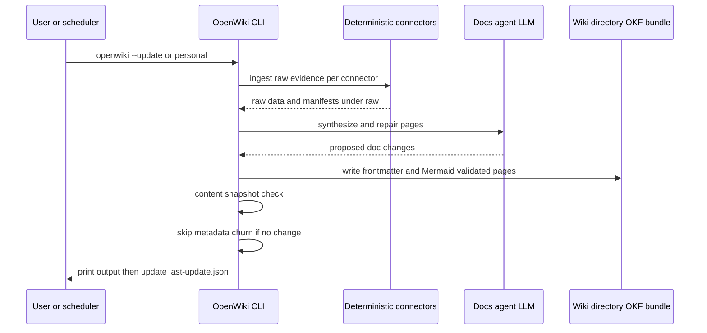

# OpenWiki

**OpenWiki** is the "self-maintaining wiki" CLI — *built for agents, explored by humans* — maintained by `langchain-ai` (MIT, npm, TypeScript). An agent reads your sources, synthesizes a linked Markdown wiki you own, and keeps it current on every change. It is built for agents to read as memory, and it ships an interactive visualizer for humans to explore (source: [langchain-ai/openwiki README](https://github.com/langchain-ai/openwiki/blob/main/README.md)).

OpenWiki is the tooling that maintains this corpus: in **personal** mode it synthesizes connected sources into `~/.openwiki/wiki`, which is an [Open Knowledge Format (OKF)](/protocols/open-knowledge-format.md) bundle (the README declares OKF v0.1 output). OpenWiki links to the wider [OKF ecosystem](/protocols/open-knowledge-format.md#ecosystem-and-tooling): independent producers (okc, erd2okf) and MCP servers (okf-mcp) target the same format.

## What it gives you

- **Agent-written docs that stay accurate**, generated by a Deep Agents documentation agent.
- **Two modes**: a `code` wiki for a repository, or a `personal` wiki for your own knowledge.
- **Thirteen model providers** out of the box (run 2 source-backed): OpenAI (API key or ChatGPT OAuth), GitHub Copilot (via GitHub CLI), OpenRouter, Anthropic, Gemini (AI Studio), Gemini Enterprise (Vertex AI, keyless via Google ADC), AWS Bedrock, Nebius Token Factory, Baseten, Fireworks, NVIDIA NIM, and any OpenAI-compatible gateway.
- **Built-in connectors** for Custom MCP, Notion, Slack, Gmail, X, Web Search, Hacker News, and local git repositories.
- An **interactive visualizer** that turns any wiki into a live, explorable node graph.
- **Self-updating** through GitHub Actions, GitLab CI, or Bitbucket Pipelines.
- **Open Knowledge Format (OKF v0.1) output** with validated Mermaid diagrams.

## Two modes

Bare `openwiki`, `openwiki --init`, and `openwiki --update` default to **code** mode; add the `personal` positional (or `--mode personal`) for the personal brain.

| Mode | Documents | Writes to | Get started |
| --- | --- | --- | --- |
| **Code** *(default)* | The current repository | `openwiki/` in the repo | `openwiki --init` |
| **Personal** | Your connected sources | `~/.openwiki/wiki` | `openwiki personal --init` |

By default the CLI stays open after a run so you can send follow-up messages. Add `-p` / `--print` for a one-shot, non-interactive run. `--init` and `--update` auto-exit on success in an interactive terminal.

## Connectors and ingestion

In personal mode OpenWiki ingests knowledge from the tools you already use, synthesizing them into your local wiki. First-run onboarding offers setup for **local git repositories, Notion, Gmail, X/Twitter, Web Search, and Hacker News**.

During an ingestion run, deterministic connector tools write raw data and manifests under `~/.openwiki/connectors/<id>/raw/`; then source-specific agent runs synthesize the wiki under `~/.openwiki/wiki/`. You can configure the same connector more than once (for example one Web Search source for AI research and another for NBA news); OpenWiki stores them as separate instances like `web-search-1` and `web-search-2`.

Operational state on disk (from `operations/credentials-and-updates.md`, retrieved run 2): `~/.openwiki/.env` (credentials, mode `0o600` in `0o700` dir), `~/.openwiki/INSTRUCTIONS.md` (the personal-mode wiki brief, editable directly; code mode stores `/openwiki/INSTRUCTIONS.md`), `~/.openwiki/onboarding.json` (selected template, connected sources, per-source ingestion guidance, per-source cron expressions + plain-English schedules, macOS LaunchAgent paths and `pmset` wake/sleep metadata), and `openwiki/.last-update.json` (update metadata).

Connector specifics (from the README):

- `git-repo` reads configured local repository paths and writes compact manifests.
- `x` uses the X API directly with OAuth user-context credentials for home timeline, user posts, mentions, bookmarks, and list posts.
- `notion` targets the hosted Notion MCP server, so authenticate through Notion OAuth rather than pasting a token.
- `google` uses the Gmail API directly with OAuth user credentials to fetch recent mail.
- `web-search` uses Tavily through LangChain and requires `TAVILY_API_KEY`.
- `hackernews` uses the public Hacker News feed and search APIs, with no credentials required.

## Authentication

`openwiki auth` runs a local browser OAuth flow, saves returned tokens into `~/.openwiki/.env`, creates connector config when possible, and discovers MCP tools for MCP-backed providers. Slack and Gmail require app client credentials to already be set in that file; Notion uses dynamic client registration for hosted MCP; X uses OAuth 2.0 with PKCE. `openwiki auth configure` and `openwiki auth tools` are advanced retry commands. Connector secrets are referenced by env var name and stored in `~/.openwiki/.env`; connector config files never contain raw secret values.

## Visualizer

`openwiki visualize` serves the wiki on a local loopback address (`127.0.0.1`, never exposed on the network) and opens your browser to an interactive node graph beside a live Markdown reader:

```
openwiki visualize --port 4400 --no-open
openwiki visualize openwiki --export docs/openwiki-visualizer
```

The `--export` mode emits `index.html`, `client.js`, `client-lib.js`, and `graph.json` for static hosting (GitHub Pages, MkDocs, others). The page loads graph/Markdown/diagram libraries from a public CDN, so an internet connection is required for both local and static viewers.

## Self-updating through CI

OpenWiki ships example workflows to keep a code wiki current:

- **GitHub Actions**: `examples/openwiki-update.yml` — runs on schedule (daily at 08:00 UTC) and manual dispatch, checks out the repository with `fetch-depth: 0` (full history) so `update` can diff HEAD against the commit it last documented (a shallow clone hides that commit and the update runs against an empty change summary), installs Node.js 22, installs OpenWiki globally, runs `openwiki code --update --print`, passes `OPENROUTER_API_KEY`/`OPENWIKI_MODEL_ID`/`LANGSMITH_API_KEY` from secrets, and opens a PR scoped to the `openwiki` directory via `peter-evans/create-pull-request`.
- **GitLab CI**: `examples/openwiki-update.gitlab-ci.yml`.
- **Bitbucket Pipelines**: `examples/openwiki-update.bitbucket-pipelines.yml`.

The CI examples are provider-aware: the generated workflow emits an env block matched to your configured provider so scheduled runs work out of the box. All three providers document that scheduled runs clone with **full history** (`fetch-depth: 0` / `GIT_DEPTH: "0"` / `depth: full`) because a shallow clone hides the last-documented commit and the update would run against an empty change summary; secrets pass through `secrets.` and non-secret settings through `vars.`, with `OPENWIKI_MODEL_ID` JSON-quoted (a Cloudflare Workers AI ID leading with `@` is a reserved YAML scalar). A `checks.yml` workflow runs lint/format CI checks. Provider selection resolves via `resolveConfiguredProvider()`: the `OPENWIKI_PROVIDER` env var wins, else the first available provider API key (OpenAI, OpenAI-compatible, OpenRouter, Anthropic, Baseten, Fireworks, Nebius, NVIDIA, Bedrock), else the default `openai`/`gpt-5.6-terra` model; the copilot provider is selectable but never auto-detected (its credential comes from the GitHub CLI at runtime).

## Architecture highlights

OpenWiki is a TypeScript CLI with a single `openwiki` binary; local credentials stored in `~/.openwiki/.env`; update metadata recorded in `openwiki/.last-update.json` (code mode) / the wiki's `.last-update.json` (personal mode). Architecture docs cover:

- The **Deep Agents documentation agent** drives each run (`src/agent/` with prompt templates `prompts/code.ts` and `prompts/personal.ts`); git evidence is gathered by the agent during the run. The agent runtime uses a **docs-only local shell backend** (`src/agent/docs-only-backend.ts`, extending DeepAgents `LocalShellBackend`) that refuses writes outside the wiki, and a `CompositeBackend` layering read-only `/skills/` and `/conversation_history/` virtual mounts on the documented repository (run 2 architecture detail).
- **OKF middleware** (`src/agent/okf-middleware.ts`) migrates existing pages to valid OKF frontmatter before the agent runs, validates frontmatter on every write, and — in its `afterAgent` finalize stage — runs three validation passes: **Mermaid fences** (`src/mermaid/wiki.ts`), **index synchronization**, and **internal-link validation** (`src/agent/wiki-link-validator.ts`; resolves targets repo-wide and GitHub-style heading anchors, stamping broken links inline with `openwiki:` comments instead of failing the run). **Translation middleware** (`src/agent/translation-middleware.ts`) translates eligible pages before the agent runs when the output language differs, retranslating pages marked `openwiki_translation_pending` from a prior failed run.
- Platform: diagnostics with secret redaction, language handling, telemetry (`src/telemetry/`) — anonymous usage telemetry with PostHog, opt-out, CI sentinel IDs, error classification/fingerprinting, and a baked-in `build_channel` stamp.
- **Mermaid** handling: fence extraction, validation, and wiki repair.
- Deterministic engine (frontmatter validation, index-label localization by BCP-47, index synchronization) in `src/okf/`.
- Connectors registry, tools, and types; ingestion (`src/ingestion/`); auth system (`src/auth/`: generic OAuth runner, provider configs, `configure`, Slack `ngrok` HTTPS tunnel, token refresh/validation, OAuth discovery); ChatGPT OAuth provider (`src/agent/openai-chatgpt-oauth.ts`); a DeepSWE evaluation harness (`evals/deepswe/`) measuring documentation leverage on a Codex agent; `.openwikiignore` read boundary (`src/agent/openwiki-ignore.ts`); `--language` (BCP-47) non-English wiki generation.
- Release flow uses **Changesets**: merged PR → Release workflow opens "chore: version packages" PR → merging bumps the version, updates CHANGELOG.md, and publishes.

Durability notes: after a non-chat run, `src/agent/utils.ts` computes a SHA-256 snapshot of the wiki directory (excluding `.last-update.json`) and writes metadata **only if the snapshot changed** — a no-op update that leaves docs untouched does not update `.last-update.json`, preventing endless loops in scheduled workflows. Auto-exit behavior: `--init`/`--update` (without `--print`) auto-exit on success in a TTY. On Windows, npm/pnpm install is preferred — the Bun global-install path can fall back to compiling `better-sqlite3`, which requires Visual Studio Build Tools (and Bun does not run install lifecycle scripts). [OpenWiki quickstart](https://github.com/langchain-ai/openwiki/blob/main/openwiki/quickstart.md) and [architecture overview](https://github.com/langchain-ai/openwiki/blob/main/openwiki/architecture/overview.md) are the canonical in-repo docs (retrieved this run).

## Relationship to OKF

OpenWiki emits **Open Knowledge Format (OKF v0.1)** documents and validates Mermaid diagrams. The [OKF spec](/protocols/open-knowledge-format.md) in `GoogleCloudPlatform/knowledge-catalog` is at **v0.2**; the README declares v0.1 output, and the in-repo docs mention `okf_version`-aware index handling. The version relationship is tracked as an [open question](/open-questions.md). Personal-mode wikis (like this one) are structurally an OKF bundle: reserved `index.md`/`log.md` filenames, required `type` frontmatter, markdown-link relationships, and `references/` conventions.


*OpenWiki run flow: deterministic connectors write raw evidence, the docs agent synthesizes pages, and the CLI validates frontmatter/Mermaid, skips churn when nothing changed, and records update metadata.*

## Sources and reliability

Primary: the [OpenWiki repository](https://github.com/langchain-ai/openwiki), its [README](https://github.com/langchain-ai/openwiki/blob/main/README.md), bundled docs (`quickstart.md`, `architecture/overview.md`, `operations/credentials-and-updates.md`), and CI examples — retrieved as raw evidence in the 2026-08-17 and 2026-08-18 web-search Agent wiki runs. The Tavily-synthesized `answer` fields for both runs are **unverified/hallucinated** and were not adopted (run 2's answer described a generic GitHub Actions update workflow with no release information). See the [web-search Agent wiki source page](/sources/web-search-agent-wiki.md).

## Confidence and gaps

- **Confirmed:** OpenWiki's identity, two modes, connector list, OKF v0.1 output claim, visualizer behavior, CI example shapes (README + repo pages retrieved this run).
- **Source-backed (run 2):** the 13-provider list with credential models, operational file layout (`INSTRUCTIONS.md`, `onboarding.json` with cron/LaunchAgent/`pmset` metadata), full-history CI clones, provider resolution order, SHA-256 content-snapshot no-op behavior, docs-only backend + virtual mounts, and the three validation passes — from the repo's `openwiki/` docs (quickstart, architecture/overview, operations/credentials-and-updates) retrieved as raw evidence.
- **Watchlist:** current release/version number; the actual OKF version emitted by the current npm build; whether the v0.2 spec is adopted (open question).
- Gap: no formal release artifacts/versions were retrieved either run (the `/releases` query returned repository docs). Direct release-file ingestion is the follow-up (see [open questions](/open-questions.md) and [backlog](/quickstart.md#backlog)).