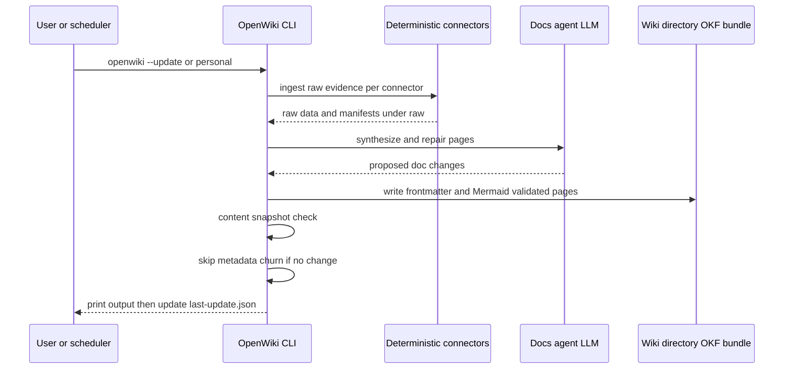

# OpenWiki

**OpenWiki** is the "self-maintaining wiki" CLI — *built for agents, explored by humans* — maintained by `langchain-ai` (MIT, npm, TypeScript). An agent reads your sources, synthesizes a linked Markdown wiki you own, and keeps it current on every change. It is built for agents to read as memory, and it ships an interactive visualizer for humans to explore (source: [langchain-ai/openwiki README](https://github.com/langchain-ai/openwiki/blob/main/README.md)).

OpenWiki is the tooling that maintains this corpus: in **personal** mode it synthesizes connected sources into `~/.openwiki/wiki`, which is an [Open Knowledge Format (OKF)](/protocols/open-knowledge-format.md) bundle. The current README declares **OKF v0.2 output in both modes** ("so your wiki is portable to any OKF-aware tool") — the earlier v0.1 declaration was superseded on `main` (tracked via the answered [open question](/open-questions.md)). The [architecture overview](https://github.com/langchain-ai/openwiki/blob/main/openwiki/architecture/overview.md) (re-retrieved 2026-08-29) frames that output as a **"portable OKF v0.2 Markdown bundle grounded in versioned source Claims"** — the OKF [provenance `sources`](/protocols/open-knowledge-format.md#51-provenance-sources) family operationalized. OpenWiki links to the wider [OKF ecosystem](/protocols/open-knowledge-format.md#ecosystem-and-tooling): independent producers (okc, erd2okf, openknowledge, okf-ingest) and MCP servers (okf-mcp) target the same format.

## What it gives you

- **Agent-written docs that stay accurate**, generated by a Deep Agents documentation agent.
- **Two modes**: a `code` wiki for a repository, or a `personal` wiki for your own knowledge.
- **Model providers** — the current README lists **12** ("from OpenAI and Anthropic to Bedrock, Gemini, and any OpenAI-compatible gateway"); run 2 (2026-08-18) documented 13 incl. **GitHub Copilot (via GitHub CLI)**, which shipped as a v0.3.3 feature ("feat: add github copilot as a model provider for inference", #192), so ≥13 is expected on newer builds: OpenAI (API key or ChatGPT OAuth), GitHub Copilot (via GitHub CLI), OpenRouter, Anthropic, Gemini (AI Studio), Gemini Enterprise (Vertex AI, keyless via Google ADC), AWS Bedrock, Nebius Token Factory, Baseten, Fireworks, NVIDIA NIM, and any OpenAI-compatible gateway.
- **Built-in connectors** for Custom MCP, Notion, Slack, Gmail, X, Web Search, Hacker News, and local git repositories.
- An **interactive visualizer** that turns any wiki into a live, explorable node graph.
- **Self-updating** through GitHub Actions, GitLab CI, or Bitbucket Pipelines.
- **Open Knowledge Format (OKF v0.2) output** (README, 2026-08-22 retrieved; replaces the earlier v0.1 declaration) with validated Mermaid diagrams.

## Releases

Two complementary version surfaces are now documented:

- **Releases-page trail (source-backed 2026-08-22 from the raw releases-page fragment):** **Latest: v0.3.3** (v0.3.2, v0.3.1, v0.3.0, v0.2.5, 0.2.4, 0.2.3, 0.2.2, 0.2.1, 0.2.0 listed before it on the page). The 2026-08-27 re-pull returned no release-page artifacts and no version change; the fragment did not capture release *dates* or complete v0.2.x–v0.3.x changelogs.
- **`main` HEAD version (source-backed 2026-08-29, `package.json` retrieved that run; re-pulled 2026-09-19):** the repo's `package.json` declares **`"version": "0.4.3"`** — the npm package (Node `>=22`, bin `./dist/cli/cli.js`) is at v0.4.3 on `main`, ahead of the last releases-page-confirmed v0.3.3. Dependencies visible in the retrieved fragments include `deepagents@1.12.0`, `langchain@^1.5.3`, `langsmith@^0.8.3`, `@modelcontextprotocol/sdk@^1.30.0`, `@anthropic-ai/vertex-sdk@^0.19.0`, and PostHog telemetry (`posthog-node`). The **2026-09-19 re-pull added a wider dependency view** (first time bedrock `@aws-sdk/client-bedrock-runtime@^3.1080.0`, the full `@langchain/*` provider set — `anthropic@^1.5.1`, `aws@^1.4.2`, `core@^1.2.4`, `google@^0.2.1`, `openai@^1.5.5`, `openrouter@^0.4.3`, `tavily@1.2.0`, plus **`@langchain/protocol@^0.0.18`** — `ci-info`, `google-auth-library`, `jsonc-parser`, and `@changesets/cli`/`@changesets/changelog-github` dev deps; scripts now show `eval:ledger` (`tsx evals/ledger/run.ts`), `postbuild` chmod, `release` = `stamp:channel` → build → `changeset publish`, and `packageManager pnpm@10.33.2`). The `version` field was again stub-blocked in the fragment, so **v0.4.3 remains a HEAD-version signal** (uncontradicted; treat the v0.3.3-latest releases-page trail as still authoritative for shipped releases until a v0.4.x release page appears).
- **Release-flow activity signal (watchlist, 2026-09-19):** the workflows-runs page shows a Release workflow entry — **"OpenWiki (#896)" and "Release #181: Commit 715109a"** — the first in-scope evidence that the Changesets release flow has run past the v0.3.3 trail fragments (no version number captured). The pulls page also shows "update OpenWiki #908 opened 15 hours" and the activity feed a deleted "OpenWiki (#892)" entry — ongoing update/release churn on `main`.
- **v0.3.3 notable changes** (from the release body fragment): `feat: add github copilot as a model provider for inference` (#192), `feat: add support for multilingual output in openwiki agent` (#477), `fix: cap retry-after delays for connector retries` (#466), `fix: harden raw connector file handling` (#401), `fix: reject invalid hackernews feed configs` (#483), `fix: prevent file/image content blocks from leaking into CLI output` (#215), docs updates (#473, #488), and a postcss dependency bump (#493).
- The release body also references a Changesets-generated line "release: 0.2.4 by Brace Sproul (#522)" — historical changelog prose bundled into the release body, not the current version.
- Generated bundle frontmatter stamps the engine version: a usage-doc sample shows `verified: by openwiki/0.3.3` at **2026-08-21 08:12:50 UTC**.
- Ongoing `main` work: "fix: harden okf claims provenance and update grounding (#692)" (branch `colifran/improve-okf`) plus the `changeset-release/main` action-required workflow — active OKF-provenance hardening and the Changesets [release flow](#releases) continue.
- Gap: the fragment did not capture release *dates* or complete v0.2.x–v0.4.x changelogs; direct release ingestion remains the follow-up (see [open questions](/open-questions.md)).

## Two modes

Bare `openwiki`, `openwiki --init`, and `openwiki --update` default to **code** mode; add the `personal` positional (or `--mode personal`) for the personal brain.

| Mode | Documents | Writes to | Get started |
| --- | --- | --- | --- |
| **Code** *(default)* | The current repository | `openwiki/` in the repo | `openwiki --init` |
| **Personal** | Your connected sources | `~/.openwiki/wiki` | `openwiki personal --init` |

By default the CLI stays open after a run so you can send follow-up messages. Add `-p` / `--print` for a one-shot, non-interactive run. `--init` and `--update` auto-exit on success in an interactive terminal.

### CLI entry patterns and auth (from `openwiki/cli/usage.md`, retrieved 2026-09-19)

The [CLI usage reference](https://github.com/langchain-ai/openwiki/blob/main/openwiki/cli/usage.md) (a wiki page inside the repo, itself an OKF document with `sources` frontmatter entries — e.g. `openwiki-source-3fc16f…` → `repo://src/cli/commands.ts` and `openwiki-source-ada18c…` → `repo://src/cli/integrations.ts` — mirroring the [OKF §5.1 Claim-grounding](/protocols/open-knowledge-format.md#51-provenance-sources) model this wiki follows) documents the supported entry patterns:

- `openwiki` — open the interactive chat UI.
- `openwiki --modelId` / `--model-id <id>` — choose a model ID for the run.
- `openwiki visualize [path] [--port N] [--no-open]` — serve the interactive node-graph visualizer on a local loopback address.
- `openwiki auth` — run OAuth login for a connector provider (gmail, notion, slack, x).
- The parser rejects incompatible combos (`--init` with `--update`) and requires a message or command with `--print`.

Run mechanics: explicit `openwiki personal --init` / `openwiki code --init` (or `--update`) in a TTY without `--print` starts the run, streams agent output, and **exits automatically on success** (`shouldAutoExitStartupRun` in `src/cli/app/app.tsx`). When stdin is not a TTY (e.g. CI) or `--print` is used, the CLI requires provider credentials already saved in `~/.openwiki/.env` or the environment — the provider API key, or `GOOGLE_CLOUD_PROJECT` for the gemini-enterprise provider. In-session commands include `/provider`, `/model`, and `/effort` (for reasoning-capable models). Provider env-var names enumerated: `OPENROUTER_API_KEY`, `OPENAI_API_KEY`, `OPENAI_COMPATIBLE_API_KEY`, `ANTHROPIC_API_KEY`, `BASETEN_API_KEY`, `FIREWORKS_API_KEY`, `GEMINI_API_KEY`, `NEBIUS_API_KEY`; the gemini-enterprise provider instead prompts for a **GCP project** (`GOOGLE_CLOUD_PROJECT`, required) and **GCP location** (`GOOGLE_CLOUD_LOCATION`, optional, default `global`); the bedrock provider prompts for AWS access key ID, secret access key, and region; the copilot provider uses the GitHub CLI (`gh auth login`) instead of an API key.

## Connectors and ingestion

In personal mode OpenWiki ingests knowledge from the tools you already use, synthesizing them into your local wiki. First-run onboarding offers setup for **local git repositories, Notion, Gmail, X/Twitter, Web Search, and Hacker News**.

During an ingestion run, deterministic connector tools write raw data and manifests under `~/.openwiki/connectors/<id>/raw/`; then source-specific agent runs synthesize the wiki under `~/.openwiki/wiki/`. You can configure the same connector more than once (for example one Web Search source for AI research and another for NBA news); OpenWiki stores them as separate instances like `web-search-1` and `web-search-2`.

Operational state on disk (from `operations/credentials-and-updates.md`, retrieved run 2): `~/.openwiki/.env` (credentials, mode `0o600` in `0o700` dir), `~/.openwiki/INSTRUCTIONS.md` (the personal-mode wiki brief, editable directly; code mode stores `/openwiki/INSTRUCTIONS.md`), `~/.openwiki/onboarding.json` (selected template, connected sources, per-source ingestion guidance, per-source cron expressions + plain-English schedules, macOS LaunchAgent paths and `pmset` wake/sleep metadata), and `openwiki/.last-update.json` (update metadata).

Connector specifics (from the README):

- `git-repo` reads configured local repository paths and writes compact manifests.
- `x` uses the X API directly with OAuth user-context credentials for home timeline, user posts, mentions, bookmarks, and list posts.
- `notion` targets the hosted Notion MCP server, so authenticate through Notion OAuth rather than pasting a token.
- `google` uses the Gmail API directly with OAuth user credentials to fetch recent mail.
- `web-search` uses Tavily through LangChain and requires `TAVILY_API_KEY`.
- `hackernews` uses the public Hacker News feed and search APIs, with no credentials required.
- `langsmith` — a built-in connector surfaced in the repo's `quickstart.md` source tree this run (2026-08-27): `src/connectors/sources/langsmith/` (`api.ts`, `index.ts`, `repo-config.ts`, `runs.ts`, `setup.ts`, `types.ts`) adds LangSmith trace/run evidence as a source (note: not listed in the README's connector count, which the repo's own docs also omit). The 2026-08-29 `package.json` re-pull corroborates the dependency (`langsmith@^0.8.3`).

## Authentication

`openwiki auth` runs a local browser OAuth flow, saves returned tokens into `~/.openwiki/.env`, creates connector config when possible, and discovers MCP tools for MCP-backed providers. Slack and Gmail require app client credentials to already be set in that file; Notion uses dynamic client registration for hosted MCP; X uses OAuth 2.0 with PKCE. `openwiki auth configure` and `openwiki auth tools` are advanced retry commands. Connector secrets are referenced by env var name and stored in `~/.openwiki/.env`; connector config files never contain raw secret values.

## Visualizer

`openwiki visualize` serves the wiki on a local loopback address (`127.0.0.1`, never exposed on the network) and opens your browser to an interactive node graph beside a live Markdown reader:

```
openwiki visualize --port 4400 --no-open
openwiki visualize openwiki --export docs/openwiki-visualizer
```

The `--export` mode emits `index.html`, `client.js`, `client-lib.js`, and `graph.json` for static hosting (GitHub Pages, MkDocs, others). The page loads graph/Markdown/diagram libraries from a public CDN, so an internet connection is required for both local and static viewers.

## Self-updating through CI

OpenWiki ships example workflows to keep a code wiki current:

- **GitHub Actions**: `examples/openwiki-update.yml` — runs on schedule (daily at 08:00 UTC) and manual dispatch, checks out the repository with `fetch-depth: 0` (full history) so `update` can diff HEAD against the commit it last documented (a shallow clone hides that commit and the update runs against an empty change summary), installs Node.js 22, installs OpenWiki globally, runs `openwiki code --update --print`, passes `OPENROUTER_API_KEY`/`OPENWIKI_MODEL_ID`/`LANGSMITH_API_KEY` from secrets, and opens a PR scoped to the `openwiki` directory via `peter-evans/create-pull-request`.
- **GitLab CI**: `examples/openwiki-update.gitlab-ci.yml`.
- **Bitbucket Pipelines**: `examples/openwiki-update.bitbucket-pipelines.yml`.

The CI examples are provider-aware: the generated workflow emits an env block matched to your configured provider so scheduled runs work out of the box. All three providers document that scheduled runs clone with **full history** (`fetch-depth: 0` / `GIT_DEPTH: "0"` / `depth: full`) because a shallow clone hides the last-documented commit and the update would run against an empty change summary; secrets pass through `secrets.` and non-secret settings through `vars.`, with `OPENWIKI_MODEL_ID` JSON-quoted (a Cloudflare Workers AI ID leading with `@` is a reserved YAML scalar). A `checks.yml` workflow runs lint/format CI checks. Provider selection resolves via `resolveConfiguredProvider()`: the `OPENWIKI_PROVIDER` env var wins, else the first available provider API key (OpenAI, OpenAI-compatible, OpenRouter, Anthropic, Baseten, Fireworks, Nebius, NVIDIA, Bedrock), else the default `openai`/`gpt-5.6-terra` model; the copilot provider is selectable but never auto-detected (its credential comes from the GitHub CLI at runtime).

## Architecture highlights

OpenWiki is a TypeScript CLI with a single `openwiki` binary; local credentials stored in `~/.openwiki/.env`; update metadata recorded in `openwiki/.last-update.json` (code mode) / the wiki's `.last-update.json` (personal mode). Architecture docs cover:

- The **Deep Agents documentation agent** drives each run (`src/agent/` with prompt templates `prompts/code.ts` and `prompts/personal.ts`); git evidence is gathered by the agent during the run. The agent runtime uses a **docs-only local shell backend** (`src/agent/docs-only-backend.ts`, extending DeepAgents `LocalShellBackend`) that refuses writes outside the wiki, and a `CompositeBackend` layering read-only `/skills/` and `/conversation_history/` virtual mounts on the documented repository (run 2 architecture detail).
- **OKF middleware** (`src/agent/okf-middleware.ts`) migrates existing pages to valid OKF frontmatter before the agent runs, validates frontmatter on every write, and — in its `afterAgent` finalize stage — runs three validation passes: **Mermaid fences** (`src/mermaid/wiki.ts`), **index synchronization**, and **internal-link validation** (`src/agent/wiki-link-validator.ts`; resolves targets repo-wide and GitHub-style heading anchors, stamping broken links inline with `openwiki:` comments instead of failing the run). **Translation middleware** (`src/agent/translation-middleware.ts`) translates eligible pages before the agent runs when the output language differs, retranslating pages marked `openwiki_translation_pending` from a prior failed run.
- **The "v1 boundary"** (CONTRIBUTING.md, retrieved 2026-08-29) keeps the v1 scope narrow: **host agents use their native repository tools** for investigation and Markdown authoring, while **OpenWiki owns deterministic preparation, finalization, metadata, provenance, and managed setup files**. This is the ownership line behind the docs-only backend/`CompositeBackend` split above. The same file documents the **Changesets release mechanics**: merged PR → Release workflow opens a "chore: version packages" PR → merging bumps the version and publishes; bump types follow semver (patch/minor/major), docs/CI-only changes need no changeset, and intent to not release can be recorded with `pnpm changeset --empty`.
- Platform: diagnostics with secret redaction, language handling, telemetry (`src/telemetry/`) — anonymous usage telemetry with PostHog, opt-out, CI sentinel IDs, error classification/fingerprinting, and a baked-in `build_channel` stamp. The 2026-09-19 README retrieval adds the precise event shape: collected on a single `openwiki_run` event keyed by a **random install ID in `~/.openwiki/install-id`** — the command (init/update), the outcome (success/failure/no-op) with a coarse error category on failure (never the message), and at setup only the brain mode, model provider, and configured connector names. The repo file listing (from the `aitoolnet.com` README mirror) shows the expanded top-level layout — `.changeset/`, `.claude/`, `.github/`, `evals/`, `examples/`, `integrations/openwiki/`, `openwiki/`, `scripts/`, `skills/`, `src/`, `static/`, `test/`, plus `CHANGELOG.md`, `DEVELOPMENT.md`, and root `AGENTS.md`/`CLAUDE.md`.
- **Mermaid** handling: fence extraction, validation, and wiki repair.
- Deterministic engine (frontmatter validation, index-label localization by BCP-47, index synchronization) in `src/okf/`.
- Connectors registry, tools, and types; ingestion (`src/ingestion/`); auth system (`src/auth/`: generic OAuth runner, provider configs, `configure`, Slack `ngrok` HTTPS tunnel, token refresh/validation, OAuth discovery); ChatGPT OAuth provider (`src/agent/openai-chatgpt-oauth.ts`); a DeepSWE evaluation harness (`evals/deepswe/`) measuring documentation leverage on a Codex agent; `.openwikiignore` read boundary (`src/agent/openwiki-ignore.ts`); `--language` (BCP-47) non-English wiki generation.
- Release flow uses **Changesets**: merged PR → Release workflow opens "chore: version packages" PR → merging bumps the version, updates CHANGELOG.md, and publishes. This is the same flow that produced the [v0.3.x line](#releases).

Durability notes: after a non-chat run, `src/agent/utils.ts` computes a SHA-256 snapshot of the wiki directory (excluding `.last-update.json`) and writes metadata **only if the snapshot changed** — a no-op update that leaves docs untouched does not update `.last-update.json`, preventing endless loops in scheduled workflows. Auto-exit behavior: `--init`/`--update` (without `--print`) auto-exit on success in a TTY. On Windows, npm/pnpm install is preferred — the Bun global-install path can fall back to compiling `better-sqlite3`, which requires Visual Studio Build Tools (and Bun does not run install lifecycle scripts). [OpenWiki quickstart](https://github.com/langchain-ai/openwiki/blob/main/openwiki/quickstart.md) and [architecture overview](https://github.com/langchain-ai/openwiki/blob/main/openwiki/architecture/overview.md) are the canonical in-repo docs (retrieved this run).

## Relationship to OKF

OpenWiki emits **Open Knowledge Format** documents and validates Mermaid diagrams. The canonical [OKF spec](/protocols/open-knowledge-format.md) now lives in **`GoogleCloudPlatform/open-knowledge-format`** (the `knowledge-catalog/okf/` copy is a frozen snapshot, confirmed 2026-08-29) at **v0.2**, and the current OpenWiki README (retrieved 2026-08-22) declares **v0.2 output in both modes** — the earlier README's v0.1 declaration is superseded on `main` (see the [answered open question](/open-questions.md)). The [architecture overview](https://github.com/langchain-ai/openwiki/blob/main/openwiki/architecture/overview.md) describes the output as a **"portable OKF v0.2 Markdown bundle grounded in versioned source Claims"** — each wiki page's `sources` frontmatter (OKF [§5.1](/protocols/open-knowledge-format.md#51-provenance-sources)) records typed `id`/`resource` pairs such as `repo://README.md` or `repo://src/agent/index.ts`, tying page-level claims to versioned repository resources. The engine stamps generated bundles with its own actor: sample frontmatter shows `verified: by openwiki/0.3.3`. Personal-mode wikis (like this one) are structurally an OKF bundle: reserved `index.md`/`log.md` filenames, required `type` frontmatter, markdown-link relationships, and `references/` conventions.


```mermaid
sequenceDiagram
    participant U as User or scheduler
    participant C as OpenWiki CLI
    participant D as Deterministic connectors
    participant A as Docs agent LLM
    participant W as Wiki directory OKF bundle
    U->>C: openwiki --update or personal
    C->>D: ingest raw evidence per connector
    D-->>C: raw data and manifests under raw
    C->>A: synthesize and repair pages
    A-->>C: proposed doc changes
    C->>W: write frontmatter and Mermaid validated pages
    C->>C: content snapshot check
    C->>C: skip metadata churn if no change
    C-->>U: print output then update last-update.json
```
*OpenWiki run flow: deterministic connectors write raw evidence, the docs agent synthesizes pages, and the CLI validates frontmatter/Mermaid, skips churn when nothing changed, and records update metadata.*

## Sources and reliability

Primary: the [OpenWiki repository](https://github.com/langchain-ai/openwiki), its [README](https://github.com/langchain-ai/openwiki/blob/main/README.md), bundled docs (`quickstart.md`, `architecture/overview.md`, `operations/credentials-and-updates.md`, `cli/usage.md`), CI examples, and the [releases page](https://github.com/langchain-ai/openwiki/releases) — retrieved as raw evidence in the 2026-08-17, 2026-08-18, 2026-08-22, 2026-08-29, and 2026-09-19 web-search Agent wiki runs. The Tavily-synthesized `answer` fields are treated as unverified evidence; adoptions come from raw fragments (run 3's release-page `answer` matched the raw fragment this time but was not relied on). See the [web-search Agent wiki source page](/sources/web-search-agent-wiki.md).

## Confidence and gaps

- **Confirmed:** OpenWiki's identity, two modes, connector list, OKF output claim (now v0.2, 2026-08-22 README), visualizer behavior, CI example shapes (README + repo pages retrieved this run).
- **Source-backed (run 2):** the 13-provider list with credential models, operational file layout (`INSTRUCTIONS.md`, `onboarding.json` with cron/LaunchAgent/`pmset` metadata), full-history CI clones, provider resolution order, SHA-256 content-snapshot no-op behavior, docs-only backend + virtual mounts, and the three validation passes — from the repo's `openwiki/` docs (quickstart, architecture/overview, operations/credentials-and-updates) retrieved as raw evidence.
- **Source-backed (run 3):** the **v0.3.3-latest release trail** and v0.3.3 change list (raw releases-page fragment), the **OKF v0.2 output claim** (README), the **12-provider README count** (13 incl. Copilot on v0.3.3+), and the `verified: openwiki/0.3.3` engine stamp (usage-doc sample).
- **Watchlist:** OpenWiki release *dates* and complete v0.2.x–v0.4.x changelogs (fragment only); whether the npm build at HEAD matches the README's v0.2-output claim.
- **Source-backed (run 4, 2026-08-27):** the **`langsmith` built-in connector** — surfaced from the repo's `quickstart.md` source tree (`src/connectors/sources/langsmith/` with `api.ts`, `repo-config.ts`, `runs.ts`, `setup.ts`, `types.ts`); note the README's connector count (eight built-ins) is not affected — langsmith is a source module the README does not enumerate (see the [source page](/sources/web-search-agent-wiki.md)).
- **Source-backed (run 5, 2026-08-29, `package.json` + architecture/overview + CONTRIBUTING retrieved):** **`main` HEAD is at v0.4.3** (package `version` field; Node `>=22`; `deepagents@1.12.0` / `langchain@^1.5.3` / `langsmith@^0.8.3` / `@modelcontextprotocol/sdk@^1.30.0` deps), the architecture overview's **"portable OKF v0.2 Markdown bundle grounded in versioned source Claims"** wording, and the **v1 boundary** + Changesets mechanics from CONTRIBUTING. The v0.4.3 number is a HEAD/package.json signal — the releases-page trail still shows v0.3.3 latest until a v0.4.x release fragment appears (watchlist for actual v0.4.x release status).
- **Source-backed (run 6, 2026-09-19, `cli/usage.md` + README + `package.json` fragments retrieved):** the **CLI usage reference** (entry patterns; `--init`+`--update` rejection; TTY auto-exit via `shouldAutoExitStartupRun`; non-TTY/`--print` credential requirements; in-session `/provider` `/model` `/effort` commands; provider env-var enumeration incl. gemini-enterprise GCP project + bedrock AWS creds + copilot via GitHub CLI), the **telemetry event shape** (single `openwiki_run` event keyed by a random install ID in `~/.openwiki/install-id`; init/update × success/failure/no-op with coarse error category; setup-only brain mode/provider/connector names), the **expanded repo layout** (`.changeset/`, `.claude/`, `evals/`, `integrations/openwiki/`, `openwiki/`, `skills/`, `static/`, `CHANGELOG.md`, `DEVELOPMENT.md`, root `AGENTS.md`/`CLAUDE.md`), and the **wider `package.json` dependency view** (incl. `@langchain/protocol@^0.0.18`, `eval:ledger` scripts, `pnpm@10.33.2` package manager) — all from raw fragments. **Watchlist:** the workflows-runs **"Release #181: Commit 715109a"** + **"OpenWiki (#896)"** signal (first evidence the Changesets release flow ran past v0.3.3, no version captured), the "update OpenWiki #908 opened 15 hours" pull, and a deleted "OpenWiki (#892)" activity entry — repo churn, not adopted as release facts. The `version` field was again stub-blocked, so v0.4.3 stays a HEAD signal.
- Gap: only the top release-page fragment was retrieved; direct release-file ingestion (npm/GitHub) is the follow-up (see [open questions](/open-questions.md) — the version and OKF-emitted questions are answered, the dates/changelog detail and the v0.4.x-release confirmation remain).