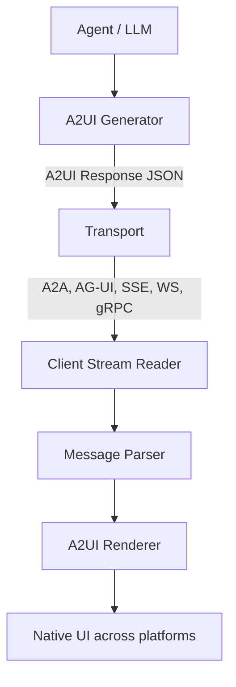

# A2UI (Agent to UI) Protocol

**A2UI (Agent to UI)** is an open, **declarative UI protocol for agent-driven interfaces**: AI agents generate rich, interactive UIs that render natively across platforms (web, mobile, desktop) *without executing arbitrary code*. Its core value propositions are framework-agnostic abstract component trees, separation of UI structure from application data, and declarative (data, not code) output for security.

Canonical materials: the A2UI site at <https://a2ui.org> and the Apache-2.0 reference repo [`a2ui-project/a2ui`](https://github.com/a2ui-project/a2ui). Evidence for this page lives on the [web-search generative-UI source page](/sources/web-search-generative-ui.md).

## Key concepts

A2UI is built on a small set of concepts:

- **Surface** — a distinct, controllable region of the client's UI identified by `surfaceId` (main content area, side panel, chat bubble); one agent stream can manage multiple surfaces independently, each with its own root component, hierarchy, and data model.
- **Component** — a UI element (Button, TextField, Card, Row, Column, …) expressed as a *typed abstract node*.
- **Data Model** — application state that components bind to (data binding). Bindings are defined with **JSON Pointers (RFC 6901)** whose resolution depends on the current **Evaluation Scope** (path resolution + variable scope during iteration).
- **Catalog** — the available component types, defined in a **Catalog Definition Document** (a JSON Schema document) so clients and servers can negotiate which catalog to use. `catalogId` is an arbitrary string ID used by A2UI SDKs and catalog negotiation (not a resolvable URI); per the v1.0 spec, catalogs should set both JSON Schema `$id` and `catalogId` to the same URI so renderer and agent developers can agree on shared catalogs with well-known IDs.
- **Message** — a JSON object such as `surfaceUpdate`, `dataModelUpdate`, or `beginRendering`. On the wire, streamed messages are usually formatted as **JSON Lines (JSONL)**, one complete JSON object per line.

## How an A2UI response is generated and rendered



End-to-end lifecycle (from the `a2ui-project/a2ui` README):

1. **Generation** — an Agent (Gemini or another LLM) generates or uses a pre-generated `A2UI Response`, a JSON payload describing the composition of UI components and their properties.
2. **Transport** — the message is sent to the client (via A2A, AG-UI, or other transports).
3. **Resolution** — the client's A2UI renderer parses the JSON.
4. **Rendering** — the renderer maps abstract components (e.g. `type: 'text-field'`) to concrete implementations in the client's codebase.

## Transports, progressive rendering, and data flow

A2UI separates the *transport contract* from *transport bindings*. Any transport that can carry JSON works:

- A2A Protocol (also used for agent-to-UI delivery)
- [AG-UI](/protocols/ag-ui.md) (bidirectional, real-time agent-UI protocol)
- REST / HTTP and Server-Sent Events (one-way streaming)
- WebSocket (persistent bidirectional connection)
- Any other (gRPC, message queues, custom) — "if it can carry JSON, it works"

The data-flow pipeline (from the A2UI data-flow page):

```
Agent (LLM) → A2UI Generator → Transport (SSE/WS/A2A)
    ↓
Client (Stream Reader) → Message Parser → Renderer → Native UI
```

**Progressive rendering** lets chunks of the response stream to the client as they are generated, so users see the UI build in real time rather than waiting on a spinner.

**Client-to-server traffic** is handled separately via the **A2A message**, with two types — `userAction` (reports a user-initiated action from a component) and `error` (reports a client-side error) — which keeps the primary data stream unidirectional.

## Renderers and client libraries

Maintained renderers cover **React, Lit (Web Components), Angular, and Flutter (GenUI SDK)**, all stable for v0.8 and v0.9.1; SwiftUI (iOS/macOS) and Jetpack Compose (Android) are planned for v1.0. A compliant renderer must parse the A2UI adjacency-list JSON format, map abstract components to native widgets, handle data binding and lifecycle events, process incremental messages to build/update UI, support server-initiated updates, and support user actions.

## Security and trust-boundary model

A2UI is explicitly "declarative data, no code execution": agents send abstract component trees, and *clients* own styling and mapping to native widgets. This is what makes it safe across trust boundaries (local, remote, and third-party agents) and across platforms (web/mobile/desktop with one agent, many renderers). Its "What A2UI is NOT" guidance deliberately excludes static websites (use HTML/CSS), simple text-only chat (use Markdown), and remote non-integrated widgets (use iframes like MCP Apps) — see the [Generative-UI ecosystem](/concepts/generative-ui-ecosystem.md) comparison.

## Versioning, roadmap, and releases

- Semantic Versioning: MAJOR = incompatible protocol changes, MINOR = backward-compatible additions, PATCH = backward-compatible bug fixes.
- Planned release cycle: major (1.0, 2.0) annually or on significant breaking changes; minor quarterly; patch as needed.
- Roadmap milestones: **Q2 2025** research across Google teams and internal products; **Q4 2025 v0.8**; **Q2 2026 v0.9**; **Q3 2026 v0.9 & v1.0**; **Q4 2026 v1.0**. Last updated June 2026. Long-term vision: full app UIs, multi-agent coordination, accessibility features, advanced UI patterns, ecosystem growth.
- Specification versions on the site: v1.0 (candidate), v0.9.1 (current), v0.9 (previous stable), v0.8 (legacy), plus a `v0.8` A2A extension (`surfaceId` + catalog negotiation for agent-to-UI delivery over A2A).
- `a2ui-project/a2ui` (Apache-2.0, ~16k stars) tracks toward API 1.0 with a restaurant-finder quickstart demo.

## Interoperability surfaces

A2UI is designed to interop with the rest of the agent-UI space rather than replace it. The site documents explicit cross-integrations: **A2UI over [MCP](/protocols/model-context-protocol.md)**, **MCP Apps in A2UI**, and **A2UI in MCP Apps** (see the [MCP Apps page](/protocols/mcp-apps.md)). Its roadmap mentions supporting more renderers (Jetpack Compose, SwiftUI) and more transports (REST). The v1.0 candidate spec adds transport contracts/binings, a functions-in-content execution model (with async evaluation and pending states), and agent/renderer capability negotiation. Interactive tools on a2ui.org include the **A2UI Composer** (visual widget builder that generates A2UI JSON for pasting into agent prompts) and **A2UI Theater** (step-through streaming scenarios across Lit, React, and Angular renderers).

## Status

- **Confidence:** source-backed (a2ui.org specification v1.0 candidate/v0.9.1/v0.8, data-flow, renderers reference, who-is-it-for, and roadmap pages, plus the `a2ui-project/a2ui` repo README; single primary source on most points, not independently cross-checked).
- Actively developed and shaped by community roadmap feedback; current stable is v0.9.1; v1.0 is a candidate targeting Q4 2026; long-term vision is full app UIs, multi-agent coordination, accessibility, advanced UI patterns, and ecosystem growth.

## Source Map

- [Web-search generative-UI source evidence](/sources/web-search-generative-ui.md) — source and coverage.
- [Generative-UI ecosystem](/concepts/generative-ui-ecosystem.md) — how A2UI compares to AG-UI, OpenUI, and MCP Apps.
- Site: <https://a2ui.org> (specification: <https://a2ui.org/specification/v1.0-a2ui>)
- Repo: <https://github.com/a2ui-project/a2ui>