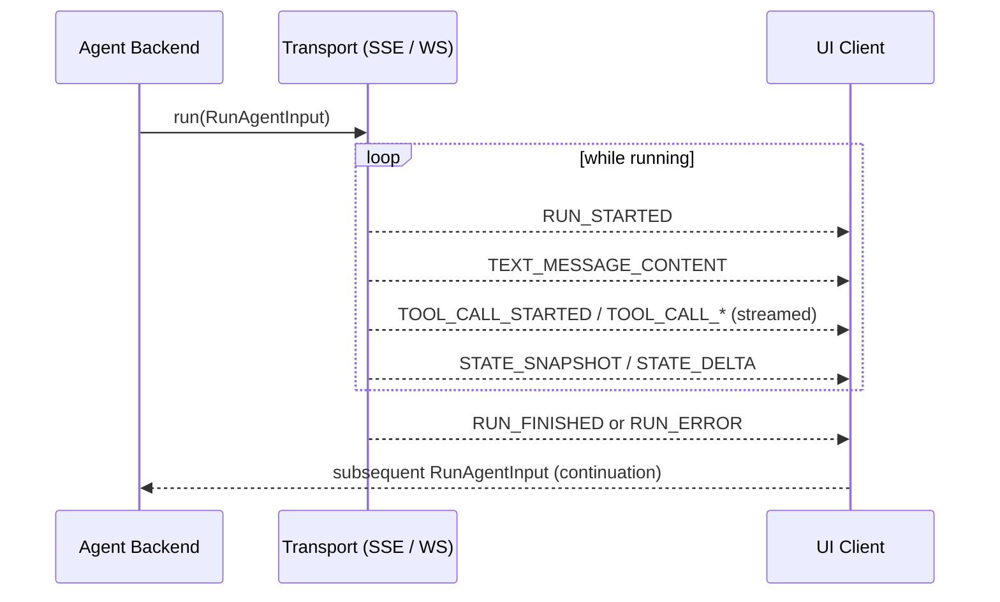

# AG-UI (Agent-User Interaction Protocol)

**AG-UI** is an open, lightweight, **event-based protocol that standardizes how AI agents connect to user-facing applications**. During agent executions, agent backends emit events compatible with one of AG-UI's ~16 standard event types; agent backends accept one of a few simple AG-UI-compatible inputs as arguments. It is the agent-to-UI counterpart in the same way the [Model Context Protocol](/protocols/mcp-apps.md) family covers agent-to-tools.

Source: [`ag-ui-protocol/ag-ui`](https://github.com/ag-ui-protocol/ag-ui), MIT-licensed (born from the CopilotKit org's partnership with LangGraph and CrewAI). Docs at <https://ag-ui.com/>; interactive building-blocks viewer at the [AG-UI Dojo](https://dojo.ag-ui.com/). Evidence and coverage for this page live on the [web-search generative-UI source page](/sources/web-search-generative-ui.md).

## Core model: events in, RunAgentInput out

- **Event-driven communication** — all agent-UI traffic flows through typed events (`BaseEvent` and subtypes): lifecycle events (`RUN_STARTED`/`RUN_FINISHED`), message events (`TEXT_MESSAGE_*`), tool events (`TOOL_CALL_*`), and state-management events (`STATE_SNAPSHOT`/`STATE_DELTA`).
- **One request shape** — agents accept a single `RunAgentInput` argument; a fixed set of event types covers the output.
- **Transport-agnostic with a middleware layer** — works with any event transport (SSE, WebSockets, webhooks, HTTP binary) and allows **loose event-format matching** for broad agent and app interoperability. A reference HTTP implementation and a default connector ship with the repo.
- **Observable streaming** — the TypeScript core uses RxJS Observables for streaming agent responses.

## The Agent Protocol Stack

The AG-UI project positions a full "agent protocol stack" for real-time agentic applications:

- Real-time agentic chat with streaming
- Bi-directional state synchronization
- Generative UI and structured messages
- Real-time context enrichment
- Frontend tool integration
- Human-in-the-loop collaboration

## Key abstractions and SDKs

The TypeScript codebase shapes agent interaction around:

1. **`AbstractAgent`** — base class all agents implement with `run(input: RunAgentInput) -> Observable`.
2. **`HttpAgent`** — standard HTTP client supporting SSE and binary protocols for connecting to agent endpoints.
3. **Event types** — lifecycle, message, tool, and state-management event families.

Official and community SDKs cover TypeScript (`@ag-ui/core`, `@ag-ui/client`, `@ag-ui/langgraph`), Python, Kotlin Multiplatform (Android/iOS/JVM, community-maintained), Go (community), and Swift (community). See the AG-UI repo structure (`/sdks/typescript/`, `/python-sdk`, `/sdks/community/*`).

### Java, Go, and Swift SDKs (source-backed from repo docs, 2026-08-16 pull)

- **Java SDK** (`com.agui.core`, `com.agui.client`, `com.agui.http`, installed via Maven/Gradle) — `HttpAgent` streams events from a remote server using a pluggable HTTP client (e.g. OkHttp); `AgentSubscriber` callbacks receive typed events such as `TextMessageContentEvent` deltas; core events cover messages, state, tools, and context.
- **Go SDK** (`sdks/community/go`, `go get github.com/ag-ui-protocol/ag-ui/sdks/community/go`) — `core/events` provides event types, interfaces, and an `EventDecoder`; `client/sse` provides an SSE client with automatic reconnection, timeouts, and auth support for streaming agent frames.
- **Swift SDK** ([paduh/ag-ui-swift](https://github.com/paduh/ag-ui-swift), community/third-party, SwiftPM + Cocoapods, ~198 commits) — `AGUIClient` (low-level `HttpAgent` HTTP transport, `SseParser`, `EventStreamManager`), `AGUICore` (protocol/event types, message/state types, domain + infrastructure layers), and `AGUITools` (tool execution with circuit-breaker patterns); stable targets not pinned in the retrieved docs. **Confidence: source-backed** (repo README/architecture, single contributor project not cross-checked).

### Runtime streaming flow

## Ecosystem adoption

- **CopilotKit** is the 1st-party client/agent framework with AG-UI built in (see the [CopilotKit page](/frameworks/copilotkit.md)).
- Other supported clients per the AG-UI README: Terminal+Agent (community), chat platforms via the Channels SDK (Slack, Microsoft Teams), and React Native (help-wanted, community).
- The [Effect-TS/effect issue #6341](https://github.com/Effect-TS/effect/issues/6341) proposes native AG-UI support in `effect/unstable/ai` so an Effect HTTP server can run LLM calls and be driven by any AG-UI client (e.g. a React frontend using `@tanstack/ai-react`). **Confidence: watchlist** — a single issue, not shipped support.
- [Oracle's Open Agent Spec integration, issue #828](https://github.com/ag-ui-protocol/ag-ui/issues/828), proposes a server-side adapter tracing Agent Spec events (LLM messages, tool calls, tool executions) into AG-UI events for LangGraph and Oracle's WayFlow runtimes, with a FastAPI endpoint per AG-UI Dojo demo (agentic_chat, backend_tool_rendering, human_in_the_loop, tool_based_generative_ui). **Confidence: watchlist** — an open proposal, not shipped.
- [microsoft/agent-governance-toolkit issue #1443](https://github.com/ag-ui-protocol/ag-ui/issues/1443) proposes replacing a custom WebSocket+REST dashboard transport with AG-UI event streams for standardized agent-frontend interaction in governance UIs. **Confidence: watchlist** — an open proposal.
- A third-party curated list claims AG-UI is "adopted by Google, LangChain, AWS, Microsoft, Mastra, and PydanticAI". **Confidence: watchlist** — promotional list, not a primary-source claim (see the [source page](/sources/web-search-generative-ui.md)).
- AG-UI is one of the transports A2UI can carry JSON over — see the [A2UI page](/protocols/a2ui.md) and the [generative-UI ecosystem](/concepts/generative-ui-ecosystem.md) comparison. A2UI's "who is it for" guidance points users who want to build a rapid "agent + UI" app *together* toward AG-UI / CopilotKit rather than A2UI.

## Relationship to other protocols

- **Complement** to the [Model Context Protocol](/protocols/mcp-apps.md): where MCP covers agent-to-tools / agent-to-data, AG-UI covers agent-to-UI.
- **Rival/alternative** to the declarative-JSON [A2UI](/protocols/a2ui.md) protocol and the [OpenUI](/frameworks/openui.md) declarative language — all three target streaming agent-driven UI but differ on event-based vs declarative modelling.
- Distinct from the session-synchronization [Agent Host Protocol](/protocols/agent-host-protocol.md); AG-UI is a wire protocol for a single agent-to-client UI stream, not a multi-client session store.

## Status

- Actively developed; README features a quickstart (`npx create-ag-ui-app`), an AG-UI Dojo of 50–200 line building-block examples, and a contributed-integration process.
- **Confidence:** source-backed (AG-UI README and `CLAUDE.md` protocol architecture from the official `ag-ui-protocol/ag-ui` repo; single primary source, not independently cross-checked).

## Source Map

- [Web-search generative-UI source evidence](/sources/web-search-generative-ui.md) — coverage and reliability notes for this page.
- [Generative-UI ecosystem](/concepts/generative-ui-ecosystem.md) — where AG-UI sits among competing approaches.
- Repository: <https://github.com/ag-ui-protocol/ag-ui>
- Docs: <https://ag-ui.com/>