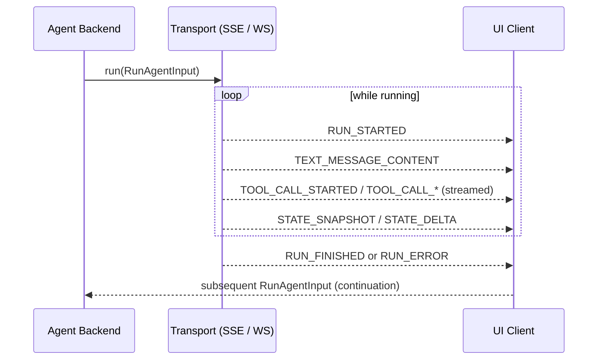

# AG-UI (Agent-User Interaction Protocol)

**AG-UI** is an open, lightweight, **event-based protocol that standardizes how AI agents connect to user-facing applications**. During agent executions, agent backends emit events compatible with one of AG-UI's ~16 standard event types; agent backends accept one of a few simple AG-UI-compatible inputs as arguments. It is the agent-to-UI counterpart in the same way the [Model Context Protocol](/protocols/model-context-protocol.md) family covers agent-to-tools.

Source: [`ag-ui-protocol/ag-ui`](https://github.com/ag-ui-protocol/ag-ui), MIT-licensed (born from the CopilotKit org's partnership with LangGraph and CrewAI). Docs at <https://ag-ui.com/>; interactive building-blocks viewer at the [AG-UI Dojo](https://dojo.ag-ui.com/) (live demos of each 50–200 line building block across frameworks; source in the repo's `apps/dojo`). Evidence and coverage for this page live on the [web-search generative-UI source page](/sources/web-search-generative-ui.md).

## Core model: events in, RunAgentInput out

- **Event-driven communication** — all agent-UI traffic flows through typed events (`BaseEvent` and subtypes): lifecycle events (`RUN_STARTED`/`RUN_FINISHED`), message events (`TEXT_MESSAGE_*`), tool events (`TOOL_CALL_*`), and state-management events (`STATE_SNAPSHOT`/`STATE_DELTA`).
- **One request shape** — agents accept a single `RunAgentInput` argument; a fixed set of event types covers the output.
- **Transport-agnostic with a middleware layer** — works with any event transport (SSE, WebSockets, webhooks, HTTP binary) and allows **loose event-format matching** for broad agent and app interoperability. A reference HTTP implementation and a default connector ship with the repo.
- **Observable streaming** — the TypeScript core uses RxJS Observables for streaming agent responses.
- **Multiple sequential runs in one stream** — the monorepo's `CLAUDE.md` documents that a single event stream can carry **multiple sequential runs**: each run must complete (`RUN_FINISHED`) before a new run begins (`RUN_STARTED`); **messages accumulate across runs** (run1 + run2), and state continues to evolve unless explicitly reset. Run-specific tracking (active messages, tool calls, steps) resets between runs. State is managed via `STATE_SNAPSHOT` (complete representation) and `STATE_DELTA` (**JSON Patch, RFC 6902** for incremental updates), with `MESSAGES_SNAPSHOT` providing conversation history. **Confidence: source-backed** (AG-UI `CLAUDE.md`, retrieved 2026-08-18).

## The Agent Protocol Stack

The AG-UI project positions a full "agent protocol stack" for real-time agentic applications:

- Real-time agentic chat with streaming
- Bi-directional state synchronization
- Generative UI and structured messages
- Real-time context enrichment
- Frontend tool integration
- Human-in-the-loop collaboration

## Key abstractions and SDKs

The TypeScript codebase shapes agent interaction around:

1. **`AbstractAgent`** — base class all agents implement with `run(input: RunAgentInput) -> Observable`.
2. **`HttpAgent`** — standard HTTP client supporting SSE and binary protocols for connecting to agent endpoints.
3. **Event types** — lifecycle, message, tool, and state-management event families.

Official and community SDKs cover TypeScript (`@ag-ui/core`, `@ag-ui/client`, `@ag-ui/encoder`, `@ag-ui/proto`), Python, Kotlin Multiplatform (Android/iOS/JVM, community-maintained), Go (community), and Swift (community), plus community in-progress Dart, Rust, Ruby, C++, Flowise, and Langflow tracks. See the AG-UI repo structure (`/sdks/typescript/`, `/python-sdk`, `/sdks/community/*`).

### Expanded integration surface (README, retrieved 2026-08-27)

The AG-UI README's integration table has grown substantially; the "Agent Protocol Stack" now spans:

- **Built-in/first-party agent platforms:** the built-in CopilotKit agent, plus 1st-party integrations for **Microsoft Agent Framework**, **Google ADK**, **AWS Strands Agents**, [Mastra](/frameworks/mastra-agentic-ui.md), **Pydantic AI**, **Agno**, **LlamaIndex**, **AG2**, and **Claude Managed Agents**; **AWS Bedrock Agents** listed in-progress.
- **Community framework integrations:** **Claude Agent SDK** and **Langroid** supported; **OpenAI Agent SDK** and **Cloudflare Agents** in-progress.
- **Protocol partnership:** **A2A** listed as a supported agent-interaction protocol (Partnership).
- **Infrastructure/deployment:** **Amazon Bedrock AgentCore** (1st party) with an [AG-UI runtime guide](https://docs.aws.amazon.com/bedrock-agentcore/latest/devguide/runtime-agui.html).
- **Standard/spec:** **Oracle Agent Spec** (specification support, `agent-spec-langgraph` demo).
- **Generative UI:** **[MCP Apps](/protocols/mcp-apps.md)** supported as a generative-UI surface (docs + demos).
- **Clients:** CopilotKit (1st party), Terminal+Agent (community), **chat platforms via the [CopilotKit Channels SDK](/frameworks/copilotkit.md#channels-sdk)** (1st party, OpenTag example), React Native (help-wanted, community).

**Confidence:** source-backed (AG-UI README, retrieved 2026-08-27; single primary source). Some integration entries are status labels rather than independently verified vendor announcements.

### Java, Go, Kotlin, and Swift SDKs (source-backed from repo docs)

- **Java SDK** (`com.agui.core`, `com.agui.client`, `com.agui.http`, installed via Maven/Gradle) — `HttpAgent` streams events from a remote server using a pluggable HTTP client (e.g. OkHttp); `AgentSubscriber` callbacks receive typed events such as `TextMessageContentEvent` deltas; core events cover messages, state, tools, and context.
- **Go SDK** (`sdks/community/go`, `go get github.com/ag-ui-protocol/ag-ui/sdks/community/go`) — `core/events` provides event types, interfaces, and an `EventDecoder`; `client/sse` provides an SSE client with automatic reconnection, timeouts, and auth support for streaming agent frames.
- **Kotlin SDK** (`docs/sdk/kotlin/`, community-contributed and maintained, `com.agui.*` Gradle coordinates; Android/iOS/JVM listed **stable** at API 26+, iOS 13+, Java 11+) — a Kotlin Multiplatform library for real-time streaming agent-UI communication. It exposes `AgUiAgent` (stateless) and `StatefulAgUiAgent` (conversation context) clients built on `kotlinx.coroutines.flow`; a Tools module (`ToolExecutor`, `ToolRegistry`, `ToolExecutionManager`) with circuit-breaker patterns; **chunked protocol events** (`TEXT_MESSAGE_CHUNK`, `TOOL_CALL_CHUNK`) automatically rewritten into their start/content/end sequences so clients see the same structured events as non-chunked streams; and `THINKING_` telemetry surfaced alongside normal messages so UIs can indicate agent reasoning before responding. **Confidence: source-backed** (official repo docs tree; community-maintained, not independently cross-checked). Retrieved 2026-08-17 from `docs/sdk/kotlin/overview.mdx`.
- **Swift SDK** ([paduh/ag-ui-swift](https://github.com/paduh/ag-ui-swift), community/third-party, SwiftPM + Cocoapods, ~198 commits) — `AGUIClient` (low-level `HttpAgent` HTTP transport, `SseParser`, `EventStreamManager`), `AGUICore` (protocol/event types, message/state types, domain + infrastructure layers), and `AGUITools` (tool execution with circuit-breaker patterns); stable targets not pinned in the retrieved docs. **Confidence: source-backed** (repo README/architecture, single contributor project not cross-checked).

### Package releases and registry evidence (2026-08-27)

The [AG-UI release](https://github.com/ag-ui-protocol/ag-ui/releases) page (retrieved 2026-08-27) returned package-registry evidence for the first time, confirming several framework adapters ship as independently versioned packages. **Confidence: confirmed** for the exact version strings below (direct release-file/registry data). The latest release was **2026-08-20**.

| Adapter / package | Ecosystem | Version (release date) |
|---|---|---|
| `@ag-ui/mastra` | npm | 1.1.2 (2026-08-16) |
| `@ag-ui/langgraph` / `ag-ui-langgraph` | npm / PyPI | 0.0.43 (2026-08-16) |
| `@ag-ui/langchain` | npm | 0.0.3 (2026-08-16) |
| `@ag-ui/pydantic-ai` | npm | 0.0.3 (2026-08-17) |
| `@ag-ui/ag2` | npm | 0.0.2 (2026-08-18) |
| `@ag-ui/agno` | npm | 0.0.6 (2026-08-20) |
| `@ag-ui/crewai` / `ag-ui-crewai` | npm / PyPI | 0.0.4 / 0.3.0 (npm 2026-08-20 / PyPI 2026-08-11) |
| `@ag-ui/llamaindex` | npm | 0.2.0 (2026-08-20) |
| `ag_ui_strands` (AWS Strands) | PyPI | 0.2.4 → 0.3.0 (2026-08-04 → 2026-08-14) |
| `AGUI.*` (Abstractions/Formatting/Protobuf/Client/Server) | NuGet (.NET) | 0.0.5 (2026-08-07) |
| `com.ag-ui.community:java-core/client/server` | Maven Central | 0.1.0 (2026-08-07) |
| `com.ag-ui.community:kotlin-client/core/tools` | Maven/Gradle | 0.4.1 (from Kotlin SDK overview) |

Repo scale: the README/CLAUDE/showcase pages report ~15.3k–15.5k stars and ~1.4k forks across the runs.

### Runtime streaming flow

```mermaid
sequenceDiagram
    participant A as Agent Backend
    participant T as Transport (SSE / WS)
    participant U as UI Client
    A->>T: run(RunAgentInput)
    loop while running
        T-->>U: RUN_STARTED
        T-->>U: TEXT_MESSAGE_CONTENT
        T-->>U: TOOL_CALL_STARTED / TOOL_CALL_* (streamed)
        T-->>U: STATE_SNAPSHOT / STATE_DELTA
    end
    T-->>U: RUN_FINISHED or RUN_ERROR
    U-->>A: subsequent RunAgentInput (continuation)
```

## Ecosystem adoption

- **CopilotKit** is the 1st-party client/agent framework with AG-UI built in (see the [CopilotKit page](/frameworks/copilotkit.md)).
- Other supported clients per the AG-UI README: Terminal+Agent (community), **chat platforms (Slack, Microsoft Teams) via the [CopilotKit Channels SDK](/frameworks/copilotkit.md#channels-sdk)** (1st party, with the OpenTag example), and React Native (help-wanted, community).
- The [Effect-TS/effect issue #6341](https://github.com/Effect-TS/effect/issues/6341) proposes native AG-UI support in `effect/unstable/ai` so an Effect HTTP server can run LLM calls and be driven by any AG-UI client; it names **TanStack AI (`@tanstack/ai-react`, `useChat` + `fetchServerSentEvents`)** as a client that is "fully AG-UI compliant" and frames AG-UI as covering "agent-to-UI the way MCP, already supported here, covers agent-to-tools." **Confidence: watchlist** — a single issue, not shipped support.
- [Oracle's Open Agent Spec integration, issue #828](https://github.com/ag-ui-protocol/ag-ui/issues/828), proposes a server-side adapter tracing Agent Spec events (LLM messages, tool calls, tool executions) into AG-UI events for LangGraph and Oracle's WayFlow runtimes, with a FastAPI endpoint per AG-UI Dojo demo (agentic_chat, backend_tool_rendering, human_in_the_loop, tool_based_generative_ui). **Confidence: watchlist** — an open proposal, not shipped.
- [microsoft/agent-governance-toolkit issue #1443](https://github.com/ag-ui-protocol/ag-ui/issues/1443) proposes replacing a custom WebSocket+REST dashboard transport with AG-UI event streams for standardized agent-frontend interaction in governance UIs. **Confidence: watchlist** — an open proposal.
- A third-party curated list claims AG-UI is "adopted by Google, LangChain, AWS, Microsoft, Mastra, and PydanticAI". **Confidence: watchlist** — promotional list, not a primary-source claim (see the [source page](/sources/web-search-generative-ui.md)).
- A feature request in the DSPy repo, [stanfordnlp/dspy#9196](https://github.com/stanfordnlp/dspy/issues/9196), proposes **DSPy support for the AG-UI protocol** ("standardised communication between agents and front-end applications"). **Confidence: watchlist** — an open feature request surfaced 2026-08-27, not shipped.
- AG-UI is one of the transports A2UI can carry JSON over — see the [A2UI page](/protocols/a2ui.md) and the [generative-UI ecosystem](/concepts/generative-ui-ecosystem.md) comparison. A2UI's "who is it for" guidance points users who want to build a rapid "agent + UI" app *together* toward AG-UI / CopilotKit rather than A2UI.

## Relationship to other protocols

- **Complement** to the [Model Context Protocol](/protocols/model-context-protocol.md): where MCP covers agent-to-tools / agent-to-data, AG-UI covers agent-to-UI.
- **Rival/alternative** to the declarative-JSON [A2UI](/protocols/a2ui.md) protocol and the [OpenUI](/frameworks/openui.md) declarative language — all three target streaming agent-driven UI but differ on event-based vs declarative modelling.
- Distinct from the session-synchronization [Agent Host Protocol](/protocols/agent-host-protocol.md); AG-UI is a wire protocol for a single agent-to-client UI stream, not a multi-client session store.

## Status

- Actively developed with a frequent (~weekly) release cadence; README features a quickstart (`npx create-ag-ui-app`), an AG-UI Dojo of 50–200 line building-block examples, a contributed-integration process, and a growing framework/SDK integration surface.
- **Confidence:** source-backed (AG-UI README and `CLAUDE.md` protocol architecture plus the `docs/sdk/*` overviews from the official `ag-ui-protocol/ag-ui` repo; single primary source, not independently cross-checked); **confirmed** for the exact package/registry version strings retrieved 2026-08-27.

## Source Map

- [Web-search generative-UI source evidence](/sources/web-search-generative-ui.md) — coverage and reliability notes for this page.
- [Generative-UI ecosystem](/concepts/generative-ui-ecosystem.md) — where AG-UI sits among competing approaches.
- Repository: <https://github.com/ag-ui-protocol/ag-ui>
- Docs: <https://ag-ui.com/>