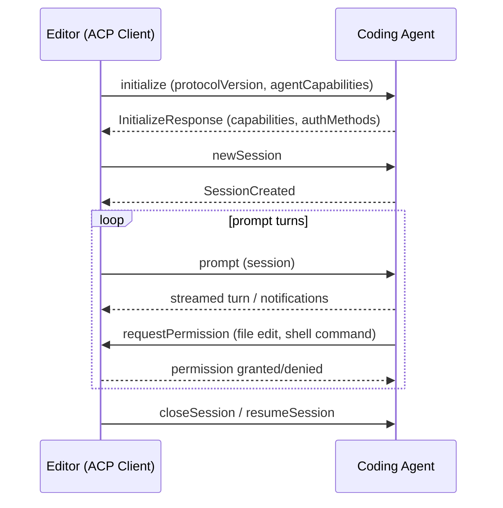

# Agent Client Protocol (ACP)

The **Agent Client Protocol (ACP)** is a standardized communication protocol between **code editors and AI-powered coding agents**. Its spec repository describes it as *"A protocol for connecting any editor to any agent."* ACP defines the wire contract that lets an editor host (the *client*) drive an autonomous coding *agent* over a session: initialize the agents, create and resume sessions, send prompts, receive streaming turns, and change model/session configuration.

Canonical materials:
- Spec repository: [`agentclientprotocol/agent-client-protocol`](https://github.com/agentclientprotocol/agent-client-protocol) (Rust tooling, Apache-2.0)
- Official documentation and protocol overview: <https://agentclientprotocol.com>
- Official TypeScript implementation: [`@agentclientprotocol/sdk`](https://www.npmjs.com/package/@agentclientprotocol/sdk), release history on the [ACP TypeScript SDK releases](/references/agent-client-protocol-typescript-sdk-releases.md) page
- Official SDK set (org listing, confirmed 2026-08-16): TypeScript, Python (`python-sdk`), Rust (`rust-sdk`), and Kotlin (`kotlin-sdk`), plus a `registry` of implementing agents. Evidence: [web-search Factory tools source page](/sources/web-search-factory-tools.md).

## What ACP standardizes

ACP is a JSON-RPC-based request/notification protocol. The two roles are:

- **Agent** — implements `initialize`, `newSession`, `prompt`, and related session methods on the agent side of the wire.
- **Client** — the editor/IDE host, implements `requestPermission`, `sessionUpdate`, and other client-side handlers.

The protocol is versioned by an **ACP JSON Schema** that the SDK tracks. Because both editors (e.g. [Zed](https://zed.dev)) and agents are independently released, the protocol ships capability flags and an explicit `protocolVersion`, and SDKs expose surface for gating features (methods are marked *unstable* until they stabilize, then promoted).

### The SDK's agent/client model

The TypeScript SDK models the protocol with two symmetric app builders:

- `acp.agent({ name })` — register typed handlers such as `initialize(...)`, `newSession(...)`, and `prompt(...)`, then `connect(stream)` returns an `AgentConnection`.
- `acp.client({ name })` — register client-side handlers such as `requestPermission(...)` and `sessionUpdate(...)`, then run a scoped agent workflow with `connectWith(stream, async (ctx) => ...)` returning a `ClientConnection`.

This is the *app-style* API introduced in SDK v0.27.0. Handlers receive a single `ctx` object: request/notification params at `ctx.params`, and outbound calls to the peer at `ctx.client` (agents) or `ctx.agent` (clients). The older `AgentSideConnection`/`ClientSideConnection` classes remain as deprecated compatibility wrappers.

## Transport and streaming

ACP is transport-agnostic but the SDK provides a **Streamable HTTP** and **WebSocket** experimental transport, plus an NDJSON stream codec. The SDK places a strong emphasis on deterministic stream behavior: SSE close/response delivery is made deterministic, the NDJSON receive path is linear in message size, and JSON-RPC message validation is unified across transports.

## Notably distinct from Agent Host Protocol

ACP is a separate, editor↔agent standardization effort and must not be confused with the [Agent Host Protocol](/protocols/agent-host-protocol.md). AHP is Microsoft's synchronized multi-client *session server* protocol for AI agent sessions (state distribution over channels). ACP is the editor/IDE-to-agent protocol associated with Zed and the `agentclientprotocol` GitHub org. They share the "agent protocol" space but are independent projects with different architectures and maintainers.

## Experimental ACP v2

The SDK incurs a draft **ACP v2** behind an explicit experimental import:

```ts
import * as acp from "@agentclientprotocol/sdk/experimental/v2";
```

ACP v2 is still a draft: its wire protocol and the TypeScript API may change incompatibly in any SDK release. The stable package entry point remains ACP v1. Draft v2 type reference: <https://agentclientprotocol.github.io/typescript-sdk/v2/>.



## Status notes

- **Confidence:** source-backed (grounded in the repo README, the migration guide, and the release bodies of the official TypeScript SDK; single high-quality source, not independently cross-checked).
- The protocol and SDK are actively evolving; the SDK hit **1.0.0** on 2026-06-24, and schema versions move frequently while v2 is a draft.

## Source Map
- [ACP TypeScript SDK releases](/references/agent-client-protocol-typescript-sdk-releases.md) — release history and current-version features.
- [Agent Host Protocol](/protocols/agent-host-protocol.md) — the sibling protocol to distinguish ACP from.