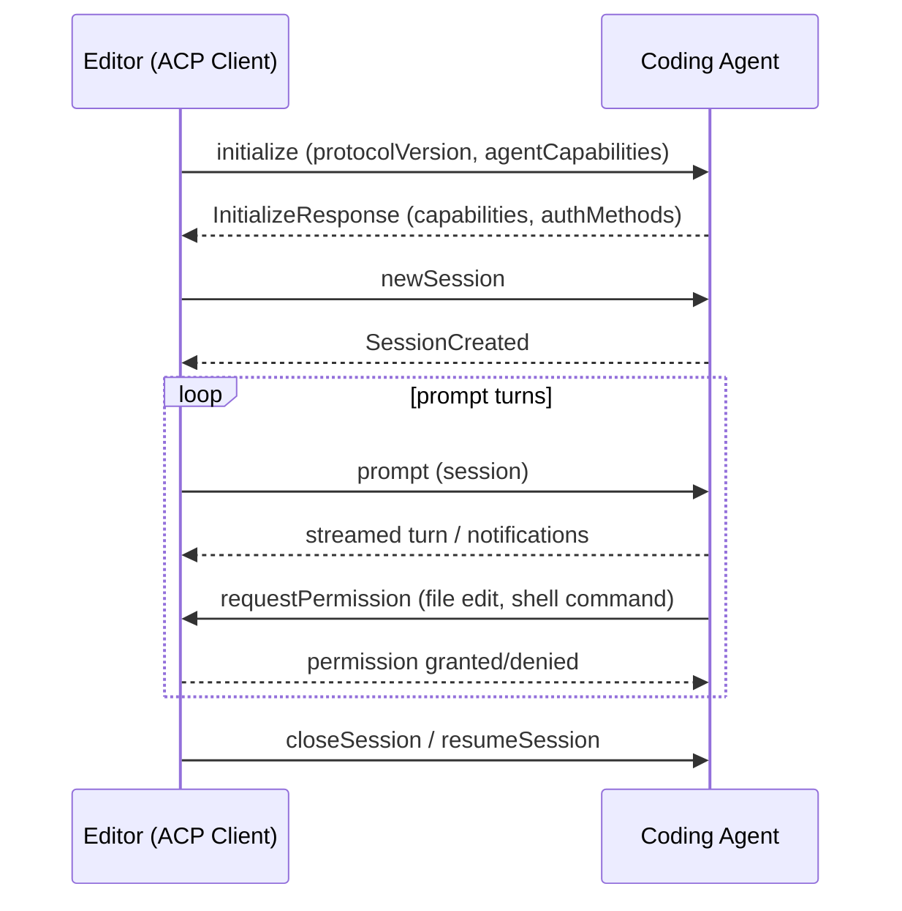

# Agent Client Protocol (ACP)

The **Agent Client Protocol (ACP)** is a standardized communication protocol between **code editors and AI-powered coding agents**. Its spec repository describes it as *"A protocol for connecting any editor to any agent."* ACP defines the wire contract that lets an editor host (the *client*) drive an autonomous coding *agent* over a session: initialize the agents, create and resume sessions, send prompts, receive streaming turns, and change model/session configuration.

Canonical materials:
- Spec repository: [`agentclientprotocol/agent-client-protocol`](https://github.com/agentclientprotocol/agent-client-protocol) (Rust tooling, Apache-2.0)
- Official documentation and protocol overview: <https://agentclientprotocol.com>
- Official TypeScript implementation: [`@agentclientprotocol/sdk`](https://www.npmjs.com/package/@agentclientprotocol/sdk), release history on the [ACP TypeScript SDK releases](/references/agent-client-protocol-typescript-sdk-releases.md) page
- Official SDK set (org listing + spec README, confirmed 2026-08-16, re-listed 2026-08-18): TypeScript (`@agentclientprotocol/sdk`), Python (`python-sdk`), Rust (`rust-sdk`), Kotlin (`acp-kotlin`, JVM), and Java (`java-sdk`), plus a `registry` of implementing agents. The 2026-08-18 org listing adds two first-party ACP **server** implementations: `codex-acp` (exposes Codex CLI functionality for ACP clients/IDEs) and `claude-agent-acp` ("use Claude Agent SDK from any ACP client"), alongside a shared `meetings` repo. Evidence: [web-search Factory tools source page](/sources/web-search-factory-tools.md).

## What ACP standardizes

ACP is a JSON-RPC-based request/notification protocol. The two roles are:

- **Agent** — implements `initialize`, `newSession`, `prompt`, and related session methods on the agent side of the wire.
- **Client** — the editor/IDE host, implements `requestPermission`, `sessionUpdate`, and other client-side handlers.

The protocol is versioned by an **ACP JSON Schema** that the SDK tracks. Because both editors (e.g. [Zed](https://zed.dev)) and agents are independently released, the protocol ships capability flags and an explicit `protocolVersion`, and SDKs expose surface for gating features (methods are marked *unstable* until they stabilize, then promoted).

### Rust/schema artifact versioning (spec repo, confirmed 2026-08-16)

The spec repository's root Rust crate is **`agent-client-protocol-schema`** (crates.io), which provides the Rust data model for ACP wire messages (request, response, notification, JSON-RPC envelope, and protocol-version types) for schema-oriented tooling and code-generation inputs. Rust agents/clients should start with the higher-level **`agent-client-protocol`** runtime crate instead.

Generated JSON Schema artifacts live in `schema/v1` and `schema/v2` in the spec repo; on a schema release, the versioned `.json` files are attached to the corresponding `schema-v*` GitHub release (the recommended download surface for SDK generators). **Version semantics:** the current stable ACP protocol version is `1`, and wire compatibility is determined by the `protocolVersion` negotiated during `initialize`, *not* by the crate/schema release version. Two JSON Schema artifact versions can therefore describe the same wire-compatible protocol version while differing in structure for SDK generators. Consumers pair the negotiated `protocolVersion` with exchanged capabilities to decide which optional ACP messages/features are supported.

### Ecosystem launch patterns and registry

Retrieved evidence (2026-08-16) documents how agents typically expose an ACP server, and the ecosystem's distribution mechanism:

- **Launch patterns** — native subcommand (`agent-name acp`: Goose, Kiro, Kimi, OpenCode), flag-based (`agent --acp` / `--experimental-acp`: Copilot, Gemini), adapter binaries (`claude-code-acp`, `vibe-acp`), and NPX adapters (`npx @zed-industries/codex-acp`). This is one of the concrete ways ACP agents plug into the [factory toolchain](/concepts/factory-toolchain.md).
- **ACP Registry** — a central registry at `agentclientprotocol.com/registry`; agents register once and become available in all ACP clients. Zed is deprecating its proprietary extension approach in favor of ACP.
- **Official SDKs** — Python `agent-client-protocol` (PyPI), TypeScript `@agentclientprotocol/sdk` (npm), Rust `agent-client-protocol` (crates.io), Kotlin `acp-kotlin` (JVM).
- **Citation note** — this ecosystem sketch is sourced from a third-party feature issue (NousResearch/hermes-agent#569), labeled **watchlist** until confirmed against the primary ACP registry docs.

### Community ecosystem signals (2026-08-22 re-pull, watchlist)

The org-wide, spec-README, and docs-github hits surfaced a small community ecosystem around ACP (all third-party, watchlist):

- **`acp-components`** (`zvzuola/acp-components`) — a React UI component library for building agentic coding interfaces that talk to ACP agents like Claude Code; uses `@agentclientprotocol/sdk`, Zustand v5 (vanilla, no React dependency), React 18/19, Monaco (optional peer dep for a `FileViewer`), i18next, react-markdown/remark-gfm.
- **`acpx`** (`openclaw/acpx`) — a headless CLI client for stateful ACP sessions (VISION.md, release-it config, ACP-session oriented).
- **Qwen Code ACP streamable-HTTP issue chain** (`QwenLM/qwen-code#4782`) — tracks the ACP **Streamable HTTP transport** implementation status and a third-party SDK version gap (`@agentclientprotocol/sdk` 0.14.1 → 0.21.0 referenced by the issue); notes that `session/close`-related standard methods and new conformance-checking types are the unlocks, and that Zed/Goose/third-party clients can connect once Qwen's PRs #4563 → #4736 → #4737 land. **Watchlist:** issue-tracker claim; the SDK versions in the issue (0.14.1/0.21.0) are lower than the wiki's known v1.3.0 and reflect the issue author's pinned environment, not the current release.
- The ACP org listing (re-confirmed) shows first-party **servers** `codex-acp` and `claude-agent-acp`.

Excluded as out of scope: `adcontextprotocol/adcp-client` (AdCP — a different "ad context" protocol, unrelated to ACP).

### GitHub Copilot CLI ACP server (official, source-backed 2026-08-16)

GitHub Copilot CLI ships an official ACP server, documented on GitHub Enterprise Cloud docs (`copilot --acp`). Factual surface (source-backed from the docs):

- **Launch & transport:** `copilot --acp` starts the ACP server; transport is `--stdio` (default) or `--port 3000` (TCP, loopback `127.0.0.1`). The two modes are mutually exclusive. Both carry the same ACP messages as newline-delimited JSON (NDJSON) over stdio (per-editor subprocess) or a TCP socket (separate process/container, longer-lived server).
- **BYOK without login:** ACP mode lets sessions with a configured bring-your-own-key provider (`COPILOT_PROVIDER_*` env vars) run without GitHub login.
- **Server-side session options:** `session/new` only sets a few parameters (cwd, MCP servers) and does not carry tool-filtering or reasoning settings; the *server* applies `--available-tools`, `--excluded-tools`, and `--effort`/`--reasoning-effort` to every session it creates, and clients cannot change them per session.
- **Slash commands over ACP:** the server advertises supported commands through the `available_commands_update` session notification; built-ins (`/compact`, `/context`, `/usage`, `/model`, `/mcp`, `/plan`, `/review`, `/research`, `/session`, `/rename`) and enabled skills appear as `/SKILL-NAME`. Clients invoke them by sending the command text as an ordinary prompt. Interactive-terminal commands (pickers/dialogs such as `/diff`, `/resume`, `/theme`) are not handled.
- **Consumption:** docs example uses the official `@agentclientprotocol/sdk` (Node ≥ 18); rendering via `acp.ndJsonStream`, `acp.ClientSideConnection`, and `initialize`/`newSession`/`prompt`.
- **Use cases:** IDE integrations, CI/CD pipelines, custom frontends, and multi-agent systems — positioning Copilot CLI as one concrete ACP server instance in the [factory toolchain](/concepts/factory-toolchain.md).

### The SDK's agent/client model

The TypeScript SDK models the protocol with two symmetric app builders:

- `acp.agent({ name })` — register typed handlers such as `initialize(...)`, `newSession(...)`, and `prompt(...)`, then `connect(stream)` returns an `AgentConnection`.
- `acp.client({ name })` — register client-side handlers such as `requestPermission(...)` and `sessionUpdate(...)`, then run a scoped agent workflow with `connectWith(stream, async (ctx) => ...)` returning a `ClientConnection`.

This is the *app-style* API introduced in SDK v0.27.0. Handlers receive a single `ctx` object: request/notification params at `ctx.params`, and outbound calls to the peer at `ctx.client` (agents) or `ctx.agent` (clients). The older `AgentSideConnection`/`ClientSideConnection` classes remain as deprecated compatibility wrappers.

## Transport and streaming

ACP is transport-agnostic but the SDK provides a **Streamable HTTP** and **WebSocket** experimental transport, plus an NDJSON stream codec. The SDK places a strong emphasis on deterministic stream behavior: SSE close/response delivery is made deterministic, the NDJSON receive path is linear in message size, and JSON-RPC message validation is unified across transports.

## Notably distinct from Agent Host Protocol

ACP is a separate, editor↔agent standardization effort and must not be confused with the [Agent Host Protocol](/protocols/agent-host-protocol.md). AHP is Microsoft's synchronized multi-client *session server* protocol for AI agent sessions (state distribution over channels). ACP is the editor/IDE-to-agent protocol associated with Zed and the `agentclientprotocol` GitHub org. They share the "agent protocol" space but are independent projects with different architectures and maintainers.

## Experimental ACP v2

The SDK incurs a draft **ACP v2** behind an explicit experimental import:

```ts
import * as acp from "@agentclientprotocol/sdk/experimental/v2";
```

ACP v2 is still a draft: its wire protocol and the TypeScript API may change incompatibly in any SDK release. The stable package entry point remains ACP v1. Draft v2 type reference: <https://agentclientprotocol.github.io/typescript-sdk/v2/> and draft protocol docs at <https://agentclientprotocol.com/protocol/v2/draft/overview> (both re-confirmed 2026-08-18).

**Reference implementation (2026-08-18):** the SDK README points to the **Gemini CLI Agent** integration (`google-gemini/gemini-cli/src/zed-integration/zedIntegration.ts`) as a complete, production implementation of an ACP client-side flow in Zed, valuable as a reference for the factory's editor-side glue.



## Status notes

- **Confidence:** source-backed (grounded in the repo README, the migration guide, and the release bodies of the official TypeScript SDK; single high-quality source, not independently cross-checked). The 2026-08-22 community ecosystem items (acp-components, acpx, Qwen streamable-HTTP issue) are watchlist only.
- The protocol and SDK are actively evolving; the SDK hit **1.0.0** on 2026-06-24, and schema versions move frequently while v2 is a draft.

## Source Map
- [ACP TypeScript SDK releases](/references/agent-client-protocol-typescript-sdk-releases.md) — release history and current-version features.
- [Agent Host Protocol](/protocols/agent-host-protocol.md) — the sibling protocol to distinguish ACP from.