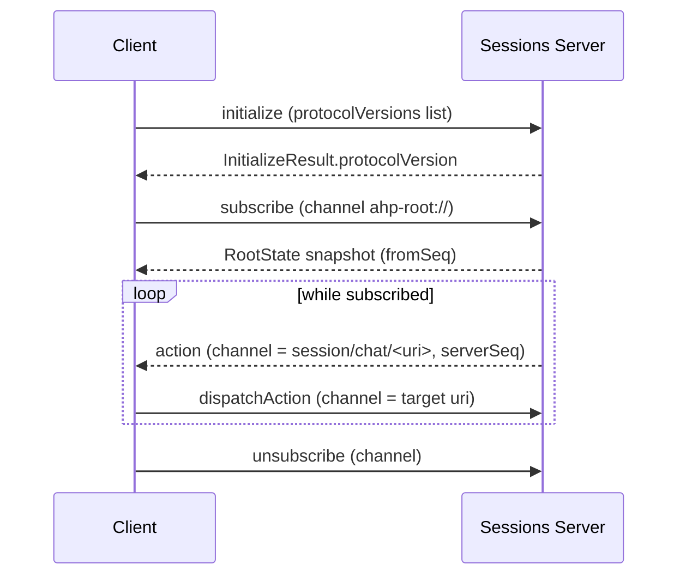
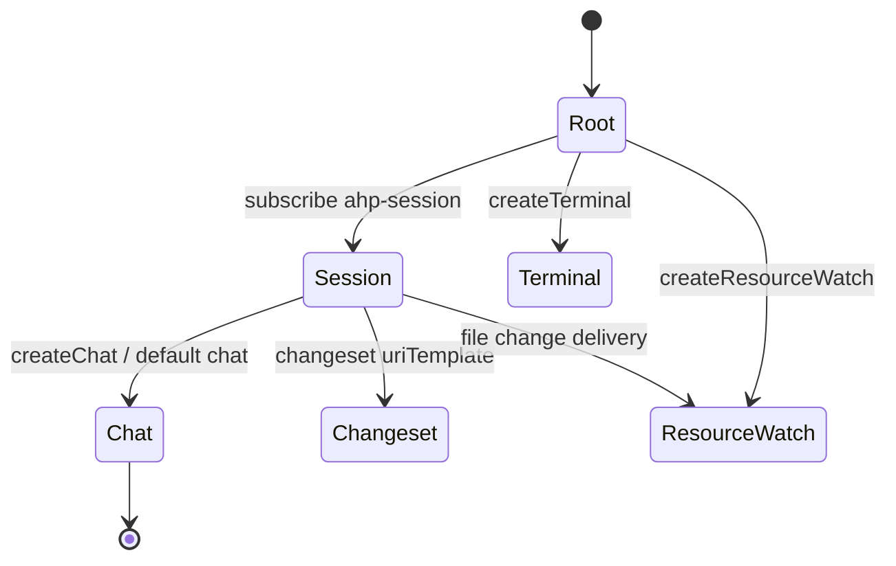

# Agent Host Protocol (AHP)

The **Agent Host Protocol (AHP)** defines how a portable, standalone *sessions server* communicates with its clients so that **multiple clients can connect to the server and see a synchronized view of AI agent sessions**. The project's own description is *"Synchronized multi-client state for AI agent sessions."*

Source: [`microsoft/agent-host-protocol`](https://github.com/microsoft/agent-host-protocol), MIT licensed; canonical documentation at <https://microsoft.github.io/agent-host-protocol/>. Maintained release and change evidence lives on the [Agent Host Protocol releases](/references/agent-host-protocol-releases.md) page, which is grounded in the [GitHub source evidence](/sources/github-agent-host-protocol.md).

> **Not the [Agent Client Protocol](/protocols/agent-client-protocol.md).** Despite the similar name, AHP is a distinct project from ACP — the editor↔agent protocol from the `agentclientprotocol` org. AHP is Microsoft's session-server/synchronization protocol; ACP is a code-editor-to-coding-agent wire protocol.

## Design foundations

AHP's core design rests on three ideas that keep multiple independent clients consistent over a shared session:

- **Synchronized, immutable state** — session, chat, terminal, and changeset states are modeled as immutable snapshots distributed to subscribed clients.
- **Pure reducers** — every state change is applied deterministically through a pure reducer, so all clients converge on the same state.
- **Write-ahead reconciliation** — mutations are sequenced (via `serverSeq`) and reconciled, giving clients a reliable order of changes even when the connection drops and reconnects.

The protocol is **transport-agnostic**: any reliable, ordered, bidirectional message stream can carry AHP messages. WebSocket is the most common and is what the [VS Code agent host](https://github.com/microsoft/vscode) reference server uses.

## Message framing and model

AHP uses [JSON-RPC 2.0](https://www.jsonrpc.org/specification) as its message framing. Messages fall into four categories:

| Direction | Type | Examples |
|---|---|---|
| Client → Server (request) | Expects one response with matching `id` | `initialize`, `subscribe`, `createSession`, `disposeSession`, `listSessions`, `fetchTurns`, the `resource*` family |
| Client → Server (notification) | Fire-and-forget, no `id` | `dispatchAction`, `unsubscribe` |
| Server → Client (request) | Symmetrical reverse direction | the `resource*` family, `createResourceWatch` (host-driven filesystem providers) |
| Server → Client (notification) | Pushed state | `action`, `root/sessionAdded`, `root/sessionRemoved`, `auth/required`, `otlp/*` |

### Channels are the routing key

Every push-style interaction in AHP is scoped to a **channel** — a URI-identified subscribable resource (the root catalogue, a session, a chat, a terminal, a changeset, …). **Every command's and every notification's `params` carries a top-level `channel: URI` field** (declared on `BaseParams`). This invariant lets servers, clients, and proxies dispatch any message by inspecting `(method, params.channel)` without per-method deserialisation; it is enforced at compile time in `types/version/message-checks.ts`.

The full channel model lives in the reference spec; the durable wire-effect is summarized in the diagram below. See also the [subscriptions reference](https://microsoft.github.io/agent-host-protocol/specification/subscriptions) from the source project.

## Connection lifecycle and version negotiation

Version negotiation happens once during the `initialize` handshake, modelled after WebSocket subprotocol negotiation:

1. The **client** sends `InitializeParams.protocolVersions` — an array of every version it can speak, most-preferred first.
2. The **server** picks one entry it can speak and returns it as `InitializeResult.protocolVersion`, honoring the client's preference order when possible.
3. If the server cannot speak any offered version, it returns `UnsupportedProtocolVersion` (`-32005`) and closes the connection.

Both peers must use the selected version for the rest of the connection; there is no per-message renegotiation. Protocol versions are strict SemVer `MAJOR.MINOR.PATCH` strings. Compatibility follows SemVer: same `MAJOR` (at `≥ 1`) or same pre-1.0 `MINOR` (at `0.X`) are compatible; additive changes in `PATCH` bumps must be ignored by older peers.

### Capabilities first, then required

New behavior lands in two stages to decouple host and client release cadence:

1. **Capability-gated.** A new feature is an opt-in capability advertised by a host or client; implementors check for it before use.
2. **Required.** Once matured, a future version may promote it to baseline and remove the flag.

This matters practically for AHP because clients are usually easier to update than remote/cloud hosts, so clients SHOULD offer a wide version range and degrade gracefully when the negotiated version or the advertised capabilities lack a feature.

## Channels and URI scheme

State-bearing channels expose typed state and are subscribable; stateless channels (telemetry today; LSP/MCP relays planned) carry notifications without snapshots.

| URI | State type | Description |
|---|---|---|
| `ahp-root://` | `RootState` | Global state (agents, terminals, host config). Always present. |
| `ahp-session:/<uuid>` | `SessionState` | Per-session state (metadata plus the `chats` catalog). |
| `ahp-chat:/<cid>` | `ChatState` | Per-chat conversation state (turns, streaming, tool calls, input requests). |
| `ahp-terminal:/<id>` | `TerminalState` | Per-terminal state. |
| `ahp-changeset:/<id>` | `ChangesetState` | Per-changeset state. |
| `ahp-otlp:` | _stateless_ | OpenTelemetry signal channels (logs, traces, metrics). |
| `ahp-resource-watch:/<id>` | `ResourceWatchState` | Long-lived file/directory change stream. |

### The `mcp://` side-channel (links to MCP Apps)

AHP also defines an optional **`mcp://` side-channel** (specified in `docs/specification/mcp-channel.md`): it lets an AHP client originate a **constrained subset of MCP traffic against an MCP server the agent host is already running**. It is the wire format AHP uses whenever a client needs to talk MCP — "but only as much MCP as the host has explicitly opted into exposing."

- The channel itself is **generic**; the methods/notifications it actually serves are determined by **capability advertisements** on the customization it hangs off. Today the only such advertisement is `AhpMcpUiHostCapabilities` (used by [MCP Apps](/protocols/mcp-apps.md)), but additional domain-specific capability sets MAY be added later without changing the channel. Capabilities map to served methods and forwarded notifications, e.g. `serverTools` (`tools/list`, `tools/call`), `serverResources` (`resources/list`, `templates`, `read`), `logging` (`logging/setLevel`, `notifications/message`), `sampling` (`sampling/createMessage`), with `listChanged` notifications when applicable.
- **Wire format:** MCP verbatim — JSON-RPC 2.0 requests/responses/notifications exactly as defined by the upstream MCP specification. AHP does not redefine request/response shapes or notification payloads.

This connects the AHP session-server state protocol into the generative-UI ecosystem: its MCP Apps capability lets a host-served UI render MCP resources (see [MCP Apps](/protocols/mcp-apps.md)). Durable source: [web-search Factory tools evidence](/sources/web-search-factory-tools.md).

## Servers and clients

- **Servers:** The first-party reference server is the [VS Code agent host](https://github.com/microsoft/vscode) (`src/vs/platform/agentHost/node/`).
- **Client libraries** (each on its own SemVer release track): Rust (`ahp`, `ahp-types`, `ahp-ws`), TypeScript (`@microsoft/agent-host-protocol`), Kotlin (`com.microsoft.agenthostprotocol`), Go (`clients/go`), and Swift (SwiftPM `microsoft/agent-host-protocol`).
- **Other clients:** [AHPX](https://github.com/TylerLeonhardt/ahpx) (CLI + Node.js) and the VS Code built-in Agent Sessions client.
- **Multi-host:** Rust, Swift, and Go SDKs ship a `MultiHostClient` for talking to two or more hosts at once; single-host consumers use the same API (`MultiHostClient::single` / `.single(...)` / `hosts.Single(...)`).
- **Related ecosystem:** MCP servers surface in AHP as first-class session customizations with a lifecycle and OAuth challenge flow; the `mcp://` side-channel further links AHP to [MCP Apps](/protocols/mcp-apps.md) generative-UI hosting.

The Release-evidence and current-version headline features (including multiroot working directories, side chats, and MCP tool-call OAuth in v0.7.0) are synthesized on the [Agent Host Protocol releases](/references/agent-host-protocol-releases.md) page.

## Status

The specification states it is a **working draft under active development**; breaking changes to wire types, actions, and state shapes are expected, and backward compatibility should not be relied on until production status. The `x-` prefix is reserved for implementation-defined extensions and is never assigned by AHP itself. **Confidence:** confirmed for the protocol's design foundations and channel/versioning model (source-backed from the official repo release page and specification docs).

## Source Map
- [Agent Host Protocol releases](/references/agent-host-protocol-releases.md) — release history and current-version features.
- [GitHub source evidence](/sources/github-agent-host-protocol.md) — evidence and coverage notes for this page.
- Releases resource: <https://github.com/microsoft/agent-host-protocol/releases>
- Repository: <https://github.com/microsoft/agent-host-protocol>