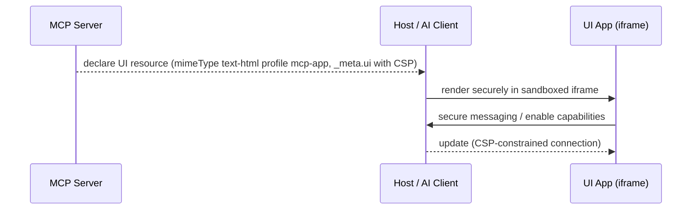

# MCP Apps (Model Context Protocol Apps extension)

**MCP Apps** is the **first official extension to the Model Context Protocol**, co-developed by **Anthropic and OpenAI** and released as an open standard. It extends MCP so that **servers can deliver interactive user interfaces to hosts** — charts, forms, dashboards, rich media, and real-time displays — rendered **securely in iframes** inside any compliant host. Predecessors/alternatives (MCP-UI, OpenAI's Apps SDK, and assorted custom implementations) each solved UI support differently; MCP Apps standardizes one mechanism.

Source: [`modelcontextprotocol/ext-apps`](https://github.com/modelcontextprotocol/ext-apps). Evidence for this page lives on the [web-search generative-UI source page](/sources/web-search-generative-ui.md).

## Why it exists

MCP already lets servers expose tools and resources to AI assistants, but responses are limited to text and structured data. Use cases that need more:

- Data visualization — charts, graphs, and dashboards that update as data changes
- Rich media — video players, audio waveforms, 3D models
- Interactive forms — multi-step wizards, configuration panels, approval workflows
- Real-time displays — live logs, progress indicators, streaming content

## How servers describe and communicate UIs

MCP Apps defines how **servers declare UI resources**, how **hosts render them securely in iframes**, and how the two **communicate**.

- A server declares a UI **resource with `mimeType` `text/html;profile=mcp-app`** (other content types reserved for future extensions).
- Resource metadata (`_meta.ui: UIResourceMeta`) carries **security and rendering configuration**: a **Content Security Policy (CSP)** that maps to `connect-src` (origins for fetch/XHR/WebSocket) and to `img-src`/`script-src`/`style-src`/`font-src`/`media-src` (origins for static resources). Empty or omitted origins mean no external connections — a secure default.
- UI resources distinguish **`desktop` vs `mobile`** device capabilities (`deviceCapabilities { touch, hover }`) and **`safeAreaInsets`** (top/right/bottom/left in pixels) so rendered apps adapt to the host surface.

The returned UI runs in a sandboxed iframe whose network and static-resource origins are controlled by the CSP in the resource metadata — the security boundary between third-party resource HTML and the host.

## Tooling and specs

- The repository ships **four agent skills** (`agent-skills.md`): `create-mcp-app` (scaffolds a new MCP App with an interactive UI), `migrate-oai-app` (migrates an existing OpenAI App to the MCP Apps SDK), and `add-…` (assembly/extension helpers).
- **Specification**: the extension is defined under `specification/2026-01-26/apps.mdx`.
- Adoption requests are already filed across official SDKs — e.g. `modelcontextprotocol/csharp-sdk` issue #1431 (SEP-1865, the MCP Apps proposal) and `modelcontextprotocol/java-sdk` issue #780 (UI capability support). **Confidence: watchlist** for these SDK requests (single issues, not shipped), but the extension itself and its January 2026 open-standard release are source-backed from the repo overview and specification.

## Relationship to other generative-UI efforts

- **Extends** the Model Context Protocol (see <https://modelcontextprotocol.io>) itself — it is the UI branch of the MCP family rather than a standalone agent-UI wire protocol like [AG-UI](/protocols/ag-ui.md).
- **Served over the Agent Host Protocol's `mcp://` side-channel** — AHP hosts run the MCP server whose `AhpMcpUiHostCapabilities` advertise the tools/resources an [AHP](/protocols/agent-host-protocol.md) client can address, letting host-served UIs render MCP Apps resources (see the [AHP page](/protocols/agent-host-protocol.md)).
- **Complementary to, and explicitly interoperable with, [A2UI](/protocols/a2ui.md)** — the A2UI site documents *A2UI over MCP*, *MCP Apps in A2UI*, and *A2UI in MCP Apps*. Note one distinction: the [A2UI](/protocols/a2ui.md) "What A2UI is not" guidance routes non-integrated remote widgets to iframes "like MCP Apps", showing the two target different integration depths (declarative in-renderer components vs iframe-wrapped apps).
- See the [Generative-UI ecosystem](/concepts/generative-ui-ecosystem.md) comparison for the fuller map.

## Status

- Released as an open standard in **January 2026** (spec snapshot `2026-01-26`), the first official MCP extension.
- **Confidence:** source-backed (the `modelcontextprotocol/ext-apps` overview, `agent-skills.md`, and the 2026-01-26 `apps.mdx` specification from the official repo).

## Source Map

- [Web-search generative-UI source evidence](/sources/web-search-generative-ui.md) — coverage and reliability notes.
- [Generative-UI ecosystem](/concepts/generative-ui-ecosystem.md) — where MCP Apps fits among competing approaches.
- Repo: <https://github.com/modelcontextprotocol/ext-apps>