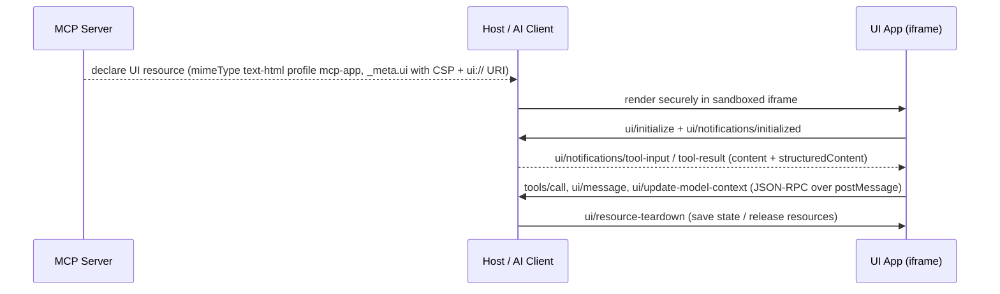

# MCP Apps (Model Context Protocol Apps extension)

**MCP Apps** is the **first official extension to the Model Context Protocol**, co-developed by **Anthropic and OpenAI** and released as an open standard. It extends MCP so that **servers can deliver interactive user interfaces to hosts** — charts, forms, dashboards, rich media, and real-time displays — rendered **securely in iframes** inside any compliant host. Predecessors/alternatives (MCP-UI, OpenAI's Apps SDK, and assorted custom implementations) each solved UI support differently; MCP Apps standardizes one mechanism.

Source: [`modelcontextprotocol/ext-apps`](https://github.com/modelcontextprotocol/ext-apps). Evidence for this page lives on the [web-search generative-UI source page](/sources/web-search-generative-ui.md) and the 2026-08-17/2026-08-18/2026-08-22 [Agent integration protocols source page](/sources/web-search-agent-integration-protocols.md). MCP Apps **extends the [Model Context Protocol](/protocols/model-context-protocol.md)** — the base JSON-RPC standard this extension builds on.

## Why it exists

MCP already lets servers expose tools and resources to AI assistants, but responses are limited to text and structured data. Use cases that need more:

- Data visualization — charts, graphs, and dashboards that update as data changes
- Rich media — video players, audio waveforms, 3D models
- Interactive forms — multi-step wizards, configuration panels, approval workflows
- Real-time displays — live logs, progress indicators, streaming content

## How servers describe and communicate UIs

MCP Apps defines how **servers declare UI resources**, how **hosts render them securely in iframes**, and how the two **communicate**.

- A server declares a UI **resource with `mimeType` `text/html;profile=mcp-app`** (other content types reserved for future extensions).
- Resource metadata (`_meta.ui: UIResourceMeta`) carries **security and rendering configuration**: a **Content Security Policy (CSP)** that maps to `connect-src` (origins for fetch/XHR/WebSocket) and to `img-src`/`script-src`/`style-src`/`font-src`/`media-src` (origins for static resources). Empty or omitted origins mean no external connections — a secure default.
- UI resources distinguish **`desktop` vs `mobile`** device capabilities (`deviceCapabilities { touch, hover }`) and **`safeAreaInsets`** (top/right/bottom/left in pixels) so rendered apps adapt to the host surface.

*MCP Apps lifecycle: discovery of UI tool resources at connect; ui/initialize handshake; data delivery as tool input/result notifications; interactive View↔Host communication; teardown before unmount.*

The returned UI runs in a sandboxed iframe whose network and static-resource origins are controlled by the CSP in the resource metadata — the security boundary between third-party resource HTML and the host.

### The UI lifecycle (5 phases)

The ext-apps overview documents the end-to-end host↔View interaction as **five phases** (the earlier 4-phase framing from the 2026-08-17 run is superseded by the overview's explicit teardown step):

1. **Discovery** — the Host learns about tools and their UI resources when connecting to the server (via the extensions capability negotiation).
2. **Initialization** — when a UI tool is called, the Host renders the iframe; the View sends `ui/initialize` and receives host context (theme, capabilities, container dimensions). This handshake ensures the View is ready before receiving data; the View then acknowledges with `ui/notifications/initialized`.
3. **Data delivery** — the Host sends tool arguments (`ui/notifications/tool-input`) and, once available, tool results (`ui/notifications/tool-result`) to the View. Results include both `content` (text for the model's context) and optionally `structuredContent` (data optimized for UI rendering) — the `content`/`structuredContent` separation lets servers provide rich data to the UI without bloating the model's context.
4. **Interactive phase** — the user interacts with the View; the View can call server tools (`tools/call`), read server resources (`resources/read`), or send messages back to the chat.
5. **Teardown** — before unmounting, the Host notifies the View (`ui/resource-teardown`) so it can save state or release resources; the View acknowledges.

### Tool–UI linkage and UI resources

UI resources are HTML templates that servers declare using the **`ui://` URI scheme** (`_meta.ui.resourceUri`, e.g. `ui://weather/forecast`). Tools reference their UI templates through tool-registration metadata: when a server registers a tool it includes `_meta.ui` pointing at a `ui://` resource, and when that tool is called the Host fetches the corresponding resource and renders it in a sandboxed iframe, then passes tool arguments and results to the View. Declaring resources up front at tool-registration time enables **prefetching** (Hosts can cache templates before tool execution), **separation of concerns** (templates/presentation separate from tool results/data), and **review** (Hosts can inspect UI templates during connection setup).

### Bidirectional communication (JSON-RPC over postMessage)

Views and Hosts communicate using **JSON-RPC over `postMessage`**, keeping the channel auditable. From a View you can:

- **Interact with the server:** call server tools (`tools/call`), read server resources (`resources/read`).
- **Interact with the chat:** send messages to the conversation (`ui/message`), update model context (`ui/update-model-context`).
- **Request host actions:** open external links (`ui/open-link`).

In the architecture the **View acts as an MCP client**, the **Host acts as a proxy**, and the **Server is a standard MCP server** — the View runs client-side and reaches the server through the Host's MCP connection.

### Tool visibility

Tools can be visible to the model, the app, or both; by default they are visible to both (`visibility: ["model", "app"]`). **App-only tools** (`visibility: ["app"]`) exist purely for the View to call and never clutter the agent's context — e.g. refresh buttons, pagination controls, or form submissions.

### Host context, theming, and display modes

When a View initializes, the Host provides context about its environment: **theme** (light/dark), **locale and timezone** (for formatting), **display mode** (inline/fullscreen/picture-in-picture), **container dimensions**, and **platform** (web/desktop/mobile). Hosts expose CSS custom properties for colors/typography/borders that Views consume with fallbacks (`var(--color-background-primary, #ffffff)`), and notify Views on theme changes without reload. Views declare which **display modes** they support; Hosts declare which they can provide; a View can request a mode change but the Host decides (final say over its own UI). Views run in sandboxed iframes with **no access to the Host's DOM, cookies, or storage**; the "restrictive by default" CSP metadata (no declared domains ⇒ no external connections) prevents data exfiltration to undeclared servers.

## Tooling and specs

- The repository ships **four agent skills** (`agent-skills.md`): `create-mcp-app` (scaffolds a new MCP App with an interactive UI), `migrate-oai-app` (migrates an existing OpenAI App to the MCP Apps SDK), `add-app-to-server` (adds interactive UI to an existing MCP server's tools), and `convert-web-app` (converts an existing web application into an MCP App). Skills install via a Claude Code plugin (`/plugin marketplace add modelcontextprotocol/ext-apps`) or the Vercel Skills CLI (`npx skills add modelcontextprotocol/ext-apps`), and work across Claude Code, VS Code/GitHub Copilot, Codex, Gemini CLI, Cline, and Goose.
- **Specification**: the extension is defined under `specification/2026-01-26/apps.mdx` (a `specification/draft/apps.mdx` tracks the next iteration) and is identified by the extension ID **`io.modelcontextprotocol/ui`**.
- **Published docs**: the repository docs are published at <https://apps.extensions.modelcontextprotocol.io> (the 2026-08-22 re-pull hit its [Quickstart](https://apps.extensions.modelcontextprotocol.io/api/documents/Quickstart.html) for `@modelcontextprotocol/ext-apps` **v1.1.2** — a watchlist package-version signal for the extension docs/website trail).

### Client/server capability negotiation

The spec formalizes how a host advertises UI support and how a server reacts (from `apps.mdx`):

- On `initialize`, the client sends the extension capability under `capabilities.extensions`, e.g. `"io.modelcontextprotocol/ui": { "mimeTypes": ["text/html;profile=mcp-app"] }`. `mimeTypes` is a required array of supported content types; future versions may add `features` (e.g. `["streaming","persistence"]`) and `sandboxPolicies` (supported sandbox attribute configurations).
- Servers **SHOULD check client capabilities before registering UI-enabled tools**; the SDK provides the `getUiCapability()` helper for this.
- **Progressive enhancement** — UI is an enhancement, not a requirement: hosts advertise UI support when connecting; servers check capabilities before registering UI-enabled tools; if a host doesn't support MCP Apps the tools still work, just returning text instead of UI.

### Reference TypeScript SDK surface

The dedicated package `@modelcontextprotocol/ext-apps` is the reference implementation alongside `@modelcontextprotocol/sdk`:

- `extensions` fields on `ClientCapabilities` and `ServerCapabilities`; generic `_meta` on tool definitions.
- `@modelcontextprotocol/ext-apps/server` module: `registerAppTool()` (tools with normalized UI metadata), `registerAppResource()` (resources with the default MCP Apps MIME type), `getUiCapability()`; typed interfaces `McpUiToolMeta`, `McpUiResourceMeta`, `McpUiResourceCsp`, `McpUiClientCapabilities`; constants `RESOURCE_MIME_TYPE`, `EXTENSION_ID`, `RESOURCE_URI_META_KEY`.
- **Python SDK** — the `mcp` Python package carries MCP Apps support alongside the TypeScript SDK (per the csharp-sdk SEP-1865 issue's SDK survey).
- **Java SDK gap (watchlist)** — as of Java SDK **v0.17.2** there is no MCP Apps support: feature request [modelcontextprotocol/java-sdk#780](https://github.com/modelcontextprotocol/java-sdk/issues/780) (2026-02-12, opened by MiniClaw/Spring Boot client author, waiting for triage) asks for protocol-level support so Spring Boot clients can render server-provided UIs; the TS implementation and AppBridge docs are cited as reference. The 2026-08-22 re-pull additionally surfaced the **Java SDK v2.0.0 GA** (see the [releases reference](/references/model-context-protocol-releases.md#sdk-posture-for-the-2026-07-28-revision)) — a major-version modernization tracking the 2025-11-25 spec — which does **not** add MCP Apps support, so the Apps gap persists past the v2.0.0 line. The csharp-sdk issue [#1431](https://github.com/modelcontextprotocol/csharp-sdk/issues/1431) (SEP-1865, milestone "2026-07-28 Spec Compliance") frames MCP Apps as the first official extension, co-developed by Anthropic and OpenAI, released January 2026, and specifies it in `ext-apps/specification/2026-01-26/apps.mdx` using existing MCP primitives (tools, resources, capabilities) augmented with the `extensions` capability fields and generic `_meta`.

## Relationship to other generative-UI efforts

- **Extends the [Model Context Protocol](/protocols/model-context-protocol.md)** itself — it is the UI branch of the MCP family rather than a standalone agent-UI wire protocol like [AG-UI](/protocols/ag-ui.md). MCP's 2026-07-28 revision made the protocol core **stateless** (no handshake/session) and formalized the **extensions framework** that MCP Apps ships under (see the [MCP page](/protocols/model-context-protocol.md#the-2026-07-28-revision-stateless-core)); the extensions concept itself (optional, additive, composable, independently versioned) was introduced with the 2025-11-25 release (see [prior-stable revision](/protocols/model-context-protocol.md#the-2025-11-25-revision-prior-stable-first-anniversary)).
- Adoption requests are filed across official SDKs — `modelcontextprotocol/csharp-sdk` issue #1431 (SEP-1865, milestone "2026-07-28 Spec Compliance") and `modelcontextprotocol/java-sdk` issue #780 (2026-02-12, waiting for triage). **Confidence: watchlist** (open issues, not yet shipped), but the extension itself and its January 2026 open-standard release are source-backed from the repo overview and specification. The 2026-07-28 extensions framework in the base [Model Context Protocol](/protocols/model-context-protocol.md) is the formal mechanism these adoption requests track against.
- **Served over the Agent Host Protocol's `mcp://` side-channel** — AHP hosts run the MCP server whose `AhpMcpUiHostCapabilities` advertise the tools/resources an [AHP](/protocols/agent-host-protocol.md) client can address, letting host-served UIs render MCP Apps resources (see the [AHP page](/protocols/agent-host-protocol.md)).
- **Complementary to, and explicitly interoperable with, [A2UI](/protocols/a2ui.md)** — the A2UI site documents *A2UI over MCP*, *MCP Apps in A2UI*, and *A2UI in MCP Apps*. Note one distinction: the [A2UI](/protocols/a2ui.md) "What A2UI is not" guidance routes non-integrated remote widgets to iframes "like MCP Apps", showing the two target different integration depths (declarative in-renderer components vs iframe-wrapped apps).
- See the [Generative-UI ecosystem](/concepts/generative-ui-ecosystem.md) comparison for the fuller map.

## Status

- Released as an open standard in **January 2026** (spec snapshot `2026-01-26`), the first official MCP extension.
- **Confidence:** source-backed (the `modelcontextprotocol/ext-apps` overview, `agent-skills.md`, and the 2026-01-26 `apps.mdx` specification from the official repo, retrieved across the 2026-08-17/18/22 runs).
- **Watchlist:** the published docs host pins `@modelcontextprotocol/ext-apps` **v1.1.2** (observed 2026-08-22, no release resource checked); the Java SDK MCP Apps gap persists past the Java SDK **v2.0.0** line (issue [#780](https://github.com/modelcontextprotocol/java-sdk/issues/780)).

## Source Map

- [Web-search generative-UI source evidence](/sources/web-search-generative-ui.md) — coverage and reliability notes.
- [Web-search Agent integration protocols source evidence](/sources/web-search-agent-integration-protocols.md) — MCP-runs coverage (2026-08-17, 2026-08-18, 2026-08-22).
- [Generative-UI ecosystem](/concepts/generative-ui-ecosystem.md) — where MCP Apps fits among competing approaches.
- Repo: <https://github.com/modelcontextprotocol/ext-apps>