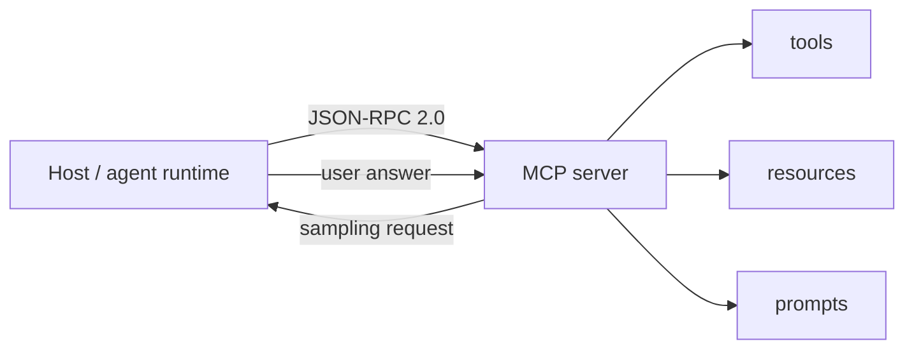

# Model Context Protocol (MCP)

**The Model Context Protocol (MCP)** is the open standard for how AI agents integrate with **external tools, data sources, and other agents**. It standardizes the interfaces an agent needs — tools, resources, prompts, sampling, elicitation — over a common JSON-RPC 2.0-based message layer, so an agent client can be connected to any MCP server the same way. MCP is the de-facto *agent-to-tools / agent-to-data* protocol of the 2026 agent ecosystem, and the base standard that the **MCP Apps** extension builds on for agent-to-UI.

- **Specification:** <https://modelcontextprotocol.io> (source repo: <https://github.com/modelcontextprotocol/modelcontextprotocol>)
- **Blog:** <https://blog.modelcontextprotocol.io>
- **Current revision:** **2026-07-28** (stateless protocol core; see [Releases reference](/references/model-context-protocol-releases.md))
- **Extension:** [MCP Apps](/protocols/mcp-apps.md) extends MCP to deliver interactive UIs (first official extension, Jan 2026).

Evidence for this page comes from the 2026-08-17, 2026-08-18, and 2026-08-22 [web-search Agent integration protocols runs](/sources/web-search-agent-integration-protocols.md) (MCP blog posts, the spec-repo releases page, and the MCP Apps `ext-apps` repository) plus earlier MCP Apps and AHP evidence. The 2026-08-18 re-pull retrieved the full 2026-07-28 announcement and the 2025-11-25 anniversary post, adding the SEP-level changelog details below; the 2026-08-22 re-pull added the full RC-post body (JSON Schema, lifecycle/conformance gating), the Java SDK v2.0.0 release surface, and registry open-source depth. Durable revisions are tracked on the [MCP releases reference](/references/model-context-protocol-releases.md).

## What MCP standardizes

MCP lets a **host** (the application or agent environment) speak to **servers** (processes exposing capabilities). The core primitives:

- **Tools** — callable functions the model can invoke with arguments (e.g. "create a file", "query a database"). Model-initiated.
- **Resources** — host-managed data the model can read or subscribe to (files, records, live state). Application-shaped, URI-addressable (`resources/list`, `resources/read`, `resources/templates`, change notifications).
- **Prompts** — reusable prompt templates a server exposes for the application to present to the user, optionally with arguments filled in.
- **Sampling** — a *server-initiated* mechanism asking the host to generate a model response (`sampling/createMessage`), letting servers ask for LLM completions without holding their own model.
- **Elicitation** — the mechanism for asking the user for information or a decision during a task (surfaced in SDKs as part of the assistant-user interaction surface; the Swift SDK 0.11.0 changelog lists "Elicitation updates" from SEP-1034/SEP-1036/SEP-1330).

*MCP in one picture: a host and server exchange JSON-RPC 2.0 messages; the server exposes tools, resources, and prompts, and can ask the host back for sampling and elicitation.*

MCP is transport-negotiated: client and server agree on a protocol version and transport (stdio, streamable HTTP, or WebSocket). Servers and clients perform **version negotiation** on connect, permitting backwards and forwards compatibility as SDKs adopt revisions at their own pace (spec-repo release notes).

## The 2026-07-28 revision (stateless core)

The **2026-07-28 specification** is the current revision, released after a release candidate announced **2026-05-21** (RC locked 2026-05-21; the final specification shipped 2026-07-28 — the ten-week window was for SDK maintainers and client implementers to validate against real workloads). It is the biggest change in MCP's history: the protocol core is now **stateless** (no handshake, no session). The RC post frames the stateless core as the completion of the plan laid out in *The Future of MCP Transports* (2025-12-19): **six SEPs work together** to make the protocol stateless, routable, cacheable, and traceable on ordinary HTTP infrastructure.

What changed in 2026-07-28 (from the official [blog announcement](https://blog.modelcontextprotocol.io/posts/2026-07-28), which the 2026-08-18 re-pull retrieved in full with SEP references):

- **No handshake or sessions** — the `initialize`/`initialized` exchange and the `Mcp-Session-Id` header are retired (SEP-2575, SEP-2567). Each request is self-contained and carries its protocol version, client identity, and client capabilities in `_meta`, so any request can land on any instance behind a plain round-robin load balancer without shared storage. Clients that want capabilities up front can call the new, optional **`server/discover` RPC**; it is not required. The protocol is "stateless, stateful applications": a server that needs state across calls mints an explicit handle from a tool and has the model pass it back as an argument.
- **Multi Round-Trip Requests (MRTR)** (SEP-2322) — replaces the server-initiated `elicitation/create`, `sampling/createMessage`, and `roots/list` requests that previously required a held-open bidirectional stream. When a tool needs something from the user mid-call (confirmation, missing parameter), the server returns `resultType: "input_required"` along with the requests it needs answered, and the client retries the original call with the answers attached in `inputResponses`.
- **Header-based routing** (SEP-2243) — streamable-HTTP requests must now include `Mcp-Method` and `Mcp-Name` headers, so gateways, rate limiters, and WAFs can route and meter on headers instead of parsing JSON bodies.
- **List results are cacheable** (SEP-2549) — responses from `tools/list`, `prompts/list`, `resources/list`, and `resources/read` carry `ttlMs` and `cacheScope` cache hints with deterministic ordering, so clients can cache tool catalogs and keep upstream prompt caches stable across reconnects.
- **Authorization hardening** — the OAuth 2.1-based authorization framework was hardened with four changes (see [Authorization](#authorization-oauth-21)): RFC 9207 `iss` validation (SEP-2468), `application_type` during DCR (SEP-837), issuer-bound client credentials (SEP-2352), and formal deprecation of DCR in favor of client metadata documents (CIMD).
- **Tasks** — the experimental Tasks primitive moves **out of the core** and into the `io.modelcontextprotocol/tasks` extension (SEP-2663): a poll-based `tasks/get` and a new `tasks/update`, with change notifications moved from the old HTTP GET endpoint to a single `subscriptions/listen` stream clients opt into per notification type. The [2026 roadmap](https://blog.modelcontextprotocol.io/posts/2026-mcp-roadmap) documents production-learned lifecycle gaps to close (retry semantics for transient failures, expiry policies for retained results).
- **Deprecations** (SEP-2577) — **Roots, Sampling, and Logging are deprecated** (still work for at least twelve months; new implementations shouldn't adopt them), the **legacy HTTP+SSE transport is officially deprecated** with a year-long offramp, and the revision ships a **formal deprecation policy** with a **twelve-month minimum window** for planning upgrades.
- **Full JSON Schema 2020-12 for tools** (SEP-2106) — tool `inputSchema` and `outputSchema` are lifted to full [JSON Schema 2020-12](https://json-schema.org/draft/2020-12): input schemas keep the `type: "object"` root constraint but now allow composition (`oneOf`, `anyOf`, `allOf`), conditionals, and references (`$ref`, `$defs`); output schemas are unrestricted and `structuredContent` can now be any JSON value rather than only an object. Implementations must not auto-dereference external `$ref` URIs and should bound schema depth and validation time.
- **Error-code errata** (SEP-2164) — the error code for a missing resource changes from the MCP-custom `-32002` to the JSON-RPC standard `-32602` Invalid Params; clients matching on the literal `-32002` must update.
- **How the protocol evolves from here** — three governance SEPs keep future revisions non-breaking: a **feature lifecycle policy** (every feature gets *Active* → *Deprecated* → *Removed* states with at least twelve months between deprecation and earliest possible removal), the extensions framework (new capabilities ship as opt-in extensions and stabilize there), and a **conformance gate** (a Standards Track SEP cannot reach Final status until a matching scenario lands in the [conformance suite](https://github.com/modelcontextprotocol/conformance), SEP-2484 — the same suite the **SDK tier system** scores official SDKs against). The stateless rework was the foundational clean break; implementers targeting 2026-07-28 should be able to adopt future revisions without rewriting transport or lifecycle code.
- **Formal extensions framework** — a first-class mechanism for extending MCP beyond the core primitives; MCP Apps and Enterprise Managed Authorization (EMA) joined Tasks as extensions under it.
- **SDK + ecosystem status** — all four Tier 1 SDKs (TypeScript, Python, Go, C#) speak `2026-07-28` as of the release, with detailed migration notes for the breaking bits; the Rust SDK supports the new spec in **beta**. Across Tier 1 SDKs, close to **half a billion downloads a month**, with TypeScript and Python SDKs each crossing **1 billion total downloads**. The release announcement carries ecosystem quotes positioning the stateless core as making MCP a first-class HTTP workload (Amazon Bedrock AgentCore, Cloudflare Workers, Microsoft Foundry, Netlify, Google Cloud, Supabase elicitations, FastMCP 4.0, Runlayer).

### Server-to-client requests, restructured

The RC post describes the "before and after": the handshake and session are gone, server-to-client requests are restructured, and messages are **routable, cacheable, traceable**. The streamable-HTTP transport remains the primary wire transport, but now serves the stateless core: clients negotiate the revision per request/response rather than establishing a session.

## The 2025-11-25 revision (prior stable; first anniversary)

The **2025-11-25 revision** was the previous stable spec, released on MCP's first anniversary (see [One Year of MCP](https://blog.modelcontextprotocol.io/posts/2025-11-25-first-mcp-anniversary), retrieved in full in the 2026-08-18 re-pull). It introduced the pre-stateless surface the 2026-07-28 revision restructures:

- **Tasks (experimental, SEP-1686)** — a new abstraction for tracking work a server is performing; any request can be augmented with a task, and clients query status and retrieve results up to a server-defined duration after creation. Task states: `working`, `input_required`, `completed`, `failed`, `cancelled`, enabling active polling, result retrieval, lifecycle management, and task isolation (session-based access control). Launched as an **experimental core capability** (not yet finalized) so it could be battle-tested in production; 2026-07-28 moved it out of the core into the Tasks extension.
- **URL-based client registration (SEP-991)** — introduced the CIMD flow: clients provide their own client ID that is a URL pointing to a JSON document (the OAuth Client ID Metadata Document) describing the client, superseding plain DCR for new implementations (see [Authorization](#authorization-oauth-21)).
- **Extensions concept** — introduced extensions as optional, additive, composable, independently versioned components outside the core spec (the mechanism 2026-07-28 formalizes); the first announcement was the [MCP Apps](https://blog.modelcontextprotocol.io/posts/2025-11-21-mcp-apps/) proposal.
- **Security and enterprise features** — SEP-1024 (client security requirements for local server installation), SEP-835 (default scopes definition in the authorization spec), and a vision for enterprise-owned MCP registries with self-managed governance (see the [Registry](#registry) section).
- **Adoption scale at the time** — thousands of active MCP servers (Notion, Stripe, GitHub, Hugging Face, Postman among the named), the MCP Registry approaching **2,000 entries (407% growth** from its September 2025 launch batch), 58 maintainers + 9 core/lead maintainers in the steering group, and 17 SEPs merged in about a quarter.

## Authorization (OAuth 2.1)

MCP adopted **OAuth 2.1** as the foundation of its authorization framework. The blog's *Evolving OAuth Client Registration in MCP* (2025-08-22) explains why client registration is central: in a world where clients and servers have no pre-existing relationship, every client-server pairing needs registration — which created operational problems with **Dynamic Client Registration (DCR)**:

- **Unbounded database growth** — every client/host pairing created a new registration on the authorization server unless the client already had one.
- **Client-expiry "black hole"** — no way to tell a client its ID is invalid without creating an open redirect vulnerability; clients had to implement their own ID-management heuristics.
- **Non-portability** — the same client on a different machine produced a distinct registration.

The **recommendation**: **keep DCR for backward compatibility, but recommend CIMD (Client ID Metadata Documents) for new implementations** — both achieve the same authorization goal. CIMD is the *OAuth Client ID Metadata Document* pattern (implemented by Bluesky): instead of a registration step, the client uses an **HTTPS metadata URL as its client ID** and the authorization server fetches the metadata document from that URL at authorization time. That sidesteps the operational issues entirely — no unbounded database growth (metadata is fetched on demand and cacheable), no expiry management (the URL is the ID), a natural one-URL-per-application model, and no unauthenticated `/register` write endpoint. The cost: clients must host a metadata document at an HTTPS URL (trivial for web apps; desktop apps typically host it on their backend). Where `localhost` impersonation is a concern, **software statements** can be layered on top (optional for both DCR and CIMD; the authorization server chooses the required trust level) — the client hosts a JWKS, its backend issues a short-lived signed JWT attesting to the client's identity, and the authorization server verifies it. Platform-level OS attestation is future work.

The 2026-07-28 revision **formally deprecates DCR in favor of CIMD** (DCR keeps working for backward compatibility but will be removed in a future spec version) and adds three hardening measures:

- **RFC 9207 `iss` validation** (SEP-2468) — authorization servers should return the `iss` parameter and clients must validate it before redeeming a code, closing an authorization-server mix-up hole.
- **`application_type` on DCR** (SEP-837) — clients set `application_type` during DCR so authorization servers stop rejecting `localhost` redirects for desktop and CLI apps (a hardening measure making the protocol comply with OAuth spec requirements while the move to CIMD proceeds).
- **Issuer-bound client credentials** (SEP-2352) — client credentials are bound to the issuer that minted them; no reuse across authorization servers.

Security considerations the implementation must handle: because both CIMD and software statements require authorization servers to make outbound HTTPS requests **to potentially untrusted domains**, implementations must prevent SSRF (block internal network access), enforce timeouts and size limits, consider caching for performance, and validate response formats strictly. This security boundary applies to **MCP Apps / AHP `mcp://` relays too** — AHP servers surface MCP endpoints to host-run services (see the [AHP `mcp://` side-channel](/protocols/agent-host-protocol.md#the-mcp-side-channel-links-to-mcp-apps)).

## The Extensions framework and MCP Apps

The 2026-07-28 revision introduces a **formal extensions framework** — the mechanism for extending the core protocol. [MCP Apps](/protocols/mcp-apps.md) is the first official extension, co-developed by Anthropic and OpenAI, announced January 2026 and specified in `ext-apps/specification/2026-01-26/apps.mdx` (extension ID `io.modelcontextprotocol/ui`). It lets MCP servers deliver interactive UIs (charts, forms, dashboards) rendered securely in iframes in any compliant host. MCP Apps is also the *first extension to be folded into the spec's capabilities/extension negotiation* (`capabilities.extensions` on initialize).

## Capability negotiation and SDKs

At initialization the client and server exchange `ClientCapabilities` / `ServerCapabilities` (including `capabilities.extensions` once the extensions framework landed). SDKs adopt revisions at their own pace while honoring version negotiation. For the 2026-07-28 revision all four **Tier 1 SDKs (TypeScript, Python, Go, C#) speak the revision as of the release day** (with migration notes for the breaking bits) and the **Rust SDK supports it in beta**; the pre-release beta posture for Go/C# is tracked on the [Releases reference](/references/model-context-protocol-releases.md). The **TypeScript SDK restructured into a v2.0.0 monorepo split** (`@modelcontextprotocol/core`, `client`, `server`, `node`, `hono`, `fastify`, `express`, `server-legacy`, `codemod` all at 2.0.0, following the 1.30.0 release) — see the [Releases reference](/references/model-context-protocol-releases.md). The Swift SDK 0.11.0 carried the reference conformance suite (SEP-1730), icons/metadata (SEP-973), and elicitation updates (SEP-1034/1036/1330), with experimental Tasks (SEP-1686), sampling-with-tools (SEP-1577), and auth updates (SEP-990/1046) still uncovered.

## Registry

The **MCP Registry** (blog, 2025-09-08) is an open catalog and API for **discovering publicly available MCP servers** — standardizing how servers are distributed and discovered, improving implementer reach and client connectivity. Launched in **preview**, hosted at <https://registry.modelcontextprotocol.io>; by November 2025 it had grown to nearly **2,000 entries (407% growth)** from its initial September batch. The registry is itself an **open-source MCP project**: the [modelcontextprotocol/registry](https://github.com/modelcontextprotocol/registry) repository (Go, ~7.2k stars / 947 forks, 686 commits, permissively licensed) implements the service, carries a parent **OpenAPI specification** (`docs/reference/api/official-registry-api.md`) so anyone can build a compatible *sub-registry*, and is maintained by a registry working group (Anthropic, GitHub, PulseMCP, Block, Stacklok, VS Code, NuGet contributors) with community-driven moderation (issues flag spam/malicious/impersonating servers; maintainers denylist entries and remove them from public access). The registry is the **primary source of truth for public MCP servers** that public sub-registries ("opinionated MCP marketplaces" per client) and **private enterprise sub-registries** (sharing API schemas) build upon. The 2025-11-25 release also established a vision for **enterprise-owned, self-managed MCP registries** with governance controls and security coverage. Part of MCP's ecosystem-growth story alongside the extensions framework.

## 2026 roadmap and governance

The [2026 MCP Roadmap](https://blog.modelcontextprotocol.io/posts/2026-mcp-roadmap) (2026-03-09) marks a shift "from releases to working groups":

- **Transport Evolution and Scalability** — the stateless core + MRTR + cacheable lists land here.
- **Agent Communication** — beyond tools, MCP grows toward agent-to-agent surfaces; Tasks (SEP-1686) lifecycle gaps (retry semantics, expiry policies) are the immediate iteration target.
- **Governance Maturation** — the SEP (spec evolution proposal) process bottlenecks on core-maintainer review; the plan is a **contributor ladder** and **delegation to trusted Working Groups** so domain experts accept SEPs without a full core review, keeping strategic oversight at the core.
- **Enterprise Readiness** — SSRF-hardened authorization, cacheable lists, and routable requests serve enterprise deployments.

## Relationships to the rest of the wiki

- **[MCP Apps](/protocols/mcp-apps.md)** *extends* MCP as its first official extension, delivering interactive UIs over the same JSON-RPC base.
- **[Agent Host Protocol (AHP)](/protocols/agent-host-protocol.md)** *relays MCP* over its `mcp://` side-channel: an AHP client can originate a capability-gated subset of MCP traffic (MCP wire format verbatim) against an MCP server the host already runs. AHP treats MCP servers as first-class session customizations with a lifecycle and OAuth challenge flow. The 2026-07-28 stateless-core change is transparent to the relay — AHP carries MCP URIs/methods, not the now-removed session handshake.
- **[AG-UI](/protocols/ag-ui.md)** *complements* MCP: where MCP covers agent-to-tools / agent-to-data (and now agent-to-UI via MCP Apps), AG-UI covers agent-to-UI streaming as a standalone event protocol.
- **[A2UI](/protocols/a2ui.md)** *can ride over* MCP — the A2UI site documents "A2UI over MCP" as a transport, alongside "MCP Apps in A2UI" and "A2UI in MCP Apps".
- **[Generative-UI ecosystem](/concepts/generative-ui-ecosystem.md)** treats MCP Apps as the "ecosystem extension" approach within the broader agent-UI landscape; MCP is the base standard that approach extends.
- **AHP ↔ MCP Apps ↔ MCP** — see the [factory-toolchain hub](/concepts/factory-toolchain.md) for how these compose in an agentic SDLC pipeline; the [AHP page](/protocols/agent-host-protocol.md#the-mcp-side-channel-links-to-mcp-apps) documents the relay.

## Status and confidence

- **Current revision:** 2026-07-28 (stateless core, MRTR, header-based routing, cacheable lists, full JSON Schema 2020-12 for tools, authorization hardening, extensions framework, Tasks extension, formal deprecation/lifecycle policy); release candidate 2026-05-21; prior stable 2025-11-25 (DCR→CIMD direction, experimental core Tasks, extensions concept, enterprise registry vision).
- **Confidence:** source-backed — official MCP blog posts (2026-07-28 spec with full SEP changelog, 2026-07-28 RC body, sdk-betas, 2026 MCP roadmap, client registration, registry preview, 2025-11-25 anniversary post) plus the spec-repo releases fragment, the `modelcontextprotocol/registry` repo page, and the MCP Apps `ext-apps` docs, all retrieved in the 2026-08-17, 2026-08-18, and 2026-08-22 runs. The exact spec-repo release tag format for 2026-07-28 is blog-backed (the GitHub releases fragment only showed the 2025-03-26 … 2025-11-25 range) — not contested, but noted on the [releases reference](/references/model-context-protocol-releases.md).
- **Watchlist:** SDK package versions and the TS v2.0.0 monorepo split are release-list observations (they will move as packages iterate); the experimental Tasks extension lifecycle iteration is a roadmap promise, not yet shipped; the 2025-11-25 Registry growth figures (2,000 entries, 407%) are from the anniversary post and will drift; the Java SDK v2.0.0 milestone was observed on its releases page fragment only. The conformance-suite (SEP-2484) and SDK-tier-system (PR 1777) gating of Standards Track SEPs is RC-post-backed, and the official conformance suite repo is linked.

## Source Map

- [Web-search Agent integration protocols source evidence](/sources/web-search-agent-integration-protocols.md) — all three runs' raw queries, hits, and reliability caveats (2026-08-17, 2026-08-18, 2026-08-22).
- [MCP releases reference](/references/model-context-protocol-releases.md) — versioned revision history, SDK posture, deprecations.
- [MCP Apps](/protocols/mcp-apps.md) — the first official extension.
- [AHP `mcp://` side-channel](/protocols/agent-host-protocol.md#the-mcp-side-channel-links-to-mcp-apps) — AHP's relay of MCP traffic.
- Blog: <https://blog.modelcontextprotocol.io> · Spec: <https://modelcontextprotocol.io>