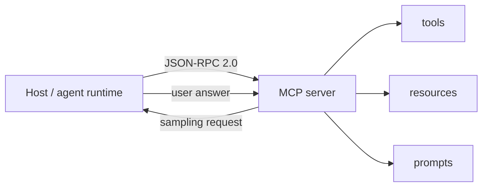

# Model Context Protocol (MCP)

**The Model Context Protocol (MCP)** is the open standard for how AI agents integrate with **external tools, data sources, and other agents**. It standardizes the interfaces an agent needs — tools, resources, prompts, sampling, elicitation — over a common JSON-RPC 2.0-based message layer, so an agent client can be connected to any MCP server the same way. MCP is the de-facto *agent-to-tools / agent-to-data* protocol of the 2026 agent ecosystem, and the base standard that the **MCP Apps** extension builds on for agent-to-UI.

- **Specification:** <https://modelcontextprotocol.io> (source repo: <https://github.com/modelcontextprotocol/modelcontextprotocol>)
- **Blog:** <https://blog.modelcontextprotocol.io>
- **Current revision:** **2026-07-28** (stateless protocol core; see [Releases reference](/references/model-context-protocol-releases.md))
- **Extension:** [MCP Apps](/protocols/mcp-apps.md) extends MCP to deliver interactive UIs (first official extension, Jan 2026).

Evidence for this page comes from the 2026-08-17 [web-search Agent integration protocols run](/sources/web-search-agent-integration-protocols.md) (MCP blog posts, the spec-repo releases page, and the MCP Apps `ext-apps` repository) plus earlier MCP Apps and AHP evidence. Durable revisions are tracked on the [MCP releases reference](/references/model-context-protocol-releases.md).

## What MCP standardizes

MCP lets a **host** (the application or agent environment) speak to **servers** (processes exposing capabilities). The core primitives:

- **Tools** — callable functions the model can invoke with arguments (e.g. "create a file", "query a database"). Model-initiated.
- **Resources** — host-managed data the model can read or subscribe to (files, records, live state). Application-shaped, URI-addressable (`resources/list`, `resources/read`, `resources/templates`, change notifications).
- **Prompts** — reusable prompt templates a server exposes for the application to present to the user, optionally with arguments filled in.
- **Sampling** — a *server-initiated* mechanism asking the host to generate a model response (`sampling/createMessage`), letting servers ask for LLM completions without holding their own model.
- **Elicitation** — the mechanism for asking the user for information or a decision during a task (surfaced in SDKs as part of the assistant-user interaction surface; the Swift SDK 0.11.0 changelog lists "Elicitation updates" from SEP-1034/SEP-1036/SEP-1330).

*MCP in one picture: a host and server exchange JSON-RPC 2.0 messages; the server exposes tools, resources, and prompts, and can ask the host back for sampling and elicitation.*

MCP is transport-negotiated: client and server agree on a protocol version and transport (stdio, streamable HTTP, or WebSocket). Servers and clients perform **version negotiation** on connect, permitting backwards and forwards compatibility as SDKs adopt revisions at their own pace (spec-repo release notes).

## The 2026-07-28 revision (stateless core)

The **2026-07-28 specification** is the current revision, released after a release candidate announced **2026-05-21**. It is the biggest change in MCP's history: the protocol core is now **stateless** (no handshake, no session).

What changed in 2026-07-28 (from the official [blog announcement](https://blog.modelcontextprotocol.io/posts/2026-07-28)):

- **No handshake or sessions** — the `initialize` handshake and session lifecycle are gone from the protocol core; "stateless protocol, stateful applications." Each request is self-contained and routable, which is what makes scalable enterprise deployments (load-balanced, multi-tenant) practical.
- **Multi Round-Trip Requests (MRTR)** — a single client request can trigger multiple server round-trips, decoupling request/response pairing from a single message exchange.
- **Header-based routing** — requests carry routing headers instead of relying on per-session state, so intermediaries and gateways can route MCP traffic without session affinity.
- **List results are cacheable** — `*_list` results (tools, resources, prompts) can be cached under standard HTTP caching semantics, cutting repeated round-trips.
<!-- openwiki: broken internal link [#authorization] heading anchor "authorization" does not exist in /protocols/model-context-protocol.md. Fix the href or restore the target, then delete this comment. -->
- **Authorization hardening** — the OAuth 2.1-based authorization framework was hardened; MCP 2026-07-28 is the OAuth 2.1 direction the [client registration evolution post](https://blog.modelcontextprotocol.io/posts/client_registration) prepared (see [Authorization](#authorization)).
- **Tasks** — the experimental **Tasks** primitive (SEP-1686) ships in the revision; the [2026 roadmap](https://blog.modelcontextprotocol.io/posts/2026-mcp-roadmap) documents production-learned lifecycle gaps to close (retry semantics for transient failures, expiry policies for retained results).
- **Deprecations** — the revision came with a **formal deprecation policy** and a set of deprecations (details in the release notes).
- **Formal extensions framework** — a first-class mechanism for extending MCP beyond the core primitives; MCP Apps is the first extension shipped under it.

### Server-to-client requests, restructured

The RC post describes the "before and after": the handshake and session are gone, server-to-client requests are restructured, and messages are **routable, cacheable, traceable**. The streamable-HTTP transport remains the primary wire transport, but now serves the stateless core: clients negotiate the revision per request/response rather than establishing a session.

## Authorization (OAuth 2.1)

MCP adopted **OAuth 2.1** as the foundation of its authorization framework. The blog's *Evolving OAuth Client Registration in MCP* (2025-08-22) explains why client registration is central: in a world where clients and servers have no pre-existing relationship, every client-server pairing needs registration — which created operational problems with **Dynamic Client Registration (DCR)**:

- **Unbounded database growth** — every client/host pairing created a new registration on the authorization server unless the client already had one.
- **Client-expiry "black hole"** — no way to tell a client its ID is invalid without creating an open redirect vulnerability; clients had to implement their own ID-management heuristics.
- **Non-portability** — the same client on a different machine produced a distinct registration.

The **recommendation**: **keep DCR for backward compatibility, but recommend CIMD (Client-Initiated Machine-to-Machine device/machine credentials) for new implementations** — both achieve the same authorization goal. Where `localhost` impersonation is a concern, **software statements** can be layered on top (optional for both DCR and CIMD; the authorization server chooses the required trust level).

Security considerations the implementation must handle: because both CIMD and software statements require authorization servers to make outbound HTTPS requests **to potentially untrusted domains**, implementations must prevent SSRF (block internal network access), enforce timeouts and size limits, consider caching for performance, and validate response formats strictly. This security boundary applies to **MCP Apps / AHP `mcp://` relays too** — AHP servers surface MCP endpoints to host-run services (see the [AHP `mcp://` side-channel](/protocols/agent-host-protocol.md#the-mcp-side-channel-links-to-mcp-apps)).

## The Extensions framework and MCP Apps

The 2026-07-28 revision introduces a **formal extensions framework** — the mechanism for extending the core protocol. [MCP Apps](/protocols/mcp-apps.md) is the first official extension, co-developed by Anthropic and OpenAI, announced January 2026 and specified in `ext-apps/specification/2026-01-26/apps.mdx` (extension ID `io.modelcontextprotocol/ui`). It lets MCP servers deliver interactive UIs (charts, forms, dashboards) rendered securely in iframes in any compliant host. MCP Apps is also the *first extension to be folded into the spec's capabilities/extension negotiation* (`capabilities.extensions` on initialize).

## Capability negotiation and SDKs

At initialization the client and server exchange `ClientCapabilities` / `ServerCapabilities` (including `capabilities.extensions` once the extensions framework landed). SDKs adopt revisions at their own pace while honoring version negotiation. For the 2026-07-28 revision the Tier 1 SDKs (TypeScript, Go, C#, Swift) released **beta/preview packages**; serving the new stateless revision over HTTP is an explicit opt-in — see [Releases](/references/model-context-protocol-releases.md). The Swift SDK 0.11.0 carried the reference conformance suite (SEP-1730), icons/metadata (SEP-973), and elicitation updates (SEP-1034/1036/1330), with experimental Tasks (SEP-1686), sampling-with-tools (SEP-1577), and auth updates (SEP-990/1046) still uncovered.

## Registry

The **MCP Registry** (blog, 2025-09-08) is an open catalog and API for **discovering publicly available MCP servers** — standardizing how servers are distributed and discovered, improving implementer reach and client connectivity. Launched in **preview**; part of MCP's ecosystem-growth story alongside the extensions framework.

## 2026 roadmap and governance

The [2026 MCP Roadmap](https://blog.modelcontextprotocol.io/posts/2026-mcp-roadmap) (2026-03-09) marks a shift "from releases to working groups":

- **Transport Evolution and Scalability** — the stateless core + MRTR + cacheable lists land here.
- **Agent Communication** — beyond tools, MCP grows toward agent-to-agent surfaces; Tasks (SEP-1686) lifecycle gaps (retry semantics, expiry policies) are the immediate iteration target.
- **Governance Maturation** — the SEP (spec evolution proposal) process bottlenecks on core-maintainer review; the plan is a **contributor ladder** and **delegation to trusted Working Groups** so domain experts accept SEPs without a full core review, keeping strategic oversight at the core.
- **Enterprise Readiness** — SSRF-hardened authorization, cacheable lists, and routable requests serve enterprise deployments.

## Relationships to the rest of the wiki

- **[MCP Apps](/protocols/mcp-apps.md)** *extends* MCP as its first official extension, delivering interactive UIs over the same JSON-RPC base.
- **[Agent Host Protocol (AHP)](/protocols/agent-host-protocol.md)** *relays MCP* over its `mcp://` side-channel: an AHP client can originate a capability-gated subset of MCP traffic (MCP wire format verbatim) against an MCP server the host already runs. AHP treats MCP servers as first-class session customizations with a lifecycle and OAuth challenge flow. The 2026-07-28 stateless-core change is transparent to the relay — AHP carries MCP URIs/methods, not the now-removed session handshake.
- **[AG-UI](/protocols/ag-ui.md)** *complements* MCP: where MCP covers agent-to-tools / agent-to-data (and now agent-to-UI via MCP Apps), AG-UI covers agent-to-UI streaming as a standalone event protocol.
- **[A2UI](/protocols/a2ui.md)** *can ride over* MCP — the A2UI site documents "A2UI over MCP" as a transport, alongside "MCP Apps in A2UI" and "A2UI in MCP Apps".
- **[Generative-UI ecosystem](/concepts/generative-ui-ecosystem.md)** treats MCP Apps as the "ecosystem extension" approach within the broader agent-UI landscape; MCP is the base standard that approach extends.
- **AHP ↔ MCP Apps ↔ MCP** — see the [factory-toolchain hub](/concepts/factory-toolchain.md) for how these compose in an agentic SDLC pipeline; the [AHP page](/protocols/agent-host-protocol.md#the-mcp-side-channel-links-to-mcp-apps) documents the relay.

## Status and confidence

- **Current revision:** 2026-07-28 (stateless core, MRTR, header-based routing, cacheable lists, authorization hardening, extensions framework, Tasks, formal deprecation policy); release candidate 2026-05-21; prior stable 2025-11-25.
- **Confidence:** source-backed — official MCP blog posts (2026-07-28 spec, 2026-07-28 RC, sdk-betas, 2026 MCP roadmap, client registration, registry preview) plus the spec-repo releases fragment and the MCP Apps `ext-apps` docs, all retrieved in the 2026-08-17 run. The exact spec-repo release tag format for 2026-07-28 is blog-backed (the GitHub releases fragment only showed the 2025-03-26 … 2025-11-25 range) — not contested, but noted on the [releases reference](/references/model-context-protocol-releases.md).
- **Watchlist:** SDK beta adoption details (Go `v1.7.0-pre.1`, C# `2.0.0-preview.1`, TS `StreamableHTTPOptions.Stateless`) are version-specific and will move; Swift SDK 0.11.0/0.12.1 release-list details are from the releases page fragment without per-release dates.

## Source Map

- [Web-search Agent integration protocols source evidence](/sources/web-search-agent-integration-protocols.md) — this run's raw queries, hits, and reliability caveats.
- [MCP releases reference](/references/model-context-protocol-releases.md) — versioned revision history, SDK beta posture, deprecations.
- [MCP Apps](/protocols/mcp-apps.md) — the first official extension.
- [AHP `mcp://` side-channel](/protocols/agent-host-protocol.md#the-mcp-side-channel-links-to-mcp-apps) — AHP's relay of MCP traffic.
- Blog: <https://blog.modelcontextprotocol.io> · Spec: <https://modelcontextprotocol.io>