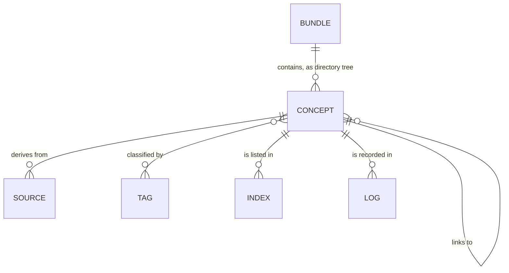
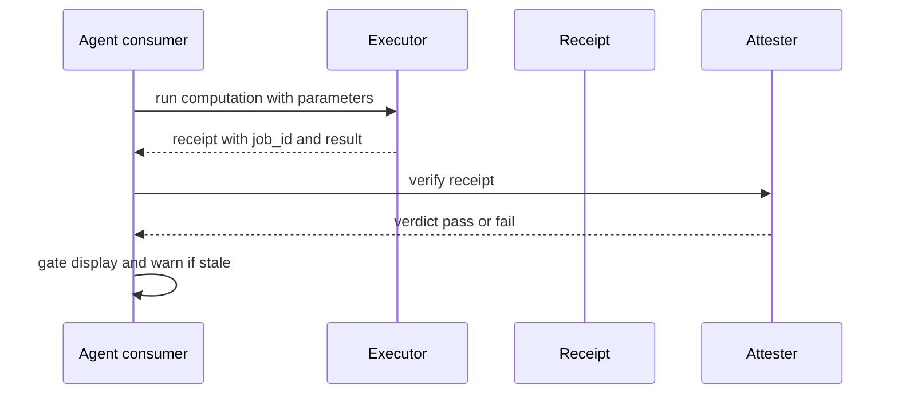

# Open Knowledge Format (OKF)

**OKF** is an open, human- and agent-friendly format for representing *knowledge*: the metadata, context, and curated insight that surrounds data and systems. It is authored by people, generated by agents, exchanged across organizations, and consumed by both. The format is intentionally minimal — a directory of markdown files with YAML frontmatter, with no schema registry, no central authority, and no required tooling (source: [OKF SPEC.md](https://github.com/GoogleCloudPlatform/knowledge-catalog/blob/main/okf/SPEC.md)). The current specification is **OKF v0.2** (spec last updated 2026-07-24 in the `GoogleCloudPlatform/knowledge-catalog` repository).

OKF is the format standard behind agent-maintained knowledge bases such as this wiki. The [OpenWiki](/frameworks/openwiki.md) tool emits OKF documents, and its personal-mode wiki (this corpus) is an OKF bundle. The spec's `references/` convention (§6.3) is mirrored in this wiki's `/references/` directory.

## Motivation and goals

Knowledge representation for AI agents is evolving quickly and many incompatible conventions are emerging. OKF takes the position that knowledge is best represented in commonly accessible, established formats that are:

- **Readable** by humans without tooling.
- **Parseable** by agents without bespoke SDKs.
- **Diffable** in version control.
- **Portable** across tools, organizations, and time.

Because a knowledge corpus is increasingly *continuously written and maintained by agents*, a consumer needs answers that plain markdown-plus-frontmatter does not make first-class. OKF v0.2 makes these first-class while staying minimally opinionated:

1. What was this created from, and how was it verified? (**provenance**)
2. How much should I trust it? (**trust**)
3. Is it still true? (**freshness**)
4. Is it the current version? (**lifecycle**)
5. Was this number produced the way we said it must be? (**attestation**)

### Goals

1. Define a universal format that **producers** (people, agents, export pipelines) can write into.
2. Inform how **consumers** (agents, UIs, search indexes, deterministic code) should read and traverse it.
3. Facilitate **exchange** of knowledge across systems and organizations.
4. Standardize the small set of frontmatter fields that make an agent-maintained corpus trustable, without prescribing any runtime.

### Non-goals

- Defining a fixed taxonomy of concept types.
- Prescribing storage, serving, or query infrastructure.
- Replacing domain-specific schemas (Avro, Protobuf, OpenAPI) — OKF *references* them, it does not subsume them.
- Specifying a packaging or invocation standard for the code an executor or attester points at. OKF fixes the interface, not the packaging.

## Terminology

- **Knowledge Bundle** (or **bundle**): a self-contained, hierarchical collection of knowledge documents; the unit of distribution.
- **Concept**: a single unit of knowledge within a bundle, represented as one markdown document — a tangible asset (a table, an API) or an abstract idea (a metric, a business process).
- **Concept ID**: the path of the concept's file within the bundle, with the `.md` suffix removed.
- **Frontmatter**: a YAML metadata block delimited by `---` at the top of a markdown file.
- **Body**: everything in the file after the frontmatter.
- **Link**: a standard markdown link from one concept to another, used to express relationships beyond the implicit parent/child hierarchy.
- **Source**: a material a concept derives from, recorded in the `sources` frontmatter field.
- **Credibility signal**: an objective, per-source fact (`author`, `usage_count`, `last_modified`) used to infer trust; OKF records the signals, not a verdict.
- **Actor**: `<producer>/<version>` for agents, `human:<id>` for people, `process:<id>` for automated processes.
- **Trust tier**: derived from a concept's `verified` field: unverified, machine-confirmed, or human-reviewed.
- **Attested Computation**: a concept (`type: Attested Computation`) carrying a sanctioned way to compute a value so a consumer can confirm the value was produced by running it.
- **Executor / Receipt / Attester**: the run instructions, the evidence a run returns, and the deterministic (no-LLM) code that inspects the receipt and returns a verdict.

## Bundle structure

A bundle is a directory tree of markdown files:

```text
path/to/bundle/
  index.md                      # Optional. Directory listing for progressive disclosure.
  log.md                        # Optional. Chronological history of updates.
  <concept>.md                  # A concept at the bundle root.
  <subdirectory>/
    index.md
    <concept>.md
```

A bundle MAY be distributed as a git repository (recommended — history, attribution, diffs), a tarball or zip, or a subdirectory within a larger repository.

### Reserved filenames

`index.md` (directory listing, §8) and `log.md` (update history, §9) have defined meaning at any level of the hierarchy and MUST NOT be used for concept documents. All other `.md` files are concept documents. Tags remain a first-class concept through the `tags` frontmatter field; a consumer wanting a tag-browsing view synthesizes one at consumption time by scanning frontmatter.

## Concept documents

Every concept is a UTF-8 markdown file with a YAML frontmatter block (delimited by `---`) and a markdown body.

```yaml
---
type: <Type name>                  # REQUIRED
title: <Optional display name>
description: <Optional one-line summary>
resource: <Optional canonical URI for the underlying asset>
tags: [<tag>, <tag>, ...]
# ... trust, lifecycle, provenance, and computation families (§5, §10)
# ... other producer-defined key/value pairs
---
```

- **Required:** `type` — a short string identifying the kind of concept; consumers use it for routing, filtering, and presentation. Type values are NOT registered centrally; consumers MUST tolerate unknown types. `type` is the only always-required key.
- **Recommended:** `title`, `description`, `resource`, `tags`.
- **Extensions:** producers MAY include additional keys; consumers SHOULD preserve unknown keys on round-trip and MUST NOT reject documents with unrecognized fields.

### Body and conventional headings

The body is standard markdown; producers SHOULD favor structural markdown (headings, lists, tables, fenced code blocks). Conventional headings: `# Schema`, `# Examples`, `# Computation` (for Attested Computations). Per-claim attribution to external sources uses markdown footnotes keyed to `sources` entries.

### Examples from the spec

A concept bound to a resource (`type: BigQuery Table`, `resource:` points at the console) with a schema table; a concept not bound to a resource (`type: Playbook`) with body steps. Both shown in the spec §4.3–4.4.

## Provenance, trust, and lifecycle

These frontmatter families make "where did this come from," "how much should I trust it," and "is it still current" answerable from frontmatter. All are optional; their absence carries meaning (an unverified concept is distinguishable from a verified one, but is never rejected).

### 5.1 Provenance: `sources`

```yaml
sources:
  - id: ga4-schema
    resource: https://developers.google.com/analytics/bigquery/export-schema
    title: GA4 BigQuery Export schema
    author: team:ga4-docs
    usage_count: 5000
    last_modified: 2026-05-30
usage_window: { from: 2026-06-01, to: 2026-06-30 }
```

- `resource` is REQUIRED within an entry — an absolute URL, a bundle-relative path, or a scope descriptor.
- Per-source **credibility signals**: `author` (authority), `usage_count` + `usage_window` (adoption/liveness), `last_modified` (recency). OKF records the signals, not a score — credibility is inferred by the consumer.
- Lineage is expressed through links, not a dedicated field.
- Per-claim attribution uses markdown footnotes whose label is a `sources[].id` (keyed, not positional, so reordering does not misattribute).

### 5.2 Trust: `generated` and `verified`

```yaml
generated: { by: reference_agent/gemini-2.5-pro, at: 2026-06-20T22:53:05Z }
verified:
  - { by: human:a1, at: 2026-06-25T09:00:00Z }
```

- `generated` records how content was produced; `verified` records who/what confirmed it.
- `verified` is independent of `generated.at`.

### 5.3 Trust tiers

Consumers derive a trust tier from `verified`, lowest to highest: **unverified** (no `verified`), **machine-confirmed** (non-human actors only), **human-reviewed** (a `human:<id>` actor verified it).

### 5.4 Lifecycle: `status`

`status: draft | stable | deprecated` — absent ⇒ `stable`.

### 5.5 Lifecycle: `stale_after`

An absolute date (`YYYY-MM-DD`), not a relative TTL, keeps staleness a plain date comparison: a concept is stale when `today >= stale_after`.

## Cross-linking and paths

Concepts MAY link via standard markdown links. Two forms are supported:

- **Absolute (bundle-relative)** — begins with `/`, interpreted relative to the bundle root; the recommended form because it stays stable when documents move.
- **Relative** — a standard relative path.

A link asserts a *relationship*; the kind (parent/child, references, joins-with, depends-on) is conveyed by surrounding prose, not the link itself. Consumers MUST tolerate broken links — a missing target may simply be not-yet-written knowledge.

Path-valued fields (`resource`, `sources[].resource`, `computation`, `executor.resource`, `attester.resource`) accept an absolute URL, a bundle-relative path beginning with `/`, or a relative path.

### The `references/` convention

A `references/` subdirectory conventionally mirrors external material, run instructions, or code as first-class concepts within the bundle. Sources, executors, and attesters commonly point into it. It is a naming convention, not a requirement — and it is the convention this wiki's `/references/` directory follows.

## Actor convention

Fields that record identity (`generated.by`, `verified[].by`) use: `<producer>/<version>` for agents and tools; `human:<id>` for people; `process:<id>` for automated processes. Consumers key trust classification off the `human:` prefix.

## Index files and log files

- An `index.md` MAY appear in any directory incl. the bundle root; it enumerates the directory's contents for **progressive disclosure** (one level at a time instead of loading the entire bundle into context). Index files contain no frontmatter except a bundle-root `index.md` MAY carry `okf_version`.
- A `log.md` MAY appear at any level; a flat list of date-grouped entries, newest first, with ISO 8601 date headings.

## Attested Computation

An Attested Computation concept (`type: Attested Computation`, §10) carries a **sanctioned way to compute** a value so a consumer can confirm the blessing ran. It is a standalone concept because: `runtime` defines what `parameters` mean (a SQL bind var, a dbt var, a Python argument); one computation can back many consumers; and trust state is per computation.

### 10.1 Computation works as a concept

Three properties motivate the standalone concept: runtime-parameter binding semantics, one-computation-many-consumers reuse, and per-computations trust/verification.

### 10.2 Contract fields

- `runtime` (REQUIRED for this type): how to run the computation, e.g. `bigquery`, `postgres`, `dbt`, `python`, `Looker`.
- `parameters`: typed, named holes the agent may fill; each `{ name, type, required }`.
- `computation`: optional path to a computation file, used instead of the body fence.
- `executor`: how the computation is run; `resource` names instructions/code; `receipt` declares the fields a run must return.
- `attester`: the deterministic (no-LLM) check that takes a receipt and returns a verdict.

### 10.3 The computation

Provide it inline (a fenced block under `# Computation`) or as a file path. The agent MAY only supply values for declared `parameters`; it MUST NOT author or edit the computation. The consumer binds values into the executable artifact; the attester re-derives the same binding to compare against what actually ran (`executed_sql`, `compiled_sql`), so a rewritten query, swapped file, or mutated dependency fails the check.

### 10.4 Concepts that use a computation

A readable document (a `Metric`, a `BigQuery Table`) links to one Attested Computation per figure. Because each computation is its own concept, revenue can be fresh while profit is past its `stale_after`, and each attests on its own run. Co-locating them is a directory choice (a `computations/` folder with an `index.md`), not a frontmatter one.

### 10.5 How a consumer uses it (informative)

1. **Discover** via `type: Attested Computation` or via a linking concept.
2. **Load** the contract from frontmatter, the computation from the body or file.
3. **Parameterize** — the agent supplies values for declared parameters.
4. **Execute** — the executor runs the binding and returns a receipt.
5. **Attest** — the consumer runs the attester over the receipt (confirms the computation that ran equals `computation` bound with the claimed parameters; re-reads by job id).
6. **Gate** — refuse to display a failing attestation; warn or refuse when `today >= stale_after`; surface the verdict so trust is visible.

### 10.6 Verification versus attestation

- `verified` confirms the *definition* matches policy: doc-level, slow, recorded in the bundle.
- Attestation confirms a single *run* produced the value the sanctioned way: per-call, runtime, not stored in the bundle.

## Conformance

A bundle is **conformant** with OKF v0.2 if:

1. Every non-reserved `.md` file has a parseable YAML frontmatter block.
2. Every frontmatter block has a non-empty `type`.
3. Every reserved filename follows the `index.md`/`log.md` structure.

Consumers MUST treat a bare `verified` mapping as a one-element list; MUST NOT reject a concept for missing optional families; SHOULD derive trust tiers and staleness only from the specified fields. Consumers MUST NOT reject a bundle because of missing optional fields, unknown `type` values, unknown extra keys, broken cross-links, or missing `index.md` files.

## Versioning

Revisions are versioned `<major>.<minor>`:

- **Minor** bump: backward-compatible additions (new optional fields, new conventional section headings).
- **Major** bump: possible breaking changes (renaming required fields, changing reserved filenames).

Bundles may declare `okf_version: "0.2"` in a bundle-root `index.md` frontmatter (the only place frontmatter is permitted in `index.md`). Consumers that do not understand the declared version SHOULD attempt best-effort consumption.

### Considered and deferred

The full runtime protocol (receipt/verdict wire formats and attestation lifecycle), the attester ABI/portability/sandboxing, attestation caching, and semantic-layer templates (Looker/dbt) where the comparison shifts from SQL equality to model-and-binding equality.

## Changes from v0.1 (breaking + additive)

**Breaking:**
- `timestamp` is superseded by `generated.at`; consumers MAY fall back to legacy `timestamp`.
- The body `# Citations` list is superseded by `sources` in frontmatter; consumers SHOULD read `sources` and MAY parse a legacy list.

**Additive:**
- New frontmatter families: `sources` (+ per-source signals, `usage_window`), `generated`, `verified`, `status`, `stale_after`.
- New concept type `Attested Computation` + computation keys (`runtime`, `parameters`, `computation`, `executor`, `attester`).
- New conventional body heading `# Computation`; new actor convention.
- Everything else is carried forward unchanged.

## v0.2 in action: the worked example

The spec's Appendix A migrates an income statement from v0.1 (single doc, SQL in prose, `timestamp`, `# Citations`) to v0.2: the two figures split into `type: Attested Computation` docs (`runtime: bigquery` and `runtime: dbt`), a narrative `type: Metric` concept links both, and every family is populated in deliberately different states (human-verified fresh revenue; process-verified stale profit) so one consumer reaches two verdicts.

## Data model


*OKF data model: a bundle contains concepts; concepts derive from sources, link to other concepts, are tagged, and are indexed/logged.*

## Attestation flow


*Attestation flow: the consumer executes the sanctioned computation via the executor, then runs the deterministic attester over the receipt before gating display.*

## Ecosystem and tooling

The spec is produced by **GoogleCloudPlatform/knowledge-catalog** (MIT-style, Apache-2.0 spec material); its README frames OKF as the format, with a bundled **reference agent** and **visualizer** as proofs of concept on both ends — production and consumption:

- **Reference agent**: two-pass producer — a BQ pass writes one OKF doc per concept from BigQuery metadata; a web pass runs the LLM as a crawler over seed URLs (`--web-seed`), choosing for each fetched page to enrich an existing concept, mint a `references/` doc, or skip, with a `--web-max-pages` cap and a same-domain allowed-hosts filter. Run with `python -m reference_agent enrich ...`.
- **Visualizer**: `python -m reference_agent visualize --bundle ...` emits a self-contained interactive HTML file (force-directed graph via Cytoscape.js, markdown via marked), a proof-of-concept consumer. Example bundles ship in `bundles/` (GA4, Stack Overflow, Bitcoin, Acme Retail — each with a `viz.html`).
- **Ecosystem implementations witnessed**:
  - **AKB (Agent Knowledge Base)** issue #86 — an independent OKF producer + conformance validator with typed-link and field aliasing feedback.
  - **openknowledge** CLI (`openknowledge-sh/openknowledge`, Apache-2.0, ~40 stars) for managing OKF bundles.
  - **`okc`** (PyPI) — reads a database schema (SQLite, PostgreSQL) and produces a deterministic, cross-linked OKF bundle: FK relationships become markdown links, `index.md` files are auto-generated per directory, output is reproducible ("same database, same schema, identical bundle"). Implements **OKF v0.1** (surfaced via knowledge-catalog [discussion #84](https://github.com/GoogleCloudPlatform/knowledge-catalog/discussions/84)).
  - **`erd2okf`** (thorsti, discussion #84 comments) — Postgres → one OKF concept per table; frontmatter is regenerated from the live schema while the markdown body stays hand-written, and a `erd2okf check` drift check exits non-zero on structural schema drift (table/column add, drop, rename, type-class change) so freshness is a verifiable CI check rather than a maintenance promise.
  - **`okf-gem`** (serradura) — "Open Knowledge Format for coding agents", speaking **OKF v0.2**: an Agent Skill (authors, curates, and consumes bundles) plus CLI (`okf validate`/`lint`), a Ruby library, interactive/static graph, and **`okf-mcp`** (an MCP server exposing 14 read-only tools for any MCP host); shipped via RubyGems, a Docker image, and a Claude Code plugin; 100% local.
  These all appeared as single GitHub/PyPI/discussion hits and remain **source-backed** (watchlist for adoption claims) until release resources or multiple independent confirmations accumulate.

### Open spec-side question (discussion #84)

In [discussion #84](https://github.com/GoogleCloudPlatform/knowledge-catalog/discussions/84) an ecosystem implementer (thorsti, `erd2okf`) asks **whether OKF should define a bundle-level freshness convention** — a standard way for a producer to say "verified against the source, and here is what 'verified' covers" — so consumers/agents do not have to trust each producer's private definition of up-to-date. The same thread debates schema-to-OKF duplication vs MCP-pulled schema and the synchronization-drift cost of generated bundles (a design center for both `okc` and `erd2okf`). This is a source-document question, not a corpus-coverage gap.

## Related concepts

- **[OpenWiki](/frameworks/openwiki.md)** is the agent-driven CLI that maintains an OKF v0.1-output wiki, including this corpus in personal mode (`~/.openwiki/wiki`); its code mode writes `openwiki/` in a repository.
- The OKF `references/` convention shapes the `/references/` releases resources in this wiki (e.g. [AHP releases](/references/agent-host-protocol-releases.md)).
- The [agent-host-protocol](/protocols/agent-host-protocol.md) and [agent-client-protocol](/protocols/agent-client-protocol.md) pages are such concept pages in this bundle.
- The corpus itself is organized around topic hubs such as the [Agentic SDLC factory toolchain](/concepts/factory-toolchain.md) — OKF is the shared format those concept pages are written in.

## Evidence and reliability

Primary source: the [OKF SPEC.md](https://github.com/GoogleCloudPlatform/knowledge-catalog/blob/main/okf/SPEC.md) (raw content retrieved in full) plus the `okf/` directory README and the [knowledge-catalog repo](https://github.com/GoogleCloudPlatform/knowledge-catalog). Synthesized Tavily `answer` fields were inspected and treated as unverified. See the [web-search Agent wiki source page](/sources/web-search-agent-wiki.md) for run notes.

## Confidence and gaps

- **Confirmed:** OKF v0.2 spec content (retrieved primary source this run), bundle/reserved-filename rules, required `type`, trust/lifecycle/provenance families, Attested Computation contract, conformance, v0.1→v0.2 breaking changes.
- **Source-backed:** the knowledge-catalog reference-agent/visualizer description (README), and the OKF ecosystem implementations — AKB and openknowledge (single GitHub file each, run 1), `okc`, `erd2okf`, and `okf-gem` (single GitHub/PyPI/discussion hits each, run 2).
- **Contested / unresolved:** none within OKF itself. OpenWiki declares OKF v0.1 output while this run retrieved the v0.2 spec as primary — an ecosystem consistency question tracked in [open questions](/open-questions.md).
- Gap: no formal OKF registry of implementations was retrieved (AKB asks whether one should exist); the ecosystem entries (okc, erd2okf, okf-gem, openknowledge, AKB) are single-hit source-backed signals awaiting release resources or multi-source confirmation.