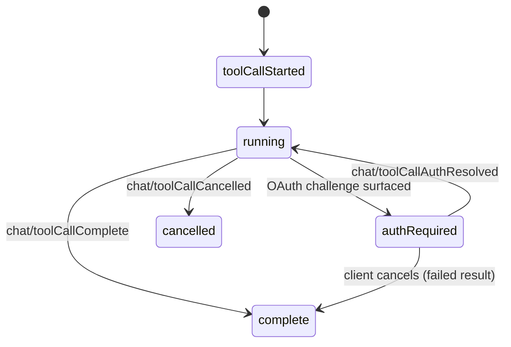

# Agent Host Protocol Releases

Reference for the canonical release/change resource of the [Agent Host Protocol](/protocols/agent-host-protocol.md): <https://github.com/microsoft/agent-host-protocol/releases>.

The release resource tracks three independently-versioned artifact families, each on its own SemVer track:

- **Spec** — `spec/v*` tags (normative protocol specification with attached schema artifacts).
- **Swift package** — `v*` tags.
- **Go module** — `clients/go/v*` tags.

Rust, TypeScript, and Kotlin clients release through their native package registries rather than GitHub releases. Grounding evidence and coverage notes are on the [GitHub source evidence](/sources/github-agent-host-protocol.md) page.

## Release history (spec-core versions)

| Version | Published | Key additions (durable highlights) |
|---|---|---|
| v0.7.0 | 2026-07-31 | Capability-gated **side chats**; **multiroot sessions** (`multipleWorkingDirectories`, `immutablePrimary`); `result` on `ToolResultTerminalContent`; `isPty` terminal metadata; stable `turnId` refs on side-chat sources. |
| v0.6.0 | 2026-07-20 | Changeset **review** capability; `_meta` on `SystemNotificationResponsePart`; turn `startedAt`/`duration`; **async tool-call risk assessments**; MCP tool-call OAuth (`ToolCallStatus.AuthRequired`, `chat/toolCallAuthRequired`/`Resolved`, `McpAuthRequirement`). |
| v0.5.2 | 2026-07-09 | Typed `resource*` client methods; `ToolResultTerminalCompleteContent`; enable/disable + invocation matrix on customizations; `ChangesetFile.reviewed` and `changeset/filesReviewedChanged`; `_meta` hoisted to `CustomizationBase`. |
| v0.5.1 | 2026-07-02 | `SessionState.inputNeeded` aggregate; `maxLatencyMs` subscription delivery; `AgentCapabilities.multipleChats` (fork); cursor pagination for `listSessions`; `chat/turnsLoaded` bounded-history subscription; `ContentRef.nonce`. |
| v0.5.0 | 2026-06-26 | `chat/activityChanged`; generic `root/progress` notifications; model token limits; `SessionSummary._meta`; `chat/draftChanged`; multi-client `activeClients`. |
| v0.4.0 | 2026-06-19 | `MessageOrigin`/`MessageKind` (user, agent, tool, systemNotification); `changeset/contentChanged`; disabled changeset operations; `_meta` on per-turn actions; sub-agent tool results point at chat URIs. |
| v0.3.0 | 2026-06-06 | MCP servers as first-class session customizations (`McpServerState` lifecycle); per-server auth (`McpServerAuthRequiredState`); `changeset/operationStatusChanged`; `changeKind`; `ClientCapabilities`. |
| v0.2.0 | 2026-05-28 | **First unified pipeline release.** Channel reorganization (top-level `channel: URI`); `otlp/*` telemetry; `resourceResolve`/`resourceMkdir`; `createResourceWatch`; `resourceWrite` `mode`/`position`/`ifMatch` with `Conflict` (`-32011`); changeset action family. |

The earliest spec version (v0.1.0) predates the release pipeline and is not separately tagged.

## Current headline features (v0.7.0, released 2026-07-31)

- **Side chats** — capability-gated side chats can start from a chat turn and return bounded chat transcripts as message attachments; sources/origins carry stable `turnId` references instead of nested turn snapshots.
- **Multiroot sessions** — `AgentCapabilities.multipleWorkingDirectories` (with `immutablePrimary` pinning `workingDirectories[0]` as a fixed primary root that clients MUST NOT remove or reorder); `CreateSessionParams.workingDirectories`, `SessionMetadata.workingDirectories`, `CreateChatParams.workingDirectories`, plus `session/workingDirectorySet`/`Removed` and `chat/workingDirectorySet`/`Removed` actions.
- **Terminal/tool-result metadata** — `result` on `ToolResultTerminalContent` (`exitCode`, `preview`, `truncated`) once a command exits; optional `isPty` on terminal resources.

Also notable: `AHPClient.completions()`/`sessionConfigCompletions()` typed conveniences, and message chat attachments may reference chats in other sessions.

## MCP + authentication evolution (v0.3.0 → v0.6.0)

Across this window, AHP deepened MCP integration and tool-call authentication:

- **v0.3.0** — MCP servers became first-class session customizations with a `starting → ready → authRequired → error → stopped` lifecycle and an `mcp://` side-channel; `authenticate` drives per-server auth.
- **v0.6.0** — Running MCP-contributed tool calls can **pause mid-execution on an OAuth challenge** (`ToolCallStatus.AuthRequired`, `McpAuthRequirement`, `chat/toolCallAuthRequired`/`Resolved`, plus a session-level `toolAuthentication` input-request variant).

## Status notes

- **Confidence:** confirmed for the release-history table and v0.6.0/v0.7.0 headline features (source-backed from the release resource, cross-checked against the spec body text in each release).
- The specification is a working draft; wire shapes and action semantics may change in future versions.

## Source Map
- [Agent Host Protocol](/protocols/agent-host-protocol.md) — canonical protocol concept.
- [GitHub source evidence](/sources/github-agent-host-protocol.md) — the raw evidence behind this page.